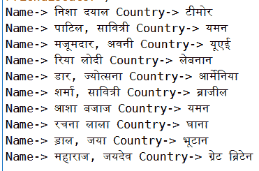

# Python Faker 库

> 原文:[https://www.geeksforgeeks.org/python-faker-library/](https://www.geeksforgeeks.org/python-faker-library/)

[Faker](https://pypi.python.org/pypi/Faker) 是一个为你生成假数据的 Python 包。

安装:[帮助链接](https://anaconda.org/conda-forge/faker)
打开蟒蛇提示命令安装:

```
conda install -c conda-forge faker 

```

**进口包装**

```
 from faker import Faker
```

Faker 具有打印/获取大量不同伪造数据的能力，例如，它可以打印伪造的姓名、地址、电子邮件、文本等。

最常用的 faker 命令

```
fake.name()
fake.address()
fake.email()
fake.text()
fake.country()

```

```
from faker import Faker
fake = Faker()
print (fake.email())
print(fake.country())
print(fake.name())
print(fake.text())
print(fake.latitude(), fake.longitude())
print(fake.url())
```

```
OUTPUT:(Different every time)
vwilson@hotmail.com
Belgium
Shane Hunter
Commodi vel libero placeat quibusdam odio odio consequatur. Ducimus libero quae optio non quidem. Facilis quas impedit quo.
26.5687745 -124.802165
http://www.turner.com/

```

**应用 1:创建一个包含学生姓名、地址、位置坐标和学生号的 100 名学生的 JSON . JSON。**

```
from faker import Faker 

# To create a json file
import json        

# For student id 
from random import randint     

fake = Faker() 

def input_data(x): 

    # dictionary 
    student_data ={} 
    for i in range(0, x): 
        student_data[i]={} 
        student_data[i]['id']= randint(1, 100) 
        student_data[i]['name']= fake.name() 
        student_data[i]['address']= fake.address() 
        student_data[i]['latitude']= str(fake.latitude()) 
        student_data[i]['longitude']= str(fake.longitude()) 
    print(student_data) 

    # dictionary dumped as json in a json file 
    with open('students.json', 'w') as fp: 
        json.dump(student_data, fp) 

def main(): 

    # Enter number of students 
    # For the above task make this 100 
    number_of_students = 10 
    input_data(number_of_students) 
main() 
# The folder or location where this python code 
# is save there a students.json will be created 
# having 10 students data. 
```

```
OUTPUT 
{0: {'id': 20, 'name': 'Benjamin Washington', 'address': 'USCGC Garrison\nFPO AP 48025-9793', 'latitude': '-68.975800', 'longitude': '153.009590'}, 1: {'id': 2, 'name': 'Christopher Howell', 'address': '7778 Sarah Center Apt. 663\nLawrenceport, WY 78084', 'latitude': '-21.8141675', 'longitude': '-122.830387'}, 2: {'id': 67, 'name': 'Fernando Fuentes', 'address': '7756 Bradford Plain Suite 997\nEast Chelseaburgh, KY 75776', 'latitude': '-82.791227', 'longitude': '-42.964122'}, 3: {'id': 86, 'name': 'Patrick Torres', 'address': 'Unit 5217 Box 7477\nDPO AE 82354-0160', 'latitude': '34.949096', 'longitude': '121.715387'}, 4: {'id': 11, 'name': 'James Hines', 'address': '4567 Donald Grove\nWilliamhaven, MO 85891', 'latitude': '86.7208035', 'longitude': '-48.103935'}, 5: {'id': 33, 'name': 'James Miller', 'address': 'PSC 2613, Box 7165\nAPO AP 29256-6576', 'latitude': '-35.4630595', 'longitude': '-50.415667'}, 6: {'id': 76, 'name': 'Randall Fuller', 'address': '7731 Garcia Pike\nNew Eric, KS 20545', 'latitude': '12.198124', 'longitude': '126.720134'}, 7: {'id': 49, 'name': 'Ivan Franco', 'address': '801 Chambers Light\nWest Daniel, IA 17114-4374', 'latitude': '-58.2576055', 'longitude': '171.773233'}, 8: {'id': 75, 'name': 'Amy Smith', 'address': '995 Luna Stream Apt. 297\nThompsonchester, NY 82115', 'latitude': '80.4262245', 'longitude': '115.142004'}, 9: {'id': 38, 'name': 'Danielle Thomas', 'address': '7309 Chris Ferry Suite 674\nColebury, MA 39673-2967', 'latitude': '-73.340443', 'longitude': '-176.964241'}}

```

**应用 2:用印地语打印 10 个假名字和国家。**

```
from faker import Faker 

#'hi_IN' changed the language
fake = Faker('hi_IN')      

for i in range(0, 10): 
    print('Name->', fake.name(),
          'Country->', fake.country()) 
```



**应用 3:创建假档案**

```
import faker from Faker
fake = Faker()
print(fake.profile())
```

```
OUTPUT
{'job': 'Town planner', 'company': 'Martinez-Clark', 'ssn': '559-93-0521', 'residence': '46820 Johnny Circles\nStokesside, IL 87065-2470', 'current_location': (Decimal('83.5271055'), Decimal('43.705455')), 'blood_group': 'A+', 'website': ['https://www.taylor.com/'], 'username': 'hsmith', 'name': 'Christopher Davis', 'sex': 'M', 'address': '335 Mcdaniel Fork Suite 589\nTeresabury, AZ 85283', 'mail': 'kenneth48@yahoo.com', 'birthdate': '1981-03-29'}

```

**应用 4:给生成器播种，再次得到特定的假数据。**
播种给出了使用在该种子号上第一次生成的相同的假数据结果。
示例

```
from faker import Faker
fake = Faker()

fake.seed(1)
print(fake.name())
print(fake.address())
print(fake.email())
```

```
OUTPUT
Ryan Gallagher
7631 Johnson Village Suite 690
Adamsbury, NC 50008
bparks@johnson.info

```

注意:即使我一次又一次地运行程序，我也会得到相同的结果。只要我去掉假种子(1)行，我们就能看到数据生成的随机性。

**应用 5:从你想要的列表中打印数据。**

```
import faker from Faker 
fake = Faker() 
# Print random sentences 
print(fake.sentence()) 

# List has words that we want in our sentence 
word_list = ["GFG", "Geeksforgeeks",
             "shaurya", "says", "Gfg",
             "GEEKS"] 

# Let's print 5 sentences that
# have words from our word_list 
for i in range(0, 5): 

    # You need to use ext_word_list = listnameyoucreated 
    print(fake.sentence(ext_word_list = word_list)) 
```

```
OUTPUT
# This is the random sentence that is generated using
# fake.sentence()
Error architecto inventore aut.

# These are the 5 sentence that contains words from 
# word_list we provided
Shaurya shaurya GEEKS Geeksforgeeks.
Gfg shaurya Geeksforgeeks GFG Gfg GFG.
Geeksforgeeks Gfg says Geeksforgeeks GEEKS Gfg Gfg GFG.
Geeksforgeeks shaurya GFG Geeksforgeeks Gfg GEEKS.
Gfg Geeksforgeeks says GFG GEEKS says.

```

**我们从 Faker**
学到的东西总结 1。姓名、地址、电子邮件、文本、句子等虚假数据生成
2。创建虚假数据的 JSON 文件。
3。不同语言伪造数据打印。
4。创建轮廓
5。播种，即打印特定的假数据
6。生成包含我们提供的单词的句子。