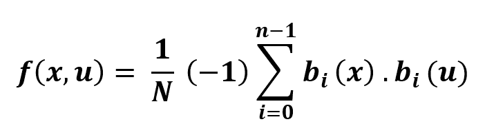

# Python |快速沃尔什哈达玛变换

> 原文:[https://www . geesforgeks . org/python-fast-Walsh-hada mard-transform/](https://www.geeksforgeeks.org/python-fast-walsh-hadamard-transform/)

**快速沃尔什哈达玛变换**，是一种**哈达玛有序**高效算法，用于计算沃尔什哈达玛变换(WHT)。正常的 WHT 计算具有 **N = 2 <sup>m</sup>** 的复杂性，但是使用 FWHT 将计算减少到 **O(n <sup>2</sup> )** 。FWHT 需要 **O(n logn)** 加减运算。这是一个分治算法，递归地分解 WHT。



**sympy . discrete . transforms . fwht():**它可以执行**沃尔什哈达玛变换(WHT)** 。该方法使用哈达玛序列排序。
序列自动向右填充零，因为基数-2 FWHT 要求样本点数为 2 的幂。

```

Parameters : 
-> seq : [iterable] sequence on which WHT is to be applied.

Returns : 
Fast Walsh Hadamard Transform Transform

```

**示例#1 :**

```
# import sympy 
from sympy import fwht

# sequence 
seq = [23, 
       56, 
       12, 
       555]

# hwht
transform = fwht(seq)
print ("Transform  : ", transform)
```

**输出:**

```
Transform  :  [646, -576, -488, 510]
```

 **例 2 :**

```
# import sympy 
from sympy import fwht

# sequence 
seq = [15, 21, 13, 44]

# hwht
transform = fwht(seq)
print ("Transform  : ", transform)
```

**输出:**

```
Transform  :  [93, -37, -21, 25]

```