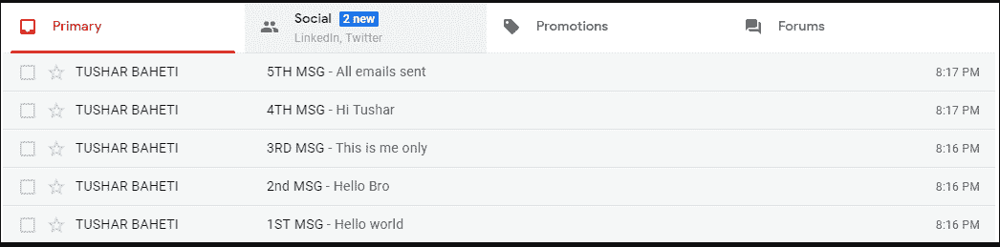

# Python |从特定用户那里获取 gmail 电子邮件

> 原文:[https://www . geesforgeks . org/python-fetch-your-Gmail-emails-来自特定用户/](https://www.geeksforgeeks.org/python-fetch-your-gmail-emails-from-a-particular-user/)

如果你想知道我们如何使用 Python 获取 Gmail 电子邮件，那么这篇文章就是为你准备的。
众所周知，Python 是一种多用途语言，可以用来做各种各样的任务。虽然获取 Gmail 电子邮件是一项乏味的任务，但是使用 Python，如果你精通它的用法，许多事情都可以完成。Gmail 为想要访问 Gmail 而无需手动登录浏览器的客户端提供 IMAP 访问。

**在设置页面，运行脚本前启用此项。**


**实现:**
该实现中使用的库包括 **imaplib** 、 **email** 。您必须手动进入您的 Gmail 帐户[设置](https://mail.google.com/mail/u/0/#settings/fwdandpop)，启用 IMAP 访问。在此之后，只有您可以访问您的 Gmail 帐户，而无需登录浏览器。

*   实现中定义了三个功能，用于获取邮件正文、搜索特定用户的电子邮件以及获取标签下的所有电子邮件。
*   为了显示结果，我已经从我的另一个 Gmail 帐户向我的 id 发送了电子邮件。现在我将从我的 Gmail 帐户中获取电子邮件，这些电子邮件是从我的另一个 Gmail 帐户中接收的。
*   这个过程从借助 *imaplib 库*建立 Gmail 连接并向其证明我们的 Gmail 登录凭证开始。
*   登录后，我们选择标签下的电子邮件:收件箱，这是所有用户的默认标签部分。但是，您也可以创建自己的标签。
*   然后我们调用获取电子邮件功能，并从搜索功能结果中为其提供参数，即“来自用户”
*   在获取电子邮件功能中，我们将所有电子邮件放在一个名为“msgs”的数组中
*   现在打印以查看 msgs 数组
*   现在我们可以很容易地迭代这个数组。我们正在按照邮件到达的顺序进行迭代。然后我们从内容开始的地方搜索索引。不同的电子邮件/用户的索引部分会有所不同，用户可以手动更改索引，只打印他们需要的部分。
*   我们把结果打印出来了。

下面是 Python 实现–

## 蟒蛇 3

```py
# Importing libraries
import imaplib, email

user = 'USER_EMAIL_ADDRESS'
password = 'USER_PASSWORD'
imap_url = 'imap.gmail.com'

# Function to get email content part i.e its body part
def get_body(msg):
    if msg.is_multipart():
        return get_body(msg.get_payload(0))
    else:
        return msg.get_payload(None, True)

# Function to search for a key value pair
def search(key, value, con):
    result, data = con.search(None, key, '"{}"'.format(value))
    return data

# Function to get the list of emails under this label
def get_emails(result_bytes):
    msgs = [] # all the email data are pushed inside an array
    for num in result_bytes[0].split():
        typ, data = con.fetch(num, '(RFC822)')
        msgs.append(data)

    return msgs

# this is done to make SSL connection with GMAIL
con = imaplib.IMAP4_SSL(imap_url)

# logging the user in
con.login(user, password)

# calling function to check for email under this label
con.select('Inbox')

 # fetching emails from this user "tu**h*****1@gmail.com"
msgs = get_emails(search('FROM', 'MY_ANOTHER_GMAIL_ADDRESS', con))

# Uncomment this to see what actually comes as data
# print(msgs)

# Finding the required content from our msgs
# User can make custom changes in this part to
# fetch the required content he / she needs

# printing them by the order they are displayed in your gmail
for msg in msgs[::-1]:
    for sent in msg:
        if type(sent) is tuple:

            # encoding set as utf-8
            content = str(sent[1], 'utf-8')
            data = str(content)

            # Handling errors related to unicodenecode
            try:
                indexstart = data.find("ltr")
                data2 = data[indexstart + 5: len(data)]
                indexend = data2.find("</div>")

                # printtng the required content which we need
                # to extract from our email i.e our body
                print(data2[0: indexend])

            except UnicodeEncodeError as e:
                pass
```

**输出:**

