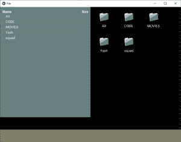
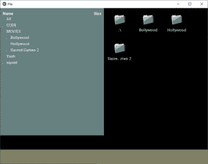

# Python | kivy 中的文件选择器

> 原文:[https://www.geeksforgeeks.org/python-file-chooser-in-kivy/](https://www.geeksforgeeks.org/python-file-chooser-in-kivy/)

Kivy 是 Python 中独立于平台的 GUI 工具。因为它可以在安卓、IOS、linux 和视窗等平台上运行。它基本上是用来开发安卓应用程序的，但并不意味着它不能在桌面应用程序上使用。

> [Kivy 教程–通过示例学习 Kivy](https://www.geeksforgeeks.org/kivy-tutorial/)。

### 文件选择器:

文件选择器模块提供了描述、显示和浏览文件系统的各种类。它就像“我的电脑”一样简单，我们可以从中选择系统中的任何文件。

*   文件选择列表视图将文件条目显示为垂直列表中的文本项目，文件夹可以折叠和展开。
*   文件选择视图从左到右显示图标和文本，并根据需要换行。

**注意:**以上两点都提供了滚动、选择和基本的用户交互。

```
Basic Approach 
1) import kivy
2) import kivyApp
3) import Boxlayot
4) Set minimum version(optional)
5) create layout class
6) create App class
7) create .kv file
8) return Layout/widget/Class(according to requirement)
9) Run an instance of the class or App
```

**实施办法:**
**。py 文件**

## 蟒蛇 3

```
# Program to explain how to use File chooser in kivy 

# import kivy module    
import kivy  

# base Class of your App inherits from the App class.    
# app:always refers to the instance of your application   
from kivy.app import App 

# this restrict the kivy version i.e  
# below this kivy version you cannot  
# use the app or software  
kivy.require('1.9.0') 

# BoxLayout arranges widgets in either in
# a vertical fashion that is one on top of
# another or in a horizontal fashion
# that is one after another.
from kivy.uix.boxlayout import BoxLayout

# create the layout class
class Filechooser(BoxLayout):
    def select(self, *args):
        try: self.label.text = args[1][0]
        except: pass

# Create the App class
class FileApp(App):
    def build(self):
        return Filechooser()

# run the App
if __name__ == '__main__':
    FileApp().run()
```

**。kv 文件**

## 蟒蛇 3

```
#, kv file implementation

<Filechooser>:

    label: label

    # Providing the orientation
    orientation: 'vertical'

    # Creating the File list / icon view

    BoxLayout:

        # Creating list view one side
        FileChooserListView:
            canvas.before:
                Color:
                    rgb: .4, .5, .5
                Rectangle:
                    pos: self.pos
                    size: self.size
            on_selection: root.select(*args)

        # Creating Icon view other side
        FileChooserIconView:
            canvas.before:
                Color:
                    rgb: .5, .4, .5
                Rectangle:
                    pos: self.pos
                    size: self.size
            on_selection: root.select(*args)

    # Adding label
    Label:
        id: label
        size_hint_y: .1
        canvas.before:
            Color:
                rgb: .5, .5, .4
            Rectangle:
                pos: self.pos
                size: self.size

```

**输出:**



