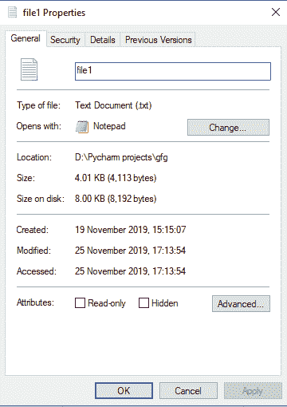
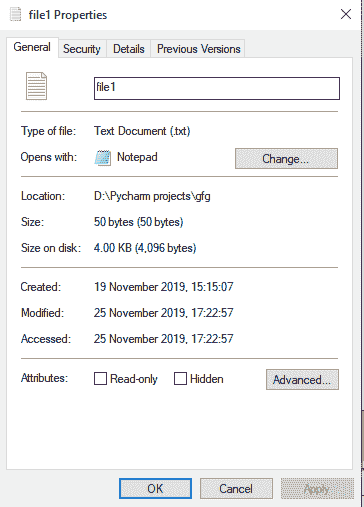

# Python 文件截断()方法

> 原文:[https://www.geeksforgeeks.org/python-file-truncate-method/](https://www.geeksforgeeks.org/python-file-truncate-method/)

**先决条件:**

*   [Python 中的文件对象](https://www.geeksforgeeks.org/file-objects-python/)
*   [用 Python 读写文件](https://www.geeksforgeeks.org/reading-writing-text-files-python/)

`Truncate()`方法截断文件的大小。如果存在可选的大小参数，文件将被截断到(最多)该大小。大小默认为当前位置。当前文件位置不变。请注意，如果指定的大小超过文件的当前大小，则结果取决于平台:可能包括文件可能保持不变，增加到指定的大小，就像零填充一样，或者增加到具有未定义新内容的指定大小。
要截断文件，可以在追加模式或写入模式下打开文件。

**语法:**

```
fileObject.truncate(size)

```

**示例:**
文件大小见下图。



让我们将文件大小更改为 100 字节。

```
# Python program to demonstrate
# truncate() method

fp = open('file1.txt', 'w')

# Truncates the file to specified
# size
fp.truncate(100)

# Closing files
fp.close()
```

**输出:**


#### 带语句

在上述方法中，每次打开文件都需要显式关闭。如果忘记关闭文件，可能会在代码中引入几个错误，即文件中的许多更改只有在文件正确关闭后才会生效。为了防止这种情况`with` 语句可以使用。Python 中的 with 语句用于异常处理，以使代码更干净、可读性更强。它简化了文件流等公共资源的管理。观察下面的代码示例，了解使用`with` 语句如何使代码更加清晰。使用 with 语句时无需调用`file.close()`。`with` 声明本身确保了资源的正确获取和释放。

让我们将上面的文件改为 50 字节

```
# Python program to demonstrate
# truncate method using with statement

with open('file1.txt', 'w') as fp:
    fp.truncate(50)
```

**输出:**


**注:**欲了解更多关于[的声明，请点击此处](https://www.geeksforgeeks.org/with-statement-in-python/)。