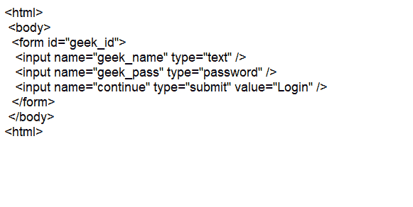
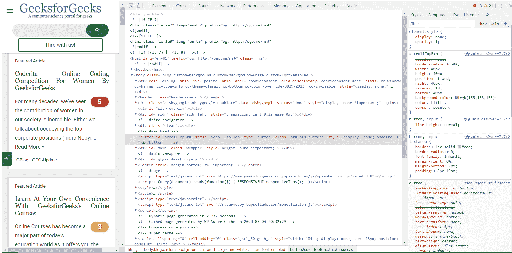

# Python–硒

中的 find_element_by_id()方法

> 原文:[https://www . geesforgeks . org/python-find _ element _ by _ id-method-in-selenium/](https://www.geeksforgeeks.org/python-find_element_by_id-method-in-selenium/)

使用 selenium 在网页上执行任何操作时，都需要定位器来执行特定任务。网页中的定位器用于识别网页中的独特元素。Web 元素可以是用户在页面上看到的任何内容，例如标题、表格、链接、按钮、切换按钮或任何其他 HTML 元素。
为了按 ID 查找元素，使用了 find_element_by_id()方法。Id 基本上是分配给网页元素的唯一属性，如按钮、图像、标题等。
**语法:**

```py
driver.find_element_by_id(ID)
```

**论点:**

```py
Takes ID in string format
```

**注意:**将返回 ID 属性值与位置匹配的第一个元素。如果没有元素具有匹配的标识属性，将引发 NoSuchElementException。
**例 1:–**
考虑以下页面来源:



下面是寻找元素的代码，即“极客 _ id”

## 蟒蛇 3

```py
#importing webdriver from selenium
from selenium import webdriver

# Here Chrome  will be used
driver=webdriver.Chrome()

# Opening the website
driver.get(url)

# finds button using its id
form = driver.find_element_by_id('geek_id')
```

表单元素可以这样定位。
**例:**
https://www.geeksforgeeks.org/源代码如下。



下面是借助滚动按钮的标识找到滚动按钮的代码。

## 蟒蛇 3

```py
#importing webdriver from selenium
from selenium import webdriver

# Here Chrome  will be used
driver=webdriver.Chrome()

# URL of website
url = "https://www.geeksforgeeks.org/"

# Opening the website
driver.get(url)

# finds button using its id
bt = driver.find_element_by_id('scrollTopBtn')
```

有了这个代码，我们可以找到这个网站的滚动顶部按钮。