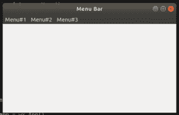

# python–findmenu()functionin wx . menubar

> 原文:[https://www . geesforgeks . org/python-find menu-function in-wx-menu bar/](https://www.geeksforgeeks.org/python-findmenu-functionin-wx-menubar/)

在本文中，我们将学习 wx 中的 FindMenu()函数。wxPython 的菜单栏类。函数的作用是:返回菜单项的索引/位置。函数只接受一个参数，即菜单项的名称。

> **语法:**
> 
> ```
> wx.MenuBar.FindMenu(self, title)
> 
> ```
> 
> **参数:**
> 
> | 参数 | 输入类型 | 描述 |
> | --- | --- | --- |
> | 标题 | 线 | menuitem 的标题。 |
> 
> **返回类型:**
> 
> ```
> int
> 
> ```

**代码示例:**

```
import wx

class Example(wx.Frame):

    def __init__(self, *args, **kwargs):
        super(Example, self).__init__(*args, **kwargs)

        self.InitUI()

    def InitUI(self):

        # create MenuBar using MenuBar() function
        menubar = wx.MenuBar()

        # menu for menuitem
        fm1 = wx.Menu()
        fm2 = wx.Menu()
        fm3 = wx.Menu()

        menubar.Append(fm1, '&Menu# 1')
        menubar.Append(fm2, '&Menu# 2')
        menubar.Append(fm3, '&Menu# 3')

        self.SetMenuBar(menubar)
        self.SetSize((300, 200))
        self.SetTitle('Menu Bar')

        # get index of menuitem using FindMenu function
        index = menubar.FindMenu("&Menu# 3")
        print(index)    

def main():

    app = wx.App()
    ex = Example(None)
    ex.Show()
    app.MainLoop()

if __name__ == '__main__':
    main()
```

**输出:**
**1。窗口输出:**

**2。打印输出**

```
2 
```