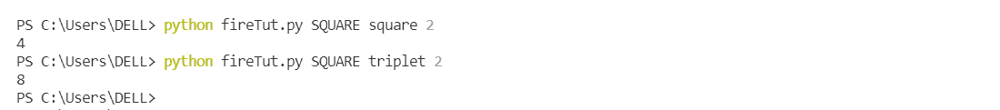
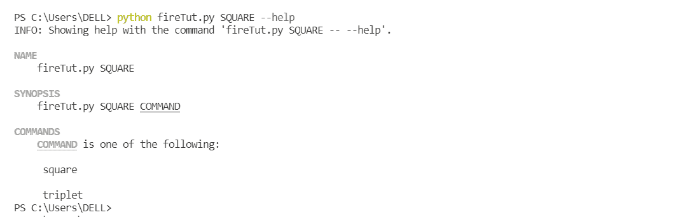

# 蟒火模块

> 原文:[https://www.geeksforgeeks.org/python-fire-module/](https://www.geeksforgeeks.org/python-fire-module/)

**Python Fire** 是一个创建 CLI 应用程序的库。它可以从 python 中的任何对象自动生成命令行界面。它不限于此，它是一个用于调试和开发目的的好工具。借助 Fire，您可以将现有代码转换为 CLI。在这篇文章中，我们将看到火的使用。

## **安装**

首先，根据您的选择，您可以执行不同的安装方法。

**使用 pip 安装:**

```py
pip install fire
```

**Fire** 适用于任何 Python 对象，包括组件、字典、列表、元组等。

## **调用函数**

这里有一个调用函数的例子，为此我们将创建一个函数，并在命令行界面中调用该函数。

## 蟒蛇 3

```py
import fire

def greeting(name):
    return "Hello " + name

fire.Fire(greeting("World!"))
```

**输出:**

```py
Hello World!
```

然后，从终端，您可以使用以下命令运行:

```py
 python main.py
```

## **将功能设置为入口点**

通过在调用时在 Fire 函数中设置一个函数，还有另一种方法可以运行这个程序。通过这样做，我们只需要在运行时传递参数，而不需要告诉调用哪个方法。

## 蟒蛇 3

```py
import fire

def hello(name):
    return "Hello " + name

if __name__ == '__main__':
    fire.Fire(hello)
```

**输出:**

```py
Hello world
```

如果您在终端中使用下面的命令运行这个函数，它将给出与上面的函数相同的结果。召唤火消耗名称=“世界”。使用这种调用 fire 的方法，可以避免用参数编写函数名。

```py
python main.py world
```

这两种呼叫方式都会输出“你好，世界”。

## **调用类上的函数**

这是一个名为 square 的创建的示例类，其中定义了一个方法“Square”。一旦我们在任何类上调用 fire，我们就可以直接在命令行上以方法的形式访问它。我们将看到如何使用下面的例子调用这个方法，

## 蟒蛇 3

```py
import fire

class Square(object):

    def square(self, number):
        return number*number

fire.Fire(Square)
```

**输出:**

```py
4
```

**这个类有两种执行方式，第一种方法是:**

```py
python main.py square 2
```

**给出相同期望输出的第二种方式是:**

```py
python main.py square --number=2
```

这两种方法将给出相同的结果= 4。

## **将参数传递给命令**

Fire 很方便，因为它允许从命令行传递参数。在上面的示例中，我们从命令行调用了方法，并同时分配了参数。

### **使用分层命令**

Fire 可用于实例化类内部的类，从而创建一个分层视图。让我们举个例子，

## 蟒蛇 3

```py
import fire

class Calculator(object):
    def __init__(self):
        self.SQUARE = Square()

class Square(object):

    def square(self, number):
        return number*number

    def triplet(self,number):
        return number*number*number

fire.Fire(Calculator)
```

这样，计算器类实例化了*正方形*类，并创建了它的对象。实例化类的成员函数可以在运行时访问，如下所示:



## **火焰旗**

要了解与特定对象或类相关联的 fire 命令的更多信息，请使用对象或类的帮助标志。例如，如下所示，我们正在查询“SQUARE”对象，它显示了与之相关联的两个命令——“SQUARE”和“三元组”。这意味着您只能用 SQUARE 传递这两个命令及其参数。



## **为什么火？**

*   火使代码更易读。
*   易于创建命令行界面。
*   火。Fire()在程序结束时调用时执行程序的全部内容。