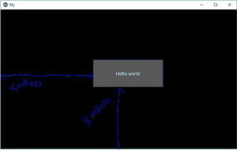
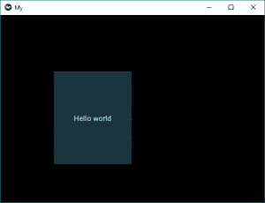

# Python | Kivy 中的浮动布局

> 原文:[https://www.geeksforgeeks.org/python-float-layout-in-kivy/](https://www.geeksforgeeks.org/python-float-layout-in-kivy/)

Kivy 是 Python 中独立于平台的 GUI 工具。因为它可以在安卓、IOS、linux 和 Windows 等平台上运行。它基本上是用来开发安卓应用程序的，但并不意味着它不能在桌面应用程序上使用。

> 👉🏽 [Kivy 教程–通过示例学习 Kivy](https://www.geeksforgeeks.org/kivy-tutorial/)。

### 浮动布局:

`**Floatlayout**` 允许我们根据当前窗口大小和高度相对放置元素，尤其是在手机中，即`Floatlayout` 允许我们使用所谓的相对位置来放置元素。这意味着我们将使用窗口大小的百分比来放置所有东西，而不是定义具体的位置或坐标。当我们改变窗口的尺寸时，放在窗口中的所有东西都会相应地调整其大小和位置。这使得应用程序更加可靠，并且可以根据窗口大小进行扩展。

**注意:**浮动布局尊重其子代的*位置提示*和*大小提示*属性。

要使用 FloatLayout，我们需要做的第一件事就是导入它。

```py
from kivy.uix.floatlayout import FloatLayout
```

```py
Basic Approach:

1) import kivy
2) import kivyApp
3) import button
4) import Floatlayout
5) Set minimum version(optional)
6) create App class
7) return Layout/widget/Class(according to requirement)
8) Run an instance of the class
```

例如，创建大小为(300，300)的浮动布局:

```py
layout = FloatLayout(size=(300, 300))
```

默认情况下，所有小部件都有其`size_hint = (1, 1)`，因此下面的按钮将采用与布局相同的大小:

```py
button = Button(text='Hello world')
layout.add_widget(button)
```

要创建一个具有特定宽度和高度的按钮，并将其放置在特定位置，您可以执行以下操作–

**实施方法:**

## 蟒蛇 3

```py
# Sample Python application demonstrating the
# working of FloatLayout in Kivy

import kivy

# base Class of your App inherits from the App class.  
# app:always refers to the instance of your application  
from kivy.app import App

# creates the button in kivy 
# if not imported shows the error 
from kivy.uix.button import Button

# module consist the floatlayout
# to work with FloatLayout first
# you have to import it
from kivy.uix.floatlayout import FloatLayout

# To change the kivy default settings 
# we use this module config 
from kivy.config import Config 

# 0 being off 1 being on as in true / false 
# you can use 0 or 1 && True or False 
Config.set('graphics', 'resizable', True) 

# creating the App class
class MyApp(App):

    def build(self):

        # creating Floatlayout
        Fl = FloatLayout()

        # creating button
        # a button 30 % of the width and 20 %
        # of the height of the layout and
        # positioned at (300, 200), you can do:
        btn = Button(text ='Hello world',
                    size_hint =(.3, .2),
                    pos =(300, 200))

        # adding widget i.e button
        Fl.add_widget(btn)

        # return the layout
        return Fl

# run the App
if __name__ == "__main__":
    MyApp().run()
```

**输出:** 

**注意:**现在如果你改变窗口的大小，它会相对改变它的位置和大小。此布局可用于应用程序。大多数情况下，您会使用窗口的大小。

**动态放置–**
现在少了点什么或者上面的代码不完美你可以说。我们仍然需要添加按钮的位置。

我们有两个属性来创建动态放置:

> 1) **pos_hint:** 提供位置提示
> 我们最多可以定义 6 个键，即它采用字典形式的参数。
> pos _ hint = {“x”:1、“y”:1、“左”:1、“右”:1、“顶”:1、“底”:1}
> 
> **2) **大小提示:**提供大小提示**
> 包含两个参数，即宽度和高度

**注:**

1.  大小提示和位置提示只能使用 0-1 之间的值。其中 0 = 0%，1 = 100%。
2.  kivy 中的坐标系从左下角开始工作！这在放置我们的对象时非常重要。(即(0，0)是左下方)。

**实现动态定位的代码:**

## 蟒蛇 3

```py
# Sample Python application demonstrating the
# working of Dynamic placement in FloatLayout in Kivy

import kivy

# base Class of your App inherits from the App class.  
# app:always refers to the instance of your application  
from kivy.app import App

# creates the button in kivy 
# if not imported shows the error 
from kivy.uix.button import Button

# module consist the floatlayout
# to work with FloatLayout first
# you have to import it
from kivy.uix.floatlayout import FloatLayout

# To change the kivy default settings 
# we use this module config 
from kivy.config import Config 

# 0 being off 1 being on as in true / false 
# you can use 0 or 1 && True or False 
Config.set('graphics', 'resizable', True) 

# creating the App class
class MyApp(App):

    def build(self):

        # creating Floatlayout
        Fl = FloatLayout()

        # creating button
        # a button 30 % of the width and 50 %
        # of the height of the layout and
        # positioned at 20 % right and 20 % up
        # from bottom left, i.e x, y = 200, 200 from bottom left:
        btn = Button(text ='Hello world', size_hint =(.3, .5),
                     background_color =(.3, .6, .7, 1),
                    pos_hint ={'x':.2, 'y':.2 })

        # adding widget i.e button
        Fl.add_widget(btn)

        # return the layout
        return Fl

# run the App
if __name__ == "__main__":
    MyApp().run()
```

**输出:**


**视频输出:**

<video class="wp-video-shortcode" id="video-305233-1" width="665" height="374" preload="metadata" controls=""><source type="video/webm" src="https://media.geeksforgeeks.org/wp-content/uploads/20190520104004/float-layout.webm?_=1">[https://media.geeksforgeeks.org/wp-content/uploads/20190520104004/float-layout.webm](https://media.geeksforgeeks.org/wp-content/uploads/20190520104004/float-layout.webm)</video>

**Reference:**
[https://kivy.org/doc/stable/api-kivy.uix.floatlayout.html](https://kivy.org/doc/stable/api-kivy.uix.floatlayout.html)
[https://techwithtim.net/tutorials/kivy-tutorial/floatlayout/](https://techwithtim.net/tutorials/kivy-tutorial/floatlayout/)