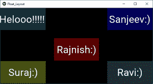

# Python |使用 Kivy 中的 FloatLayout。kv 文件

> 原文:[https://www . geesforgeks . org/python-float layout-in-kivy-using-kv-file/](https://www.geeksforgeeks.org/python-floatlayout-in-kivy-using-kv-file/)

Kivy 是 Python 中独立于平台的 GUI 工具。因为它可以在安卓、IOS、linux 和 Windows 等平台上运行。它基本上是用来开发安卓应用程序的，但并不意味着它不能在桌面应用程序上使用。

> 👉🏽 [Kivy 教程–通过示例学习 Kivy](https://www.geeksforgeeks.org/kivy-tutorial/)。

### 浮动布局:

**`Floatlayout`** 为我们提供了相对排列像[按钮](https://www.geeksforgeeks.org/python-working-with-buttons-in-kivy/)这样的元素的灵活性，也就是说，它允许我们使用所谓的相对位置来放置元素。这意味着我们不用定义具体的位置或坐标，而是使用窗口大小的百分比来放置所有的东西，也就是说，我们可以动态地安排元素的位置。

我们需要做的第一件事是导入浮动布局–

```
from kivy.uix.floatlayout import FloatLayout
```

我们有两个属性来创建动态放置–

> 1) pos_hint:提供位置提示
> 我们最多可以定义 6 个键，即它采用字典形式的参数。
> pos _ hint = {“x”:1、“y”:1、“左”:1、“右”:1、“顶”:1、“底”:1}
> 
> **2)大小提示:提供大小提示**
> 包含宽度和高度两个参数

**注:**

*   大小提示和位置提示只能使用 0-1 之间的值。其中 0 = 0%，1 = 100%。
*   kivy 中的坐标系从左下角开始工作！这在放置我们的对象时非常重要。(即(0，0)是左下方)。

```
Basic Approach:

1) import kivy
2) import kivyApp
3) import Floatlayout
4) Set minimum version(optional)
5) create Layout class
6) create App class
7) Set up .kv file
8) return Layout/widget/Class(according to requirement)
9) Run an instance of the class
```

**实施该方法–**

**main.py file**

```
## Sample Python application demonstrating the
## working of FloatLayout in Kivy using .kv file

###################################################
# import modules

import kivy

# base Class of your App inherits from the App class.  
# app:always refers to the instance of your application 
from kivy.app import App

# module consist the floatlayout
# to work with FloatLayout first
# you have to import it
from kivy.uix.floatlayout import FloatLayout

# To change the kivy default settings 
# we use this module config 
from kivy.config import Config 

# 0 being off 1 being on as in true / false 
# you can use 0 or 1 && True or False 
Config.set('graphics', 'resizable', True)

# creating the root widget used in .kv file 
class FloatLayout(FloatLayout):
    pass

# creating the App class in which name
#.kv file is to be named Float_Layout.kv
class Float_LayoutApp(App):
    # defining build()
    def build(self):
        # returning the instance of root class
        return FloatLayout()

# run the app
if __name__ == "__main__":
    Float_LayoutApp().run()
```

这个文件包括按钮的动态位置，即随着屏幕尺寸的变化，按钮相对于自身进行调整，这是浮动布局的好处。

**[。kv 文件](https://www.geeksforgeeks.org/python-kivy-kv-file/)实施办法**–

```
#.kv file implementation of FloatLayout

# creating button feature
<Button>:
    font_size: 40

    # creating button
    # a button 30 % of the width and 50 %
    # of the height of the layout 
    size_hint: 0.3, 0.3

<FloatLayout>:

    Button:
        text: "Helooo !!!!! "
        background_color: 0.1, 0.5, 0.6, 1

        # positioned at 0 % right and 100 % up / top
        # from bottom left, i.e x, top = 0, 100 from bottom left:
        pos_hint: {"x":0, "top":1}

    Button:
        text:"Rajnish:)"
        background_color: 1, 0, 0, 1
        pos_hint: {"x":0.35, "y":0.3}

    Button:
        text:"Ravi:)"
        background_color: 0.4, 0.5, 0.6, 1
        pos_hint: {"x":.7, "bottom":0}

    Button:
        text:"Sanjeev:)"
        background_color: 0, 0, 1, 1
        pos_hint: {"x":.7, "top":1}

    Button:
        text:"Suraj:)"
        background_color: 0.8, 0.9, 0.2, 1
        pos_hint: {"x":0, "bottom":1}
```

**输出:**


**视频输出:**

<video class="wp-video-shortcode" id="video-305243-1" width="665" height="374" preload="metadata" controls=""><source type="video/webm" src="https://media.geeksforgeeks.org/wp-content/uploads/20190520123952/Floatkv-.webm?_=1">[https://media.geeksforgeeks.org/wp-content/uploads/20190520123952/Floatkv-.webm](https://media.geeksforgeeks.org/wp-content/uploads/20190520123952/Floatkv-.webm)</video>

**Reference:**
[https://kivy.org/doc/stable/api-kivy.uix.floatlayout.html](https://kivy.org/doc/stable/api-kivy.uix.floatlayout.html)
[https://techwithtim.net/tutorials/kivy-tutorial/floatlayout/](https://techwithtim.net/tutorials/kivy-tutorial/floatlayout/)