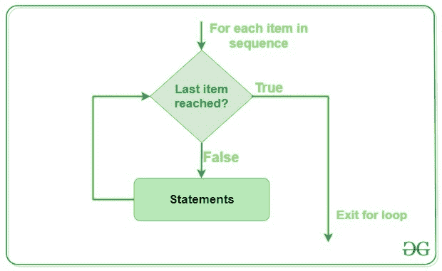

# Python For Loops

> 原文:[https://www.geeksforgeeks.org/python-for-loops/](https://www.geeksforgeeks.org/python-for-loops/)

**Python For 循环**用于顺序遍历，即用于对字符串、元组、列表等可迭代对象进行迭代。它属于**确定**迭代的范畴。明确的迭代意味着重复的次数是预先明确指定的。Python 中没有循环的 C 风格，即 for(I = 0；一<n；i++)。有一个“for in”循环，它类似于其他语言中的每个循环。让我们学习如何使用 in 循环进行顺序遍历。

**注意:**在 Python 中，for 循环只实现基于集合的迭代。

**语法:**

```py
for var in iterable:
    # statements
```

### for 循环的流程图



这里的 iterable 是像列表、元组这样的对象的集合。for 循环中的缩进语句对 iterable 中的每个项执行一次。变量 var 在每次循环中取 iterable 的下一项的值。

### **示例:** Python For Loop 使用列表、字典、字符串

## 蟒蛇 3

```py
# Python program to illustrate
# Iterating over a list
print("List Iteration")
l = ["geeks", "for", "geeks"]
for i in l:
    print(i)

# Iterating over a tuple (immutable)
print("\nTuple Iteration")
t = ("geeks", "for", "geeks")
for i in t:
    print(i)

# Iterating over a String
print("\nString Iteration")
s = "Geeks"
for i in s:
    print(i)

# Iterating over dictionary
print("\nDictionary Iteration")
d = dict()
d['xyz'] = 123
d['abc'] = 345
for i in d:
    print("% s % d" % (i, d[i]))
```

**输出:**

```py
List Iteration
geeks
for
geeks

Tuple Iteration
geeks
for
geeks

String Iteration
G
e
e
k
s

Dictionary Iteration
xyz 123
abc 345
```

## 循环控制语句

循环控制语句改变其正常顺序的执行。当执行离开一个范围时，在该范围内创建的所有自动对象都将被销毁。Python 支持以下控制语句。

### 连续语句

Python [continue 语句](https://www.geeksforgeeks.org/python-continue-statement/)将控制返回到循环的开始。

### 示例:带继续语句的循环 Python

## 蟒蛇 3

```py
# Prints all letters except 'e' and 's'
for letter in 'geeksforgeeks':
    if letter == 'e' or letter == 's':
        continue
    print('Current Letter :', letter)
```

**输出:**

```py
Current Letter : g
Current Letter : k
Current Letter : f
Current Letter : o
Current Letter : r
Current Letter : g
Current Letter : k
```

### **中断声明**

Python [break 语句](https://www.geeksforgeeks.org/python-break-statement/)将控制带出循环。

### 示例:带中断语句的 Python For 循环

## 蟒蛇 3

```py
for letter in 'geeksforgeeks':

    # break the loop as soon it sees 'e'
    # or 's'
    if letter == 'e' or letter == 's':
        break

print('Current Letter :', letter)
```

**输出:**

```py
Current Letter : e
```

### **通过声明**

[传递语句](https://www.geeksforgeeks.org/python-pass-statement/)来写空循环。Pass 也用于空的控制语句、函数和类。

### 示例:带传递语句的 Python For 循环

## 蟒蛇 3

```py
# An empty loop
for letter in 'geeksforgeeks':
    pass
print('Last Letter :', letter)
```

**输出:**

```py
Last Letter : s 
```

## range()函数

Python [range()](https://www.geeksforgeeks.org/python-range-function/) 是一个内置函数，当用户需要执行特定次数的动作时使用。Python(3.x)中的 range()只是 Python(2.x)中一个名为 [xrange()](https://www.geeksforgeeks.org/range-vs-xrange-python/) 的函数的重命名版本。range()函数用于生成一系列数字。根据用户传递给函数的参数数量，用户可以决定该系列数字的开始和结束位置，以及一个数字和下一个数字之间的差异有多大。

*   **开始:**整数，从该整数开始返回整数序列
*   **停止:**整数，在此之前返回整数序列。
    整数的范围以停止-1 结束。
*   **步骤:**确定序列中每个整数之间增量的整数值

### 示例:Python 用于带范围函数的循环

## 蟒蛇 3

```py
# Python Program to
# show range() basics

# printing a number
for i in range(10):
    print(i, end=" ")
print()

# using range for iteration
l = [10, 20, 30, 40]
for i in range(len(l)):
    print(l[i], end=" ")
print()

# performing sum of first 10 numbers
sum = 0
for i in range(1, 10):
    sum = sum + i
print("Sum of first 10 numbers :", sum)
```

**Output**

```py
0 1 2 3 4 5 6 7 8 9 
10 20 30 40 
Sum of first 10 numbers : 45
```

## Python for 循环与 else

在大多数编程语言(C/C++、Java 等)中，else 语句的使用受到 if 条件语句的限制。但是 Python 也允许我们对循环使用 else 条件。

**注意:**for/while 之后的 else 块仅在循环没有被 break 语句终止时执行

## 蟒蛇 3

```py
# Python program to demonstrate
# for-else loop

for i in range(1, 4):
    print(i)
else:  # Executed because no break in for
    print("No Break\n")

for i in range(1, 4):
    print(i)
    break
else:  # Not executed as there is a break
    print("No Break")
```

**输出:**

```py
1
2
3
No Break

1
```

**注意:**更多信息请参考我们的 [Python for loop with else 教程](https://www.geeksforgeeks.org/using-else-conditional-statement-with-for-loop-in-python/)。