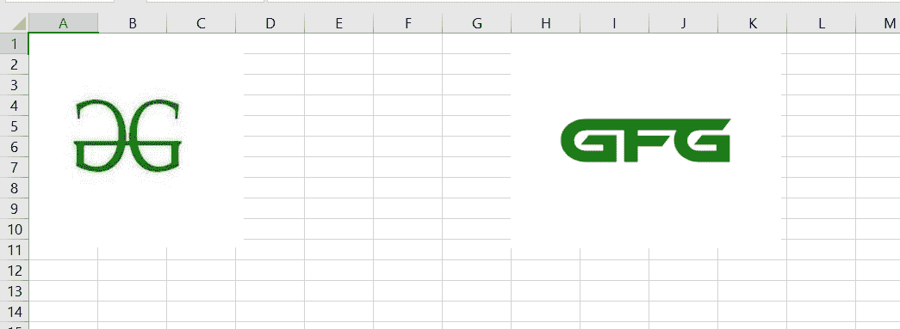
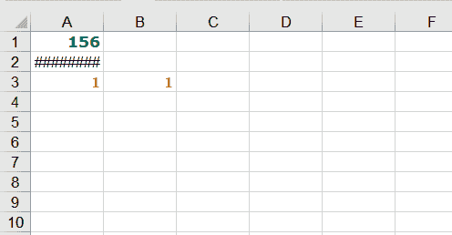
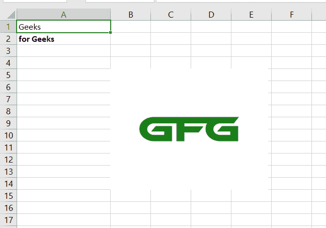

# 面向电子表格用户的 Python

> 原文:[https://www.geeksforgeeks.org/python-for-spreadsheet-users/](https://www.geeksforgeeks.org/python-for-spreadsheet-users/)

Excel 是流行的数据管理电子表格之一。虽然在一个长的 Excel 表格中编写和更新数据很繁琐，但 Python 有助于最大限度地减少这项任务，并有助于轻松创建、读取和编写 Excel 表格。这可以通过各种 Python 库来实现，本文将讨论其中的 3 个库。

## **使用 Openxyl** 库

Openpyxl 是一个用于读写 Excel(扩展名为 xlsx/xlsm/xltx/xltm)文件的 Python 库。openpyxl 模块允许 Python 程序读取和修改 Excel 文件。

### 装置

在终端中运行以下命令来安装该模块。

> pip 安装 openpyxl

### **创建或编写工作簿**

我们在代码编辑器中编写代码并保存代码。

## 蟒蛇 3

```
# import modules
from openpyxl import Workbook
import datetime

wb = Workbook()

ws = wb.active

# assign sheet
ws['A1'] = 75

# add data
ws.append([1, 2, 3])
ws.append([4, 5, 6])
ws.append([8, 10, 12])

ws['A2'] = datetime.datetime.now()

# save spreadsheet
wb.save("test.xlsx")
```

**输出:**


**说明:**

我们首先导入库，然后给电子表格一个工作簿实例。之后，我们分配对应于列 a 的随机值。这里，我们在 A1 和 A2 中追加了。我们也可以覆盖原始值，因为 A1 中的 1 和 A2 中的 4 已被覆盖为各自的日期和时间。最后，我们保存工作表，在那里它被保存为“测试”。

### **阅读练习册**

我们也可以从下面的程序中读取工作簿

## 蟒蛇 3

```
# import modules
from openpyxl import load_workbook
from openpyxl import Workbook

# load spreadsheet
wb = load_workbook(filename = 'test.xlsx')
```

这将打开我们之前打开的同一文件。

### **在工作簿中插入图像**

我们还可以在 Excel 工作表中插入一些图像，如下面的代码所示

## 蟒蛇 3

```
# import modules
from openpyxl import Workbook
from openpyxl import Workbook
from openpyxl.drawing.image import Image
Spreadsheet = Workbook()

worksheet = Spreadsheet.active
wb = Workbook()
ws = wb.active

# assign title
ws['A1'] = 'Two logos demonstrated'

# create an image
img = Image('gfg.png')
img2=Image('gfg2.png')

# add image
ws.add_image(img, 'A1')
ws.add_image(img2, 'H1')
wb.save('logo.xlsx')
```

**输出:**



**说明:**

我们必须下载枕头库进行依赖，并导入子库，如图所示。我们现在下载两个我们喜欢的图片，给他们指定的行，然后我们插入我们的图片！

## **使用 XLWT 库**

这是一个库，供开发人员用来生成与 Microsoft Excel 到 2003 版本兼容的电子表格文件。包本身是纯 Python，不依赖于标准 Python 发行版之外的模块或包。

我们可以将值加粗、着色、斜体等。此外，字体大小可以控制。

### **安装**

通过以下命令安装 python 包

> pip3 安装 xlwt
> 
> 运筹学
> 
> pip install xlwt

### **创建工作簿**

下面给出了一个代码，它给出了探索值的格式，这是在

## 蟒蛇 3

```
# import module
import xlwt
from datetime import datetime

# assign attributes
style0 = xlwt.easyxf('font: name Verdana, color-index green, bold on',)
style1 = xlwt.easyxf(num_format_str='D-MMM-YY')
style2 = xlwt.easyxf(
    'font: name Times New Roman, color-index orange, bold on',)

wb = xlwt.Workbook()
ws = wb.add_sheet('A Test Sheet')

# add data
ws.write(0, 0, 156, style0)
ws.write(1, 0, datetime.now(), style1)
ws.write(2, 0, 1, style2)
ws.write(2, 1, 1, style2)
ws.write(2, 2, xlwt.Formula("A3+B3"))

# printing results
wb.save('example.xls')
```

**输出:**



**说明:**

我们导入库，然后声明 3 种不同的样式来应用于这些值。Style 1 探索了一个家族和颜色绿色，而第三个是 Times New Roman，颜色是橙色，造型一样大胆。Stye 1 是日期的格式，如果提到的话，它是 D-MM-YY

这一次，我们在各自的行和列中写入值，都以 0 索引开始。因此，ws.write(行、列、值、样式)。这里样式是可选的。

## **使用 Xlsx 编写器**

XlsxWriter 是一个 Python 模块，用于以 Excel 2007+ XLSX 文件格式编写文件。XlsxWriter 可用于将文本、数字、公式和超链接写入多个工作表，并且它支持多种功能这里有一个简单的示例:条件格式。，工作表 PNG/JPEG/BMP/WMF/EMF 图像，丰富的多格式字符串，单元格注释。，与熊猫融合。，文本框。，支持添加宏。

### **安装**

从命令安装下面的库

> pip 安装 XlsxWriter
> 
> 运筹学
> 
> pip3 安装 XlsxWriter

**例**

这是创建 Excel 工作表的另一种方法，并且具有广泛的选项以及所有支持的扩展的图像。让我们看下面的代码示例。

## 蟒蛇 3

```
# import module
import xlsxwriter

# Create an new Excel file and add a 
# worksheet.
workbook = xlsxwriter.Workbook('demo.xlsx')
ws = workbook.add_worksheet()

# Widen the first column to make the 
# text clearer.
ws.set_column('A:A', 20)

# Adding a bold format to use to highlight 
# cells.
style = workbook.add_format({'bold': True})

# add data
ws.write('A1', 'Geeks')
ws.write('A2', 'for Geeks', style)
ws.insert_image('B5', 'logo.png')

workbook.close()
```

**说明:**

我们首先导入上述库，并创建一个工作簿(demo.xlsx)，并从设置一个宽列并给出大小为 20 开始。然后我们声明一个样式名加粗，将样式设置为 true。接下来，我们写“极客”这个词没有风格，但是下一个“极客”这个词被应用到我们给定的风格中。请注意，与前面的示例相比，我们使用 true 而不是 on 和 easyxf 函数来声明样式。与其他两种语法相比，这使得 xlsxWriter 成为可读性最强、用户最方便的语法。

**输出:**

