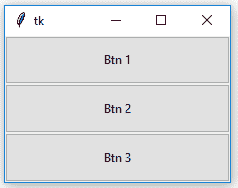
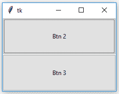
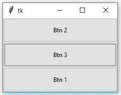
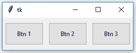
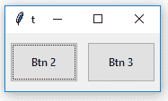
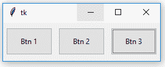

# Tkinter

中的 Python |忘记 _pack()和忘记 _grid()方法

> 原文:[https://www . geesforgeks . org/python-忘带 _ pack-and-忘带 _grid-method-in-tkinter/](https://www.geeksforgeeks.org/python-forget_pack-and-forget_grid-method-in-tkinter/)

如果我们想从屏幕或顶层取消任何部件的映射，那么使用 `**forget()**`方法。遗忘法``forget_pack()`` (类似于`forget()` )和`forget_grid()`两种，分别与`**pack()**`和`**grid()**`法配合使用。

### `forget_pack()`方法–

```py
Syntax: widget.forget_pack()

widget can be any valid widget which is visible.

```

**Code #1:**

```py
# Imports tkinter and ttk module
from tkinter import * 
from tkinter.ttk import *

# toplevel window
root = Tk()

# method to make widget invisible
# or remove from toplevel
def forget(widget):

    # This will remove the widget from toplevel
    # basically widget do not get deleted
    # it just becomes invisible and loses its position
    # and can be retrieve
    widget.forget()

# method to make widget visible
def retrieve(widget):
    widget.pack(fill = BOTH, expand = True)

# Button widgets
b1 = Button(root, text = "Btn 1")
b1.pack(fill = BOTH, expand = True)

# See, in command forget() method is passed
b2 = Button(root, text = "Btn 2", command = lambda : forget(b1))
b2.pack(fill = BOTH, expand = True)

# In command retrieve() method is passed
b3 = Button(root, text = "Btn 3", command = lambda : retrieve(b1))
b3.pack(fill = BOTH, expand = True)

# infinite loop, interrupted by keyboard or mouse
mainloop()
```

**输出:**


忘记
后

检索后


**注意**忘记前后以及取回后按钮 1 的位置差异。

### `forget_grid()`方法–

```py
Syntax: widget.forget_grid()

widget can be any valid widget which is visible.

```

**注:**此方法只能与`**grid()**` 几何方法配合使用。

**代码#2:**

```py
# Imports tkinter and ttk module
from tkinter import *
from tkinter.ttk import *

# toplevel window
root = Tk()

# method to make widget invisible
# or remove from toplevel
def forget(widget):

    # This will remove the widget from toplevel
    # basically widget do not get deleted
    # it just becomes invisible and loses its position
    # and can be retrieve
    widget.grid_forget()

# method to make widget visible
def retrieve(widget):
    widget.grid(row = 0, column = 0, ipady = 10, pady = 10, padx = 5)

# Button widgets
b1 = Button(root, text = "Btn 1")
b1.grid(row = 0, column = 0, ipady = 10, pady = 10, padx = 5)

# See, in command forget() method is passed
b2 = Button(root, text = "Btn 2", command = lambda : forget(b1))
b2.grid(row = 0, column = 1, ipady = 10, pady = 10, padx = 5)

# In command retrieve() method is passed
b3 = Button(root, text = "Btn 3", command = lambda : retrieve(b1))
b3.grid(row = 0, column = 2, ipady = 10, pady = 10, padx = 5)

# infinite loop, interrupted by keyboard or mouse
mainloop()
```

**输出:**


遗忘后


检索后


**注意**在**忘记**和**取回**后，按钮 1 的位置保持不变。用`grid_forget()`方法，检索后可以放在任意网格上，但一般选择原网格。