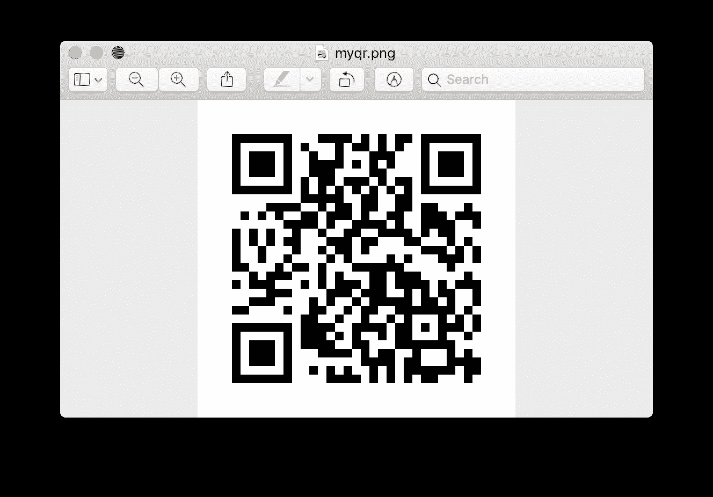

# Python |使用 pyqrcode 模块生成 QR Code】

> 原文:[https://www . geesforgeks . org/python-generate-QR-code-using-pyqr code-module/](https://www.geeksforgeeks.org/python-generate-qr-code-using-pyqrcode-module/)

来看看如何使用`pyqrcode`模块在 Python 中生成二维码。

**`pyqrcode`模块**是一个二维码发生器。该模块自动化了创建二维码的大部分构建过程。本模块试图尽可能遵循二维码标准。`pyqrcode` 中使用的术语和编码直接来自标准。

**安装**

```py
$ pip install pyqrcode

```

安装附加模块 pypng，以 png 格式保存图像:

```py
$ pip install pypng

```

**`pyqrcode.create(content, error='H', version=None, mode=None, encoding=None)` :** 创建二维码时，只需要编码的内容，代码的所有其他属性都会根据给定的内容进行猜测。该函数将返回一个`QRCode` 对象。

可以通过`pyqrcode.create()`功能的可选参数指定所需二维码的所有属性。以下是一些属性:

> **错误:**该参数设置代码的纠错级别。
> **版本:**此参数指定代码的大小和数据容量。
> **模式:**该参数设置内容的编码方式。

下面是代码:

```py
# Import QRCode from pyqrcode
import pyqrcode
import png
from pyqrcode import QRCode

# String which represents the QR code
s = "www.geeksforgeeks.org"

# Generate QR code
url = pyqrcode.create(s)

# Create and save the svg file naming "myqr.svg"
url.svg("myqr.svg", scale = 8)

# Create and save the png file naming "myqr.png"
url.png('myqr.png', scale = 6)
```

**输出:**


