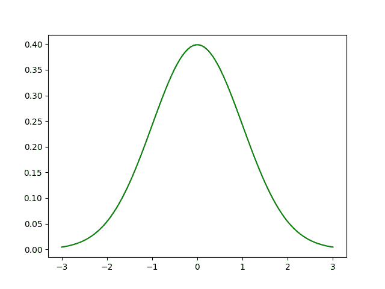
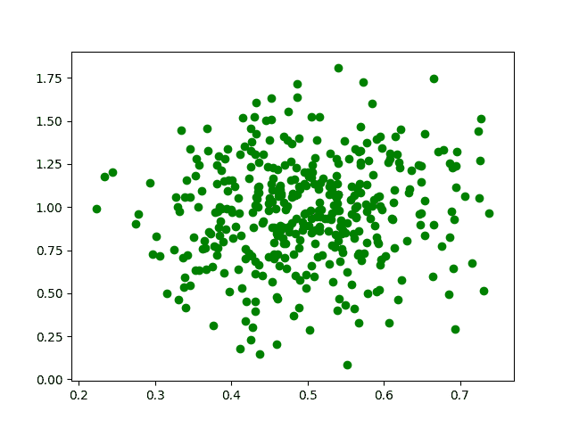
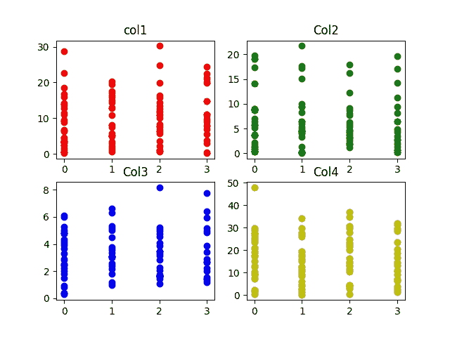

# Python |为机器学习生成测试数据集

> 原文:[https://www . geesforgeks . org/python-生成-测试-数据集-用于机器学习/](https://www.geeksforgeeks.org/python-generate-test-datasets-for-machine-learning/)

每当我们想到机器学习，首先想到的就是数据集。虽然您可以在 Kaggle 等网站上找到许多数据集，但有时自行提取数据并生成自己的数据集会很有用。生成自己的数据集使您能够更好地控制数据，并允许您训练机器学习模型。

在本文中，我们将使用 Python 中的 **Numpy** 库生成随机数据集。

**所需库:**

```py
-> Numpy: pip3 install numpy
-> Pandas: pip3 install pandas
-> Matplotlib: pip3 install matplotlib
```

## 正态分布:

在概率论中，正态或高斯分布是一种非常常见的关于平均值对称的连续概率分布，表明平均值附近的数据比远离平均值的数据出现得更频繁。统计学中使用的正态分布，通常用于表示实值随机变量。
正态分布是统计分析中最常见的分布类型。标准正态分布有两个参数:均值和标准差。平均值是分布的中心趋势。标准偏差是可变性的量度。它定义了正态分布的宽度。标准偏差决定了数值趋向于离平均值多远。它代表观测值和平均值之间的典型距离。它符合许多自然现象，例如，身高、血压、测量误差和智商分数都遵循正态分布。

**正态分布图:**



**例:**

## PYTHON3

```py
# importing libraries
import pandas as pd
import numpy as np
import matplotlib.pyplot as plt

# initialize the parameters for the normal
# distribution, namely mean and std.
# deviation

# defining the mean
mu = 0.5
# defining the standard deviation
sigma = 0.1

# The random module uses the seed value as a base
# to generate a random number. If seed value is not
# present, it takes the system’s current time.
np.random.seed(0)

# define the x co-ordinates
X = np.random.normal(mu, sigma, (395, 1))

# define the y co-ordinates
Y = np.random.normal(mu * 2, sigma * 3, (395, 1))

# plot a graph
plt.scatter(X, Y, color = 'g')
plt.show()
```

**输出:**



让我们看一个更好的例子。
我们将生成一个包含 4 列的数据集。数据集中的每一列都代表一个要素。数据集的第五列是输出标签。它在 0-3 之间变化。该数据集可用于训练分类器，例如逻辑回归分类器、神经网络分类器、支持向量机等。

## PYTHON3

```py
# importing libraries
import numpy as np
import pandas as pd
import math
import random
import matplotlib.pyplot as plt

# defining the columns using normal distribution

# column 1
point1 = abs(np.random.normal(1, 12, 100))
# column 2
point2 = abs(np.random.normal(2, 8, 100))
# column 3
point3 = abs(np.random.normal(3, 2, 100))
# column 4
point4 = abs(np.random.normal(10, 15, 100))

# x contains the features of our dataset
# the points are concatenated horizontally
# using numpy to form a feature vector.
x = np.c_[point1, point2, point3, point4]

# the output labels vary from 0-3
y = [int(np.random.randint(0, 4)) for i in range(100)]

# defining a pandas data frame to save
# the data for later use
data = pd.DataFrame()

# defining the columns of the dataset
data['col1'] = point1
data['col2'] = point2
data['col3'] = point3
data['col4'] = point4

# plotting the various features (x)
# against the labels (y).
plt.subplot(2, 2, 1)
plt.title('col1')
plt.scatter(y, point1, color ='r', label ='col1')

plt.subplot(2, 2, 2)
plt.title('Col2')
plt.scatter(y, point2, color = 'g', label ='col2')

plt.subplot(2, 2, 3)
plt.title('Col3')
plt.scatter(y, point3, color ='b', label ='col3')

plt.subplot(2, 2, 4)
plt.title('Col4')
plt.scatter(y, point4, color ='y', label ='col4')

# saving the graph
plt.savefig('data_visualization.jpg')       

# displaying the graph
plt.show()
```

**输出:**

