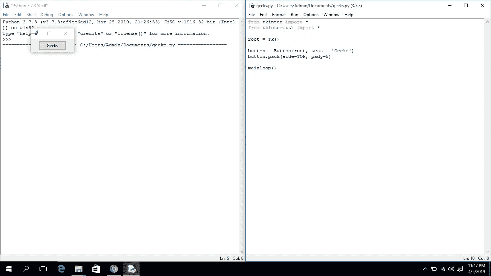
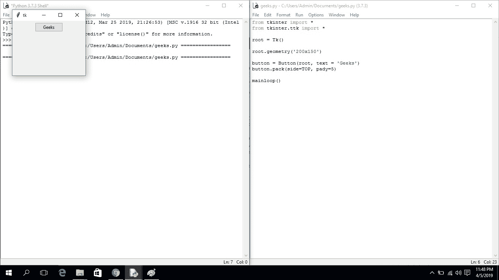
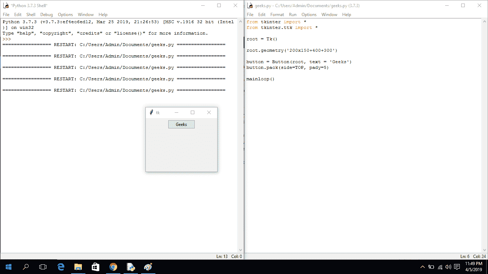

# Python | Tkinter 中的几何方法

> 原文:[https://www . geesforgeks . org/python-geometry-method-in-tkinter/](https://www.geeksforgeeks.org/python-geometry-method-in-tkinter/)

[Tkinter](https://www.geeksforgeeks.org/python-gui-tkinter/) 是一个 Python 模块，用于开发 GUI(图形用户界面)应用程序。它与 Python 一起提供，所以您不必使用 **pip** 命令来安装它。

Tkinter 提供了很多方法；其中之一就是**几何()**法。该方法用于设置 [Tkinter](https://www.geeksforgeeks.org/python-gui-tkinter/) 窗口的尺寸，并用于设置主窗口在用户桌面上的位置。

**代码#1:** 不使用**几何**方法的 Tkinter 窗口。

## 蟒蛇 3

```py
# importing only those functions which are needed
from tkinter import Tk, mainloop, TOP
from tkinter.ttk import Button

# creating tkinter window
root = Tk()

# Create Button and add some text
button = Button(root, text = 'Geeks')
# pady is used for giving some padding in y direction
button.pack(side = TOP, pady = 5)

# Execute Tkinter
root.mainloop()
```

**输出:**



只要运行应用程序，您就会看到 Tkinter 窗口的位置在屏幕的西北位置，窗口的大小也很小，如输出所示。

**代码#2:**

## 蟒蛇 3

```py
# importing only those functions which
# are needed
from tkinter import Tk, mainloop, TOP
from tkinter.ttk import Button

# creating tkinter window
root = Tk()

# creating fixed geometry of the
# tkinter window with dimensions 150x200
root.geometry('200x150')

# Create Button and add some text
button = Button(root, text = 'Geeks')
button.pack(side = TOP, pady = 5)

# Execute Tkinter
root.mainloop()
```

**输出:**



运行应用程序后，您会看到 Tkinter 窗口的大小发生了变化，但屏幕上的位置是相同的。

**代码#3:**

## 蟒蛇 3

```py
# importing only those functions which
# are needed
from tkinter import Tk, mainloop, TOP
from tkinter.ttk import Button

# creating tkinter window
root = Tk()

# creating fixed geometry of the
# tkinter window with dimensions 150x200
root.geometry('200x150 + 400 + 300')

# Create Button and add some text
button = Button(root, text = 'Geeks')
button.pack(side = TOP, pady = 5)

# Execute Tkinter
root.mainloop()
```

**输出:**



运行应用程序时，您会发现位置和大小都发生了变化。现在，Tkinter 窗口出现在不同的位置(在 Y 轴上移动 300，在 X 轴上移动 400)。
**注:**我们也可以在几何方法中传递一个变量自变量，但应该是 **(variable1) x (variable2)** 的形式；否则，它将引发错误。