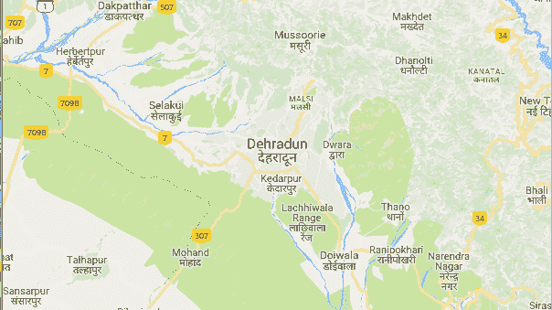

# Python |使用谷歌静态地图 API

获取指定位置的谷歌地图图像

> 原文:[https://www . geesforgeks . org/python-get-Google-map-image-specified-location-use-Google-static-maps-API/](https://www.geeksforgeeks.org/python-get-google-map-image-specified-location-using-google-static-maps-api/)

**谷歌静态地图 API** 让用户在网页上嵌入谷歌地图图像，无需 JavaScript 或任何动态页面加载。谷歌静态地图应用编程接口服务根据通过标准 HTTP 请求发送的网址参数创建地图，并将地图作为图像返回，以便在网页上显示。

要使用这个服务，必须需要一个应用编程接口密钥，从[这里](https://developers.google.com/maps/documentation/static-maps/intro)获取。

**注意:**一个需要在谷歌上创建计费账户的人，那么只能使用谷歌 API。

**所需模块:**

```py
import requests
```

下面是实现:

```py
# Python program to get a google map 
# image of specified location using 
# Google Static Maps API

# importing required modules
import requests

# Enter your api key here
api_key = "_your_api_key_"

# url variable store url
url = "https://maps.googleapis.com/maps/api/staticmap?"

# center defines the center of the map,
# equidistant from all edges of the map. 
center = "Dehradun"

# zoom defines the zoom
# level of the map
zoom = 10

# get method of requests module
# return response object
r = requests.get(url + "center =" + center + "&zoom =" +
                   str(zoom) + "&size = 400x400&key =" +
                             api_key + "sensor = false")

# wb mode is stand for write binary mode
f = open('address of the file location ', 'wb')

# r.content gives content,
# in this case gives image
f.write(r.content)

# close method of file object
# save and close the file
f.close()
```

**输出:**


**注意:**为了检查 API 密钥是否正常工作，将`r.content`存储在`.txt`文件中，而不是保存为`.png` 文件。如果应用编程接口密钥无效，应用编程接口将返回此错误消息，而不是图像“谷歌地图应用编程接口服务器拒绝了您的请求。提供的应用编程接口密钥无效”。

以下列表显示了在每个缩放级别可以看到的大致细节级别:

```py
1 : World
5 : Landmass/continent
10 : City
15 : Streets
20 : Buildings

```