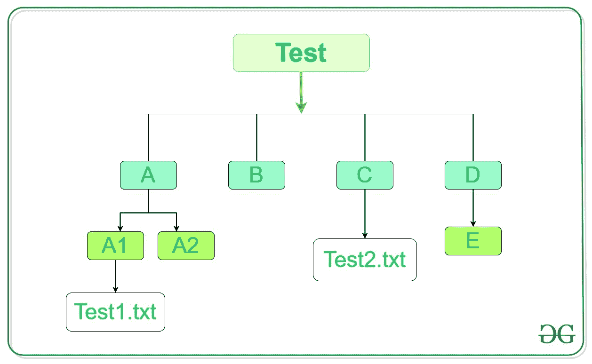

# Python:获取所有空目录列表

> 原文:[https://www . geesforgeks . org/python-get-list-all-empty-directory/](https://www.geeksforgeeks.org/python-get-list-of-all-empty-directories/)

Python 中的 **[操作系统模块](https://www.geeksforgeeks.org/os-module-python-examples/)** 用于与操作系统交互。该模块附带 Python 的标准实用程序模块，因此无需从外部安装。在文件名和路径无效或不可访问的情况下，或者在其他具有正确类型但不被操作系统接受的参数的情况下，操作系统模块中的所有功能都会引发`OSError` 。

`os.walk()`这个模块的方法可以用来列出所有的空目录。这种方法基本上是在目录树中自顶向下或自底向上生成文件名。对于以目录顶部(包括顶部本身)为根的树中的每个目录，它[产生一个三元组(`dirpath`、`dirnames`、`filenames`)。](https://www.geeksforgeeks.org/python-yield-keyword/)

*   **目录路径:**目录路径的字符串
*   **目录名:**从根目录开始的所有子目录。
*   **文件名:**根目录下的所有文件。

> **语法:** os.walk(顶部，自上而下=真，一个错误=无，跟随链接=假)
> 
> **参数:**
> **top:** 起始目录为 os.walk()。
> **自上而下:**如果该可选参数为真，则从上而下扫描目录，否则从下而上扫描目录。默认情况下，这是真的。
> **onerror:** 它是一个处理可能出现的错误的函数。
> **跟随链接:**如果设置为真，这将访问符号链接所指向的目录。
> 
> **返回类型:**对于以目录顶部为根的树中的每个目录(包括顶部本身)，它生成一个三元组(目录路径、目录名、文件名)。

**示例:**假设目录如下所示–



我们想打印出所有的空目录。由于该方法返回子目录和文件的元组，我们将检查每个元组的大小，如果大小为零，则目录将为空。下面是实现。

```
# Python program to list out
# all the empty directories

import os

# List to store all empty
# directories
empty = []

# Traversing through Test
for root, dirs, files in os.walk('Test'):

    # Checking the size of tuple
    if not len(dirs) and not len(files):

        # Adding the empty directory to
        # list
        empty.append(root)

Print("Empty Directories:")
print(empty)
```

**输出:**

```
Empty Directories:
['Test\\A\\A2', 'Test\\B', 'Test\\D\\E']

```

以上代码可以使用 **[【列表理解】](https://www.geeksforgeeks.org/python-list-comprehension-and-slicing/)** 来缩短，这是一种比较皮通的方式。下面是实现。

```
# Python program to list out
# all the empty directories

import os

# List comprehension to enter
# all empty directories to list

empty = [root for root, dirs, files, in os.walk('Test')
                   if not len(dirs) and not len(files)]

print("Empty Directories:")
print(empty)
```

**输出:**

```
Empty Directories:
['Test\\A\\A2', 'Test\\B', 'Test\\D\\E']

```