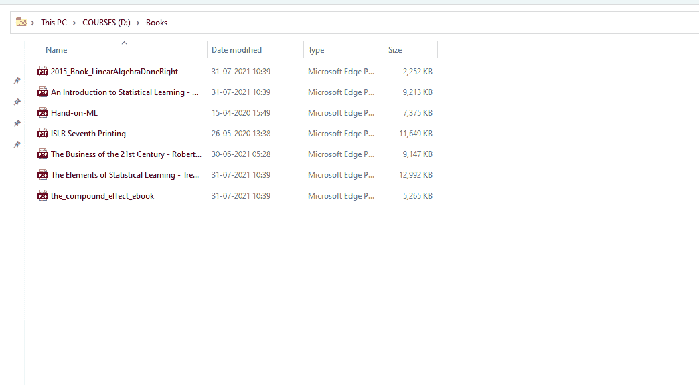

# Python–获取目录中文件的列表，大小为

> 原文:[https://www . geeksforgeeks . org/python-get-带大小的目录中文件列表/](https://www.geeksforgeeks.org/python-get-list-of-files-in-directory-with-size/)

在本文中，我们将看到如何提取目录的文件列表及其大小。为此，我们将使用操作系统模块。

[Python 中的 OS 模块](https://www.geeksforgeeks.org/os-module-python-examples/)提供了与操作系统交互的功能。操作系统属于 Python 的标准实用程序模块。该模块提供了一种使用操作系统相关功能的可移植方式。 [os.path](https://www.geeksforgeeks.org/os-path-module-python/) 模块是 Python 中 os 模块的子模块，用于公共路径名操作。

## **使用的功能**

*   [**Python 中的 os.path.isfile()**](https://www.geeksforgeeks.org/python-os-path-isfile-method/) 方法用于检查指定路径是否为已有常规文件。

> **语法:** os.path.isfile(路径)
> 
> **参数:**
> 
> *   **路径:**表示文件系统路径的类路径对象。类似路径的对象是表示路径的字符串或字节对象。
> 
> **返回类型:**该方法返回 bool 类的布尔值。如果指定的路径是现有的常规文件，此方法返回 True，否则返回 False。

*   [**【OS . path . join()】**](https://www.geeksforgeeks.org/python-os-path-join-method/)方法在 Python 中智能地连接一个或多个路径组件。此方法将各种路径组件串联起来，除了最后一个路径组件之外，每个非空部分后面都有一个目录分隔符(“/”)。如果要连接的最后一个路径组件为空，则在末尾放置一个目录分隔符(“/”)。如果路径组件表示绝对路径，则所有以前连接的组件都将被丢弃，并且从绝对路径组件继续连接。

> **语法:** os.path.join(路径，* path)
> 
> **参数:**
> 
> *   **路径:**表示文件系统路径的类似路径的对象。**T3】**
> *   ***路径:**表示文件系统路径的类似路径的对象。它表示要连接的路径组件。
> *   类似路径的对象是表示路径的字符串或字节对象。
> *   **注意:**python 中函数定义的特殊语法*args(此处为* paths)用于将可变数量的参数传递给
> *   一个函数。
> 
> **返回类型:**该方法返回一个字符串，该字符串表示连接的路径组件。

*   [**OS . listdir():**](https://www.geeksforgeeks.org/python-os-listdir-method/)python 中的这个方法用来获取指定目录下所有文件和目录的列表。如果我们没有指定任何目录，那么将返回当前工作目录中的文件和目录列表。

> **语法:** os.listdir(路径)
> 
> **参数:**
> 
> *   **路径(可选):**目录路径
> 
> **返回类型:**该方法返回指定路径下所有文件和目录的列表。此方法的返回类型是 list。

*   [**filter():**](https://www.geeksforgeeks.org/filter-in-python/)**这个方法借助一个测试序列中每个元素是否为真的函数来过滤给定的序列。**

> ****语法:**过滤器(功能，序列)**
> 
> ****参数:****
> 
> *   ****函数:**测试序列中每个元素是否为真的函数。**
> *   ****序列:**需要过滤的序列，可以是集合、列表、元组，也可以是任意迭代器的容器。**
> 
> ****返回:**返回一个已经过滤的迭代器。**

*   **[**OS . stat()**](https://www.geeksforgeeks.org/python-os-stat-method/)**:**Python 中的这个方法在指定路径上执行 stat()系统调用。此方法用于获取指定路径的状态。**

> ****语法:** os.stat(路径)**
> 
> ****参数:****
> 
> ****路径:**表示有效路径的字符串或字节对象**
> 
> ****返回:** st_size:表示文件的大小，以字节为单位。**

*   **[**【OS . walk()】**](https://www.geeksforgeeks.org/os-walk-python/)**:**此通过自上而下或自下而上遍历目录树来生成目录树中的文件名。对于树中以目录顶部(包括顶部本身)为根的每个目录，它产生一个三元组(目录路径、目录名、文件名)。**

## **具有大小的目录中的文件列表**

**在这部分代码中，我们将只获得文件名称和大小的列表。在这段代码中，我们使用 os.stat()函数来获取每个文件的大小，该大小将导致“byte”，因此为了更好地理解，我们必须将文件的大小从 1024*1024 除以以“MB”为单位的大小。**

### **使用的目录**

****

## **蟒蛇 3**

```py
# import python modules
import os

# directory name from which
# we are going to extract our files with its size
path = "D:\Books"

# Get list of all files only in the given directory
fun = lambda x : os.path.isfile(os.path.join(path,x))
files_list = filter(fun, os.listdir(path))

# Create a list of files in directory along with the size
size_of_file = [
    (f,os.stat(os.path.join(path, f)).st_size)
    for f in files_list
]
# Iterate over list of files along with size
# and print them one by one.
for f,s in size_of_file:
    print("{} : {}mb".format(f, round(s/(1024*1024),3)))
```