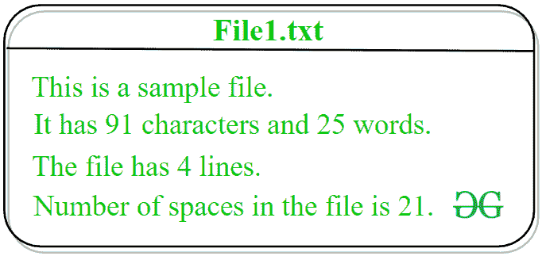

# Python–获取文件中的字符、单词、空格和行数

> 原文:[https://www . geesforgeks . org/python-get-字符数-单词-空格-文件中的行/](https://www.geeksforgeeks.org/python-get-number-of-characters-words-spaces-and-lines-in-a-file/)

**先决条件:**[Python 中的文件处理](https://www.geeksforgeeks.org/file-handling-python/)

给定一个文本文件 *fname* ，任务是统计文件中字符、单词、空格和行的总数。

正如我们所知，Python 提供了多个用于处理文件的内置特性和模块。让我们讨论使用 Python 计算文件中字符、单词、空格和行数的不同方法。



**Method #1: Naive approach**In this approach, the idea is to solve the task by developing our own logic. Without using any built-in function of Python, the total number of characters, words, spaces and lines of the file will be calculated.

下面是上述方法的实现。

```
# Python implementation to compute
# number of characters, words, spaces
# and lines in a file

# Function to count number 
# of characters, words, spaces 
# and lines in a file
def counter(fname):

    # variable to store total word count
    num_words = 0

    # variable to store total line count
    num_lines = 0

    # variable to store total character count
    num_charc = 0

    # variable to store total space count
    num_spaces = 0

    # opening file using with() method
    # so that file gets closed 
    # after completion of work
    with open(fname, 'r') as f:

        # loop to iterate file
        # line by line
        for line in f:

            # incrementing value of 
            # num_lines with each 
            # iteration of loop to
            # store total line count 
            num_lines += 1

            # declaring a variable word
            # and assigning its value as Y
            # because every file is 
            # supposed to start with 
            # a word or a character
            word = 'Y'

            # loop to iterate every
            # line letter by letter
            for letter in line:

                # condition to check 
                # that the encountered character
                # is not white space and a word
                if (letter != ' ' and word == 'Y'):

                    # incrementing the word
                    # count by 1
                    num_words += 1

                    # assigning value N to 
                    # variable word because until
                    # space will not encounter
                    # a word can not be completed
                    word = 'N'

                # condition to check 
                # that the encountered character
                # is a white space
                elif (letter == ' '):

                    # incrementing the space
                    # count by 1
                    num_spaces += 1

                    # assigning value Y to
                    # variable word because after
                    # white space a word
                    # is supposed to occur
                    word = 'Y'

                # loop to iterate every 
                # letter character by 
                # character
                for i in letter:

                    # condition to check 
                    # that the encountered character 
                    # is not  white space and not
                    # a newline character
                    if(i !=" " and i !="\n"):

                        # incrementing character
                        # count by 1
                        num_charc += 1

    # printing total word count 
    print("Number of words in text file: ", num_words)

    # printing total line count
    print("Number of lines in text file: ", num_lines)

    # printing total character count
    print('Number of characters in text file: ', num_charc)

    # printing total space count
    print('Number of spaces in text file: ', num_spaces)

# Driver Code: 
if __name__ == '__main__': 
    fname = 'File1.txt'
    try: 
        counter(fname) 
    except: 
        print('File not found')
```

**输出:**

```
Number of words in text file:  25
Number of lines in text file:  4
Number of characters in text file:  91
Number of spaces in text file:  21

```

**方法 2:使用一些内置功能和 OS 模块功能**
在这种做法中，思路是使用 OS 模块的`os.linesep()`方法来分离当前平台上的线路。当翻译的扫描仪遇到`os.linesep`时，它会用`\n`字符替换它。之后将使用`strip()`和`split()`功能执行任务。
了解更多`[strip()](https://www.geeksforgeeks.org/python-string-strip/)`和`[split()](https://www.geeksforgeeks.org/python-string-split/)`功能。

下面是上述方法的实现。

```
# Python implementation to compute
# number of characters, words, spaces
# and lines in a file

# importing os module
import os

# Function to count number 
# of characters, words, spaces 
# and lines in a file
def counter(fname):

    # variable to store total word count
    num_words = 0

    # variable to store total line count
    num_lines = 0

    # variable to store total character count
    num_charc = 0

    # variable to store total space count
    num_spaces = 0

    # opening file using with() method
    # so that file gets closed 
    # after completion of work
    with open(fname, 'r') as f:

        # loop to iterate file
        # line by line
        for line in f:

            # separating a line 
            # from \n character 
            # and storing again in line 
            # variable for further operations
            line = line.strip(os.linesep)

            # splitting the line 
            # to make a list of
            # all the words present
            # in that line and storing
            # that list in
            # wordlist variable
            wordslist = line.split()

            # incrementing value of 
            # num_lines with each 
            # iteration of loop to
            # store total line count
            num_lines = num_lines + 1

            # incrementing value of 
            # num_words by the 
            # number of items in the
            # list wordlist
            num_words = num_words + len(wordslist)

            # incrementing value of 
            # num_charc by 1 whenever
            # value of variable c is other 
            # than white space in the separated line
            num_charc = num_charc + sum(1 for c in line 
                          if c not in (os.linesep, ' '))

            # incrementing value of 
            # num_spaces by 1 whenever
            # value of variable s is 
            # white space in the separated line
            num_spaces = num_spaces + sum(1 for s in line 
                                if s in (os.linesep, ' '))

    # printing total word count
    print("Number of words in text file: ", num_words)

    # printing total line count
    print("Number of lines in text file: ", num_lines)

    # printing total character count
    print("Number of characters in text file: ", num_charc)

    # printing total space count
    print("Number of spaces in text file: ", num_spaces)

# Driver Code: 
if __name__ == '__main__': 
    fname = 'File1.txt'
    try: 
        counter(fname) 
    except: 
        print('File not found')
```

**输出:**

```
Number of words in text file:  25
Number of lines in text file:  4
Number of characters in text file:  91
Number of spaces in text file:  21

```