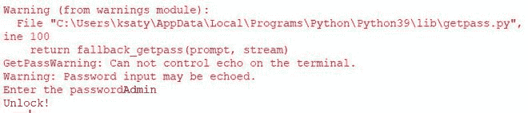
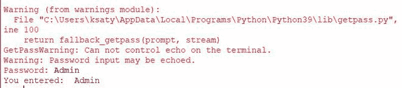
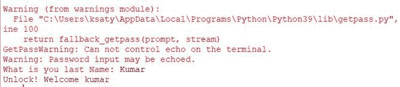
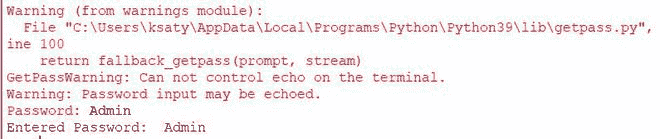
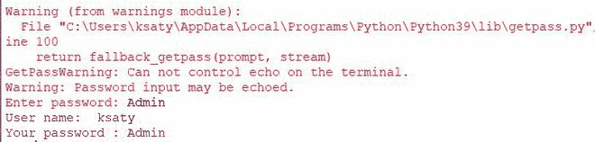

# Python getpass 模块

> 原文:[https://www.geeksforgeeks.org/python-getpass-module/](https://www.geeksforgeeks.org/python-getpass-module/)

当我们使用基于终端的应用程序，在执行应用程序之前使用密码的一些安全凭证时，它将使用 Python Getpass 模块来完成。在本文中，我们将看到如何使用 Getpass 模块。

**Getpass 模块提供两个功能:**

*   getpass.getpass()
*   getpass.getuser（）

## getpass()

在许多程序中，我们需要一个安全的数据或程序，在这种情况下，我们使用一些密钥或密码来识别用户。使用 getpass()可以在 python 程序中接受密码。

## 蟒蛇 3

```
import getpass

pwd = getpass.getpass(prompt = 'Enter the password')
if pwd == 'Admin':
    print('Unlock!')
else:
    print('You entered wrong password')
```

**输出:**



**我们来了解一下这个模块的一些例子:**

### 不带提示的 getpass:

在本例中，我们将看到如何从用户那里获取密码，并在没有提示的情况下返回相同的密码。

## 蟒蛇 3

```
import getpass

pwd = getpass.getpass()
print("You entered: ", pwd)
```

**输出:**



### 带提示的 getpass:

如果用户在登录前想要一些信息，比如安全问题，那么我们将在 getpass 中使用**提示**属性。

## 蟒蛇 3

```
import getpass

pwd = getpass.getpass(prompt = 'What is you last Name: ')
if pwd == 'Kumar':
    print('Unlock! Welcome kumar')
else:
    print('You entered wrong Name')
```

**输出:**



### 与其他流一起 getpass:

该功能允许我们流式传输用户输入的密码。

## 蟒蛇 3

```
import getpass
import sys

pwd = getpass.getpass(stream = sys.stderr)
print('Entered Password: ', pwd)
```

**输出:**



## getused（）

该功能返回用户的系统登录名。它会检查您计算机的环境变量，获取用户名并以字符串形式返回，如果找不到环境变量，则会引发异常。

**例 1:**

这里我们将使用 getuser()获取我们计算机的用户名。

## 蟒蛇 3

```
import getpass

print(getpass.getuser())
```

**输出:**


**例 2:**

在这里，我们将使用 getuser()和 getpass()获取用户名和密码。

## 蟒蛇 3

```
import getpass

user_name = getpass.getuser()
pass_word = getpass.getpass("Enter password: ")

print("User name: ", user_name)
print("Your password :", pass_word)
```

**输出:**

