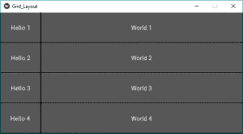
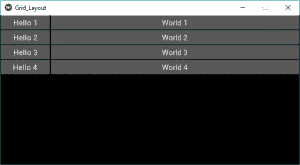

# Python |不带的 Kivy 中的网格布局。kv 文件

> 原文:[https://www . geesforgeks . org/python-grid-layout-in-kivy-不带-kv-file/](https://www.geeksforgeeks.org/python-grid-layout-in-kivy-without-kv-file/)

Kivy 是一个独立的平台，因为它可以在安卓、IOS、linux 和视窗等平台上运行。Kivy 为您提供了一次性编写代码并在不同平台上运行的功能。它基本上是用来开发安卓应用程序的，但并不意味着它不能在桌面应用程序上使用。

> ？？？？？？？？ [Kivy 教程–通过示例学习 Kivy](https://www.geeksforgeeks.org/kivy-tutorial/)。

### 网格布局:

*   小部件必须放在特定的列/行中。每个子对象都被自动分配一个位置，该位置由布局配置和子对象在子对象列表中的索引决定。
*   网格布局必须始终包含以下任何一个输入约束:
    网格布局列或网格布局行。如果不指定列或行，布局将引发异常。
*   网格布局在矩阵中排列子级。它占据了可用的空间，并将其划分为行和列，然后向生成的“单元格”中添加小部件。
*   行和列就像我们在矩阵中观察到的一样，这里我们可以调整每个网格的大小。
*   初始大小由 col_default_width 和 row_default_height 属性给出。我们可以通过设置 col_force_default 或 row_force_default 属性来强制默认大小。这将强制布局忽略子级的宽度和大小提示属性，并使用默认大小。

要使用网格布局，我们需要做的第一件事就是导入它。

```py
from kivy.uix.gridlayout import GridLayout 
```

**创建网格布局的基本方法:**

```py
1) import kivy
2) import kivyApp
3) import button
4) import Gridlayout
5) Set minimum version(optional)
6) create App class:
          - define build function
              : add widget (Buttons)
7) return Layout/widget/Class(according to requirement)
8) Run an instance of the class
```

**实现方法–**
**代码#1:**
在下面的示例中，所有小部件都将具有相同的大小。默认情况下，size_hint 为(1，1)，因此 Widget 将采用父代的完整大小:

## 蟒蛇 3

```py
# Sample Python application demonstrating 
# How to create GridLayout in Kivy

# import kivy module
import kivy

# base Class of your App inherits from the App class.  
# app:always refers to the instance of your application  
from kivy.app import App

# creates the button in kivy 
# if not imported shows the error 
from kivy.uix.button import Button

# The GridLayout arranges children in a matrix.
# It takes the available space and
# divides it into columns and rows,
# then adds widgets to the resulting “cells”.
from kivy.uix.gridlayout import GridLayout

# creating the App class
class Grid_LayoutApp(App):

    # to build the application we have to
    # return a widget on the build() function.
    def build(self):

        # adding GridLayouts in App
        # Defining number of column
        # You can use row as well depends on need
        layout = GridLayout(cols = 2)

        # 1st row
        layout.add_widget(Button(text ='Hello 1'))
        layout.add_widget(Button(text ='World 1'))

        # 2nd row
        layout.add_widget(Button(text ='Hello 2'))
        layout.add_widget(Button(text ='World 2'))

        # 3rd row
        layout.add_widget(Button(text ='Hello 3'))
        layout.add_widget(Button(text ='World 3'))

        # 4th row
        layout.add_widget(Button(text ='Hello 4'))
        layout.add_widget(Button(text ='World 4'))

        # returning the layout
        return layout

# creating object of the App class
root = Grid_LayoutApp()
# run the App
root.run()
```

**输出:**


现在只需用代码#2 和代码#3 更改上面代码中的类代码，除此之外，所有代码都将与代码#1 相同，并在更改后运行代码，您将获得以下结果。
**代码#2:**
现在，让我们将 Hello 按钮的大小固定为 100px，而不是使用 size_hint_x=1:

## 蟒蛇 3

```py
# creating the App class
class Grid_LayoutApp(App):

    # to build the application we have to
    # return a widget on the build() function.
    def build(self):

        # adding GridLayouts in App
        # Defining number of column
        # You can use row as well depends on need
        layout = GridLayout(cols = 2)

        # 1st row
        layout.add_widget(Button(text ='Hello 1', size_hint_x = None, width = 100))
        layout.add_widget(Button(text ='World 1'))

        # 2nd row
        layout.add_widget(Button(text ='Hello 2', size_hint_x = None, width = 100))
        layout.add_widget(Button(text ='World 2'))

        # 3rd row
        layout.add_widget(Button(text ='Hello 3', size_hint_x = None, width = 100))
        layout.add_widget(Button(text ='World 3'))

        # 4th row
        layout.add_widget(Button(text ='Hello 4', size_hint_x = None, width = 100))
        layout.add_widget(Button(text ='World 4'))

        # returning the layout
        return layout
```

**输出:**



**代码#3:**
现在，让我们将行高固定为特定大小:

## 蟒蛇 3

```py
# creating the App class
class Grid_LayoutApp(App):

    # to build the application we have to
    # return a widget on the build() function.
    def build(self):

        # adding GridLayouts in App
        # Defining number of column and size of the buttons i.e height
        layout = GridLayout(cols = 2, row_force_default = True,
                            row_default_height = 30)

        # 1st row
        layout.add_widget(Button(text ='Hello 1', size_hint_x = None, width = 100))
        layout.add_widget(Button(text ='World 1'))

        # 2nd row
        layout.add_widget(Button(text ='Hello 2', size_hint_x = None, width = 100))
        layout.add_widget(Button(text ='World 2'))

        # 3rd row
        layout.add_widget(Button(text ='Hello 3', size_hint_x = None, width = 100))
        layout.add_widget(Button(text ='World 3'))

        # 4th row
        layout.add_widget(Button(text ='Hello 4', size_hint_x = None, width = 100))
        layout.add_widget(Button(text ='World 4'))

        # returning the layout
        return layout
```

**输出:**



**参考资料:**[https://kivy . org/doc/stability/API-kivy . uix . grid layout . html](https://kivy.org/doc/stable/api-kivy.uix.gridlayout.html)