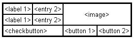
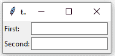
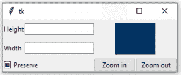

# Tkinter 中的 Python | grid()方法

> 原文:[https://www . geesforgeks . org/python-grid-method-in-tkinter/](https://www.geeksforgeeks.org/python-grid-method-in-tkinter/)

**网格**几何管理器将小部件放在二维表格中。主小部件被分成许多行和列，结果表中的每个“单元格”可以容纳一个小部件。
**格子**经理是[Tkit](https://www.geeksforgeeks.org/python-gui-tkinter/)中最灵活的几何经理。如果你不想学习如何以及何时使用这三个经理，你至少应该确保学习这一个。

考虑以下示例–


使用 **pack** 管理器创建这个布局是可能的，但是它需要大量额外的框架小部件，并且需要大量的工作来使事情看起来更好。如果改为使用网格管理器，每个小部件只需要一次调用就可以让一切都布局好。

使用**网格**管理器很容易。只需创建小部件，并使用**网格**方法告诉管理人员将它们放置在哪个行和列中。您不必事先指定网格的大小；管理器会根据其中的小部件自动确定这一点。

**代码#1:**

```py
# import tkinter module
from tkinter import * from tkinter.ttk import *

# creating main tkinter window/toplevel
master = Tk()

# this wil create a label widget
l1 = Label(master, text = "First:")
l2 = Label(master, text = "Second:")

# grid method to arrange labels in respective
# rows and columns as specified
l1.grid(row = 0, column = 0, sticky = W, pady = 2)
l2.grid(row = 1, column = 0, sticky = W, pady = 2)

# entry widgets, used to take entry from user
e1 = Entry(master)
e2 = Entry(master)

# this will arrange entry widgets
e1.grid(row = 0, column = 1, pady = 2)
e2.grid(row = 1, column = 1, pady = 2)

# infinite loop which can be terminated by keyboard
# or mouse interrupt
mainloop()
```

**输出:**


**代码#2:** 创建如上图所示的布局。

```py
# import tkinter module
from tkinter import * from tkinter.ttk import *

# creating main tkinter window/toplevel
master = Tk()

# this will create a label widget
l1 = Label(master, text = "Height")
l2 = Label(master, text = "Width")

# grid method to arrange labels in respective
# rows and columns as specified
l1.grid(row = 0, column = 0, sticky = W, pady = 2)
l2.grid(row = 1, column = 0, sticky = W, pady = 2)

# entry widgets, used to take entry from user
e1 = Entry(master)
e2 = Entry(master)

# this will arrange entry widgets
e1.grid(row = 0, column = 1, pady = 2)
e2.grid(row = 1, column = 1, pady = 2)

# checkbutton widget
c1 = Checkbutton(master, text = "Preserve")
c1.grid(row = 2, column = 0, sticky = W, columnspan = 2)

# adding image (remember image should be PNG and not JPG)
img = PhotoImage(file = r"C:\Users\Admin\Pictures\capture1.png")
img1 = img.subsample(2, 2)

# setting image with the help of label
Label(master, image = img1).grid(row = 0, column = 2,
       columnspan = 2, rowspan = 2, padx = 5, pady = 5)

# button widget
b1 = Button(master, text = "Zoom in")
b2 = Button(master, text = "Zoom out")

# arranging button widgets
b1.grid(row = 2, column = 2, sticky = E)
b2.grid(row = 2, column = 3, sticky = E)

# infinite loop which can be terminated 
# by keyboard or mouse interrupt
mainloop()
```

**输出:**


**警告:**不要将**格()**和**包()**混在同一个主窗口。