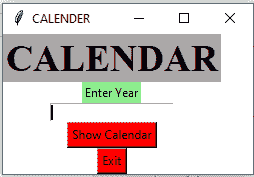
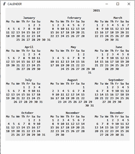

# Python |使用 Tkinter 的 GUI 日历

> 原文:[https://www . geesforgeks . org/python-GUI-calendar-using-tkinter/](https://www.geeksforgeeks.org/python-gui-calendar-using-tkinter/)

**先决条件:** [简介](https://www.geeksforgeeks.org/python-gui-tkinter/) Tkinter

Python 为开发图形用户界面提供了多种选择。在所有的 GUI 方法中，Tkinter 是最常用的方法。Python 搭配 Tkinter 输出了创建 GUI 应用程序最快最简单的方法。在本文中，我们将学习如何使用 Tkinter 创建一个 GUI Calendar 应用程序，并提供一步一步的指导。

**创建** Tkinter **:**

*   导入模块–Tkit
*   创建主窗口(容器)
*   向主窗口添加任意数量的小部件。
*   在小部件上应用事件触发器。

图形用户界面如下所示:

 

让我们创建一个基于图形用户界面的日历应用程序，它可以显示用户给定年份的日历。

**下面是实现:**

## 蟒蛇 3

```py
# import all methods and classes from the tkinter  
from tkinter import *

# import calendar module
import calendar

# Function for showing the calendar of the given year
def showCal() :

    # Create a GUI window
    new_gui = Tk()

    # Set the background colour of GUI window
    new_gui.config(background = "white")

    # set the name of tkinter GUI window
    new_gui.title("CALENDAR")

    # Set the configuration of GUI window
    new_gui.geometry("550x600")

    # get method returns current text as string
    fetch_year = int(year_field.get())

    # calendar method of calendar module return
    # the calendar of the given year .
    cal_content = calendar.calendar(fetch_year)

    # Create a label for showing the content of the calendar
    cal_year = Label(new_gui, text = cal_content, font = "Consolas 10 bold")

    # grid method is used for placing
    # the widgets at respective positions
    # in table like structure.
    cal_year.grid(row = 5, column = 1, padx = 20)

    # start the GUI
    new_gui.mainloop()

# Driver Code
if __name__ == "__main__" :

    # Create a GUI window
    gui = Tk()

    # Set the background colour of GUI window
    gui.config(background = "white")

    # set the name of tkinter GUI window
    gui.title("CALENDAR")

    # Set the configuration of GUI window
    gui.geometry("250x140")

    # Create a CALENDAR : label with specified font and size
    cal = Label(gui, text = "CALENDAR", bg = "dark gray",
                            font = ("times", 28, 'bold'))

    # Create a Enter Year : label
    year = Label(gui, text = "Enter Year", bg = "light green")

    # Create a text entry box for filling or typing the information. 
    year_field = Entry(gui)

    # Create a Show Calendar Button and attached to showCal function
    Show = Button(gui, text = "Show Calendar", fg = "Black",
                              bg = "Red", command = showCal)

    # Create a Exit Button and attached to exit function
    Exit = Button(gui, text = "Exit", fg = "Black", bg = "Red", command = exit)

    # grid method is used for placing
    # the widgets at respective positions
    # in table like structure.
    cal.grid(row = 1, column = 1)

    year.grid(row = 2, column = 1)

    year_field.grid(row = 3, column = 1)

    Show.grid(row = 4, column = 1)

    Exit.grid(row = 6, column = 1)

    # start the GUI
    gui.mainloop()

```

**输出:**

<video class="wp-video-shortcode" id="video-377558-1" width="640" height="360" preload="metadata" controls=""><source type="video/mp4" src="https://media.geeksforgeeks.org/wp-content/uploads/20210116124132/FreeOnlineScreenRecorderProject2.mp4?_=1">[https://media.geeksforgeeks.org/wp-content/uploads/20210116124132/FreeOnlineScreenRecorderProject2.mp4](https://media.geeksforgeeks.org/wp-content/uploads/20210116124132/FreeOnlineScreenRecorderProject2.mp4)</video>