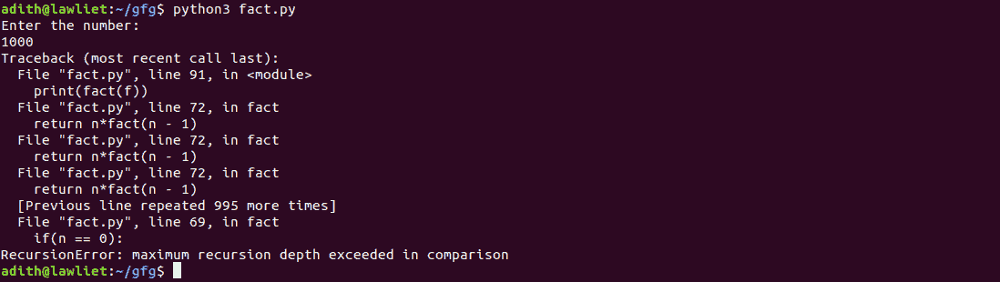
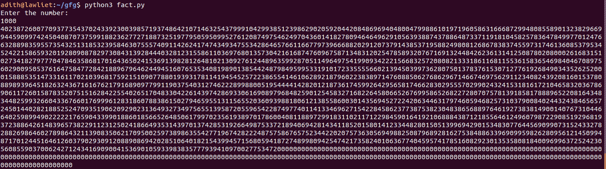

# Python |处理递归限制

> 原文:[https://www . geesforgeks . org/python-处理-递归-限制/](https://www.geeksforgeeks.org/python-handling-recursion-limit/)

当您在大型输入(> 10^4)上执行 Python 中的递归函数时，您可能会遇到“最大递归深度超出错误”。这是执行 DFS、阶乘等算法时常见的错误。大量投入。当您试图在各种测试用例上运行递归算法时，这在多个平台上的竞争性编程中也很常见。
在本文中，我们将了解为什么会出现这个错误，以及如何在 Python 中处理它。为了理解这一点，我们需要首先看看尾部递归。
[**尾部递归**](https://www.geeksforgeeks.org/tail-recursion/)**–**
在典型的递归函数中，我们通常先进行递归调用，然后取递归调用的返回值来计算结果。因此，我们只有在所有的递归调用都返回了一些值之后才能得到最终的结果。但是在尾部递归函数中，首先执行各种计算和语句，然后对函数进行递归调用。通过这样做，我们将当前步骤的结果传递给函数的下一个递归调用。因此，Tail 递归函数中的最后一条语句是对该函数的递归调用。
这意味着当我们对函数执行下一次递归调用时，不再需要当前堆栈帧(被当前函数调用占用)。这允许我们优化代码。我们只需在下一个递归步骤中重用当前的堆栈框架，并对所有其他函数调用重复这个过程。
使用常规递归，每个递归调用将另一个条目推送到调用堆栈上。当函数返回时，它们会从堆栈中弹出。在尾部递归的情况下，我们可以优化它，以便只有一个堆栈条目用于函数的所有递归调用。这意味着即使在大的输入上，也不会有堆栈溢出。这被称为尾部递归优化。
lisp 和 c/c++等语言都有这种优化。但是，Python 解释器不执行尾部递归优化。因此，python 的递归限制通常被设置为一个小值(大约，10^4).这意味着当您向递归函数提供大量输入时，您将会得到一个错误。这样做是为了避免堆栈溢出。Python 解释器限制了递归限制，从而避免了无限递归。

**处理递归限制–**
Python 中的“sys”模块提供了一个名为 **setrecursionlimit()** 的函数来修改 Python 中的递归限制。它需要一个参数，即新递归限制的值。默认情况下，该值通常是 10^3.如果您正在处理大输入，可以将其设置为 10^6，这样就可以处理大输入而没有任何错误。
**示例:**
考虑一个使用递归计算一个数的阶乘的程序。当给定大的输入时，程序崩溃并给出“最大递归深度超出错误”。

## 蟒蛇 3

```py
# A simple recursive function
# to compute the factorial of a number
def fact(n):

    if(n == 0):
        return 1

    return n * fact(n - 1)

if __name__ == '__main__':

    # taking input
    f = int(input('Enter the number: \n'))

    print(fact(f))
```

**输出:**



使用 setrecursionlimit()方法，我们可以增加递归限制，即使在大的输入上，程序也可以无错误地执行。

## 蟒蛇 3

```py
# importing the sys module
import sys

# the setrecursionlimit function is
# used to modify the default recursion
# limit set by python. Using this,
# we can increase the recursion limit
# to satisfy our needs

sys.setrecursionlimit(10**6)

# a simple recursive function
# to compute the factorial of a number
# it takes one parameter, the
# number whose factorial we
# want to compute and returns
# its factorial
def fact(n):

    if(n == 0):
        return 1

    return n * fact(n - 1)

if __name__ == '__main__':

    # taking input
    f = int(input('Enter the number: \n'))

    print(fact(f))
```

**输出:**

