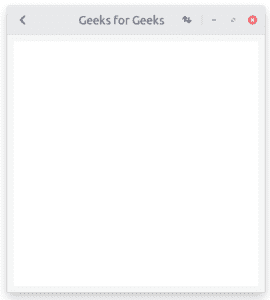

# GTK+3 中的 Python–header bar

> 原文:[https://www.geeksforgeeks.org/python-headerbar-in-gtk-3/](https://www.geeksforgeeks.org/python-headerbar-in-gtk-3/)

A `Gtk.HeaderBar`与水平`Gtk.Box`相同，它允许在开始或结束放置孩子，并显示标题。GTK+支持客户端装饰，因此我们可以使用`Gtk.HeaderBar`代替标题栏。标题将相对于框的宽度居中。一个`Gtk.HeaderBar`通常位于窗口的顶部，应该包含影响下面内容的常用控件。它们还提供对窗口控件的访问，包括关闭窗口按钮和窗口菜单。

**遵循以下步骤:**

1.  导入 GTK+ 3 模块。
2.  创建主窗口。
3.  创建 HeaderBar。
4.  创建按钮。
5.  创建盒子。

**示例:**

```
import gi
# Since a system can have multiple versions
# of GTK + installed, we want to make 
# sure that we are importing GTK + 3.
gi.require_version("Gtk", "3.0")
from gi.repository import Gtk, Gio

class HeaderBarWindow(Gtk.Window):
    def __init__(self):
        Gtk.Window.__init__(self, title ="GfG")
        self.set_border_width(10)
        self.set_default_size(400, 400)

        # Create HeaderBar.
        hb = Gtk.HeaderBar()
        hb.set_show_close_button(True)
        hb.props.title = "Geeks for Geeks"
        self.set_titlebar(hb)

        # Create Button
        button = Gtk.Button()
        icon = Gio.ThemedIcon(name ="mail-send-receive-symbolic")
        image = Gtk.Image.new_from_gicon(icon, Gtk.IconSize.BUTTON)
        button.add(image)
        hb.pack_end(button)

        # Create Box
        box = Gtk.Box(orientation = Gtk.Orientation.HORIZONTAL)
        Gtk.StyleContext.add_class(box.get_style_context(), "linked")

        button = Gtk.Button()
        button.add(Gtk.Arrow(Gtk.ArrowType.LEFT, Gtk.ShadowType.NONE))
        box.add(button)

        hb.pack_start(box)

        self.add(Gtk.TextView())

win = HeaderBarWindow()
win.connect("destroy", Gtk.main_quit)
# Display the window.
win.show_all()
# Start the GTK + processing loop
Gtk.main()
```

**输出:**
