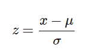

# Python |如何以及在哪里应用特征缩放？

> 原文:[https://www . geesforgeks . org/python-如何以及在哪里应用功能扩展/](https://www.geeksforgeeks.org/python-how-and-where-to-apply-feature-scaling/)

**特征缩放或标准化**:是数据预处理的一个步骤，应用于数据的自变量或特征。它基本上有助于在特定范围内规范化数据。有时，它也有助于加速算法中的计算。

**使用的包装:**

```
sklearn.preprocessing
```

**进口:**

```
 from sklearn.preprocessing import StandardScaler
```

**后端**
标准化中使用的公式将这些值替换为它们的 Z 分数。



大多数情况下，**拟合**方法用于特征缩放

```
fit(X, y = None)
Computes the mean and std to be used for later scaling.
```

## 计算机编程语言

```
import pandas as pd
from sklearn.preprocessing import StandardScaler

# Read Data from CSV
data = read_csv('Geeksforgeeks.csv')
data.head()

# Initialise the Scaler
scaler = StandardScaler()

# To scale data
scaler.fit(data)
```

**为什么以及在哪里应用特征缩放？**
真实数据集包含幅度、单位和范围差异很大的要素。当一个特征的尺度不相关或具有误导性时，应进行标准化，当尺度有意义时，不应进行标准化。

使用欧几里德距离度量的算法对量值敏感。这里，特征缩放有助于平等地权衡所有特征。

从形式上来说，如果数据集中的某个要素与其他要素相比规模较大，那么在测量欧几里德距离的算法中，这个规模较大的要素将占据主导地位，需要进行归一化。

**特征缩放很重要的算法示例**
1。 **K-Means** 在这里使用欧几里德距离度量特征比例关系。
2。 **K 近邻**也需要特征缩放。
3。**主成分分析**:试图得到方差最大的特征，这里也需要特征缩放。
4。**梯度下降**:特征缩放后，随着θ计算变快，计算速度增加。

**注意:**朴素贝叶斯、线性判别分析和基于树的模型不受特征缩放的影响。
简而言之，任何基于**而不是**距离的算法都是受到特征缩放影响的**而不是**。