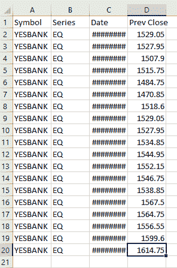
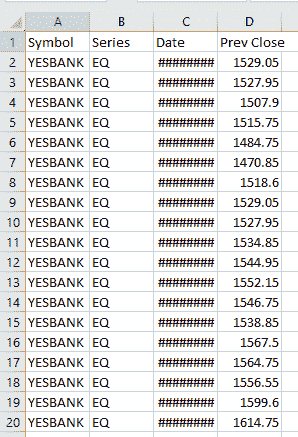

# Python |如何将数据从一张 excel 表复制到另一张

> 原文:[https://www . geesforgeks . org/python-如何将数据从一个 excel 工作表复制到另一个工作表/](https://www.geeksforgeeks.org/python-how-to-copy-data-from-one-excel-sheet-to-another/)

在本文中，我们将学习如何使用 Python 中的 openpyxl 模块将数据从一个 excel 工作表复制到目标 excel 工作簿。

对于使用 excel 文件，我们需要`**openpyxl**`，这是一个 Python 库，用于读取、写入和修改 excel(扩展名为 xlsx/xlsm/xltx/xltm)文件。可以使用以下命令安装它:

```py
Sudo pip3 install openpyxl
```

为了将一个 excel 文件复制到另一个，我们首先打开源和目标 excel 文件。然后，我们计算源 excel 文件中的行和列的总数，读取单个单元格值并将其存储在变量中，然后将该值写入目标 excel 文件中与源文件中的单元格位置相似的单元格位置。目标文件已保存。

**程序–**

> 1)将 openpyxl 库导入为 xl。
> 2)使用源 excel 文件所在的路径打开该文件。
> 
> **注意:**路径应该是一个字符串，并且有双反斜杠(\\)而不是单反斜杠(\)。例:路径应该是`C:\\Users\\Desktop\\source.xlsx`而不是`C:\Users\Admin\Desktop\source.xlsx`
> 
> 3)使用所需工作表的索引打开该工作表进行复制。工作表“n”的索引为“n-1”。例如，工作表 1 的索引为 0。
> 4)打开目标 excel 文件和其中的活动工作表。
> 5)计算源 excel 文件中的总行数和总列数。
> 6)使用两个 for 循环(一个用于迭代 excel 文件的行，另一个用于迭代 excel 文件的列)将源文件中的单元格值读取到变量，然后从该变量将其写入目标文件中的单元格。
> 7)保存目标文件。

```py
# importing openpyxl module
import openpyxl as xl;

# opening the source excel file
filename ="C:\\Users\\Admin\\Desktop\\trading.xlsx"
wb1 = xl.load_workbook(filename)
ws1 = wb1.worksheets[0]

# opening the destination excel file 
filename1 ="C:\\Users\\Admin\\Desktop\\test.xlsx"
wb2 = xl.load_workbook(filename1)
ws2 = wb2.active

# calculate total number of rows and 
# columns in source excel file
mr = ws1.max_row
mc = ws1.max_column

# copying the cell values from source 
# excel file to destination excel file
for i in range (1, mr + 1):
    for j in range (1, mc + 1):
        # reading cell value from source excel file
        c = ws1.cell(row = i, column = j)

        # writing the read value to destination excel file
        ws2.cell(row = i, column = j).value = c.value

# saving the destination excel file
wb2.save(str(filename1))
```

源文件:


**输出:**
