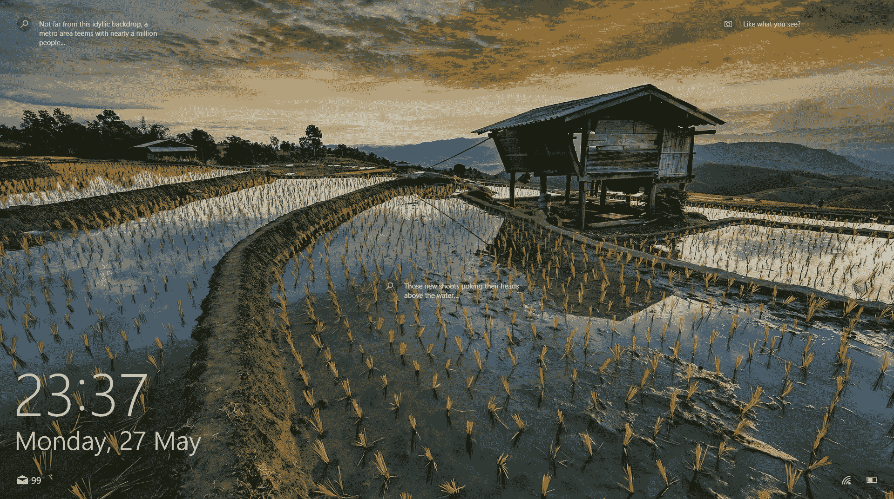
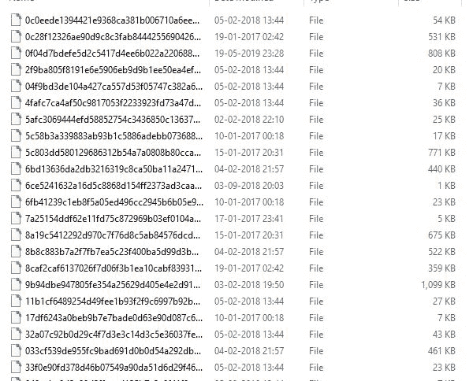
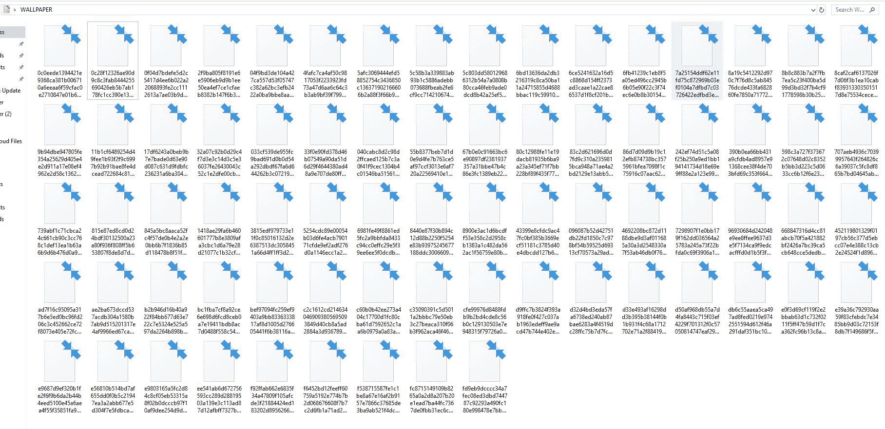
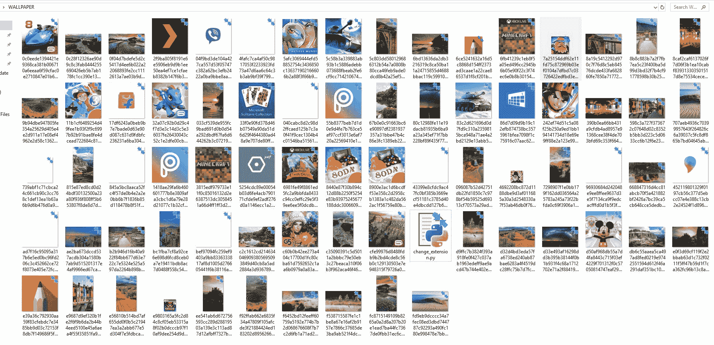

# Python |如何下载 windows 锁屏壁纸

> 原文:[https://www . geesforgeks . org/python-如何下载-windows-锁定-屏幕-壁纸/](https://www.geeksforgeeks.org/python-how-to-download-windows-lock-screen-wallpapers/)

每当你打开电脑/笔记本电脑时，你是否在你的视窗 10 锁屏中见过这些很酷的壁纸？


每当我们连接到互联网时，它们都会随机变化。但有没有想过背后的工作？这些图像存储在以下路径中:

```py
C:\Users\[[Your Username]]\AppData\Local\Packages\Microsoft.Windows.ContentDeliveryManager_cw5n1h2txyewy\LocalState\Assets
```

但是这个故事有一个转折。壁纸会是这样的。

这些其实是没有它们的扩展名的图像，也就是它们的扩展名被去掉了。

您可能正在考虑一个接一个地复制图像，然后一个接一个地更改图像的扩展名，这也是手动的。
好吧，为了让你的生活更轻松，Python 就在你身边。它将只为您完成任务，同样只需一个代码。

下面是 Python 实现–

**注意:在桌面上制作一个名为壁纸的文件夹。**

```py
import os
import shutil

os.chdir('C:\\')
username = os.environ['USERNAME']

# The folder which contains the wallpaper files
source = ("C:\\Users\\"+ username +"\\AppData\\Local\\Packages\\Microsoft.Windows.ContentDeliveryManager_cw5n1h2txyewy\\LocalState\\Assets\\")

# You will have to add the path of your
# destination here. Just make sure the
# folder exists on the desktop.
destination = ("C:\\Users\\"+ username +"\\Desktop\\WALLPAPER\\")

for the_file in os.listdir(destination):

    path_of_file = os.path.join(destination, the_file)
    base_file, ext = os.path.splitext(the_file)

    if ext ==".jpg":
        try:
            if os.path.isfile(path_of_file):
                os.unlink(path_of_file)

        except Exception as e:
            print(e)

for name_of_file in os.listdir(source):
    shutil.copy( source + name_of_file, destination)
    print(name_of_file)
```

但是，文件夹还是会像这样。


**那么接下来怎么办呢？**
看到下面的 Python 代码，把它作为副本保存在桌面的同一个壁纸文件夹中，然后在那里运行它。

下面是 Python 代码–

```py
import os, sys

# It oversees all the file in the folder 
# and changes it with a proper extension.
for filename in os.listdir(os.path.dirname(os.path.abspath(__file__))):

  base_file, ext = os.path.splitext(filename)

  if ext == "":
    os.rename(filename, base_file + ".jpg")
```

执行后，文件夹将如下所示。将会有一些图片不是壁纸，而是一些游戏或其他应用程序的图标。但是一旦你删除它们，你会得到一个很酷的文件夹，里面装满了很酷的壁纸。
