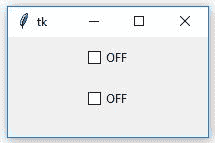
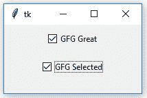
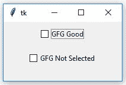
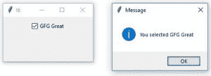

# Python |如何动态更改 Checkbutton 的文本

> 原文:[https://www . geesforgeks . org/python-如何动态更改 checkbutton 的文本/](https://www.geeksforgeeks.org/python-how-to-dynamically-change-text-of-checkbutton/)

[Tkinter](https://www.geeksforgeeks.org/python-gui-tkinter/) 是一个 GUI(图形用户界面)模块，用于创建各种类型的应用程序。它与 Python 一起出现，由各种类型的小部件组成，可用于使图形用户界面更具吸引力和用户友好性。[检查按钮](https://www.geeksforgeeks.org/python-tkinter-ttk-checkbutton-and-comparison-with-simple-checkbutton/)是用于选择多个选项的小部件之一。

[检查按钮](https://www.geeksforgeeks.org/python-tkinter-ttk-checkbutton-and-comparison-with-simple-checkbutton/)可以如下创建:

```
chkbtn = ttk.Checkbutton(parent, value = options, ...)
```

**代码#1:**

```
# This will import tkinter and ttk
from tkinter import * from tkinter import ttk

root = Tk()

# This will set the geometry to 200x100
root.geometry('200x100')

text1 = StringVar()
text2 = StringVar()

# These text are used to set initial
# values of Checkbutton to off
text1.set('OFF')
text2.set('OFF')

chkbtn1 = ttk.Checkbutton(root, textvariable = text1, variable = text1,
                          offvalue = 'GFG Not Selected',
                          onvalue = 'GFG Selected')

chkbtn1.pack(side = TOP, pady = 10)
chkbtn2 = ttk.Checkbutton(root, textvariable = text2, variable = text2,
                          offvalue = 'GFG Average',
                          onvalue = 'GFG Good')
chkbtn2.pack(side = TOP, pady = 10)

root.mainloop()
```

**输出#1:** 当您运行应用程序时，您会看到[检查按钮](https://www.geeksforgeeks.org/python-tkinter-ttk-checkbutton-and-comparison-with-simple-checkbutton/)的初始状态，如输出所示。


**输出#2:** 只要您**选择[检查按钮](https://www.geeksforgeeks.org/python-tkinter-ttk-checkbutton-and-comparison-with-simple-checkbutton/)中的**，您就会看到文本已经如输出中一样被更改。


**输出#3:** 当您**取消选择[检查按钮](https://www.geeksforgeeks.org/python-tkinter-ttk-checkbutton-and-comparison-with-simple-checkbutton/)时，您将再次观察到以下变化。
**

**代码#2:** 命令可以与[检查按钮](https://www.geeksforgeeks.org/python-tkinter-ttk-checkbutton-and-comparison-with-simple-checkbutton/)集成，当根据条件选择或取消选择检查按钮时，可以执行该命令。

```
# Importing tkinter, ttk and
# _show method to display
# pop-up message window
from tkinter import * from tkinter import ttk
from tkinter.messagebox import _show

root = Tk()
root.geometry('200x100')

text1 = StringVar()
text1.set('OFF')

# This function is used to display
# the pop-up message
def show(event):
    string = event.get()
    _show('Message', 'You selected ' + string)

chkbtn1 = ttk.Checkbutton(root, textvariable = text1, variable = text1,
                          offvalue = 'GFG Good',
                          onvalue = 'GFG Great',
                          command = lambda : show(text1))
chkbtn1.pack(side = TOP, pady = 10)

root.mainloop()
```

**输出:**

**注意:**在上述代码中**关值**和**开值**分别用于设置非选择状态和选择状态的[检查按钮](https://www.geeksforgeeks.org/python-tkinter-ttk-checkbutton-and-comparison-with-simple-checkbutton/)的值。