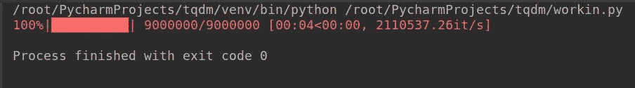
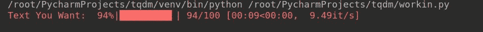
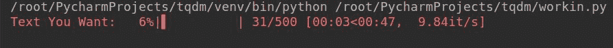
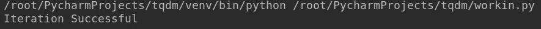
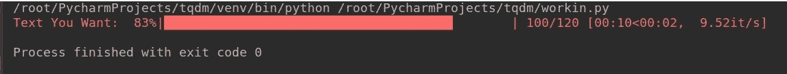
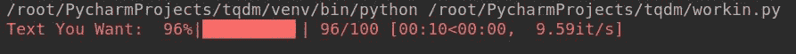
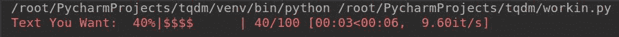
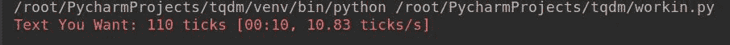
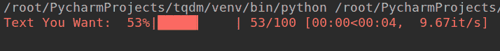

# Python |如何使用 tqdm 制作终端进度条

> 原文:[https://www . geesforgeks . org/python-如何制作终端-进度条-使用-tqdm/](https://www.geeksforgeeks.org/python-how-to-make-a-terminal-progress-bar-using-tqdm/)

无论您是安装软件、加载页面还是进行事务处理，每当您看到小进度条让您估计完成或呈现该过程需要多长时间时，它总是会让您感到轻松。如果您的脚本或代码中有一个简单的进度条，它看起来非常赏心悦目，并且每当用户执行代码时都会给用户适当的反馈。您可以使用 Python 外部库 **tqdm** ，创建简单的&无障碍进度条，您可以将其添加到代码中，使其看起来生动活泼！

## 装置

打开命令提示符或终端，键入:

```py
pip install tqdm
```

如果您正在使用 Python3，请键入:

```py
pip3 install tqdm
```

此命令将在您的计算机上成功安装库，现在可以使用了。

## 使用

使用`tqdm`很简单，只需要在代码中导入库后，在`tqdm()`之间添加代码即可。您需要确保放在 tqdm()函数之间的代码必须是可迭代的，否则它根本无法工作。

让我们看看下面的例子，它将帮助您更好地理解:

**示例:**

```py
from tqdm import tqdm

for i in tqdm(range(int(9e6))):
    pass
```

**输出:**



现在我们知道如何实现 tqdm，让我们看看它提供的一些重要参数，以及如何使用它来调整进度条。

*   **desc: You can use this parameter to specify the description of your progress bar as follows:

    **语法:**

    ```py
    tqdm (self, iterable, desc= “Text You want”)
    ```

    **示例:**

    ```py
    from tqdm import tqdm
    from time import sleep

    for i in tqdm(range(0, 100), desc ="Text You Want"):
        sleep(.1)
    ```

    **输出:**
    ** *   ****total: This is used to specify the total number of expected iterations if not specified already or needs modification.

    **语法:**

    ```py
    tqdm (self, iterable, total= 500)
    ```

    **示例:**

    ```py
    from tqdm import tqdm
    from time import sleep

    for i in tqdm(range(0, 100), total = 500,
                  desc ="Text You Want"):
        sleep(.1)
    ```

    **输出:**

    **** *   ******disable: This parameter can be used if you want to completely disable the progress bar.

    **语法:**

    ```py
    tqdm (self, iterable, disable=True)
    ```

    **示例:**

    ```py
    from tqdm import tqdm
    from time import sleep

    for i in tqdm(range(0, 100), disable = True,
                   desc ="Text You Want"):
        sleep(.1)

    print("Iteration Successful")
    ```

    **输出:**

    ****** *   ******ncols: This parameter is used to specify the entire width of the output message. If left unspecified it remains dynamic to the size of the window. This can be fixed through the `ncols` parameter.

    **语法:**

    ```py
    tqdm (self, iterable, ncols= 100)
    ```

    **示例:**

    ```py
    from tqdm import tqdm
    from time import sleep

    for i in tqdm(range(0, 100), ncols = 100,
                   desc ="Text You Want"):
        sleep(.1)
    ```

    **输出:**

    ****** *   ******mininterval: You can easily change the minimum progress display update using this option. The default is to 0.1 seconds.

    **语法:**

    ```py
    tqdm (self, iterable, mininterval=3)
    ```

    **示例:**

    ```py
    from tqdm import tqdm
    from time import sleep

    for i in tqdm(range(0, 100), mininterval = 3, 
                  desc ="Text You Want"):
        sleep(.1)
    ```

    **输出:**

    ****** *   ******ascii: You can use ASCII characters to fill the progress bar as per your liking.

    **语法:**

    > tqdm (self，iterable，ascii = " 123456789 { content }-# x201；，desc=“你想要的文字”)

    **示例:**

    ```py
    from tqdm import tqdm
    from time import sleep

    for i in tqdm(range(0, 100), 
                  ascii ="123456789{content}quot;):
        sleep(.1)
    ```

    **输出:**

    ****** *   ******unit: The default unit of time is “it” and can be changed by using this parameter to your preferred unit.

    **语法:**

    ```py
    tqdm (self, iterable, unit= “ ticks”)
    ```

    **示例:**

    ```py
    from tqdm import tqdm
    from time import sleep

    for i in tqdm(range(0, 100), unit =" ticks", 
                  desc ="Text You Want"):
        sleep(.1)
    ```

    **输出:**
    ****** *   ******initial
    The initial value of the progress bar starts from 0\. If you wish to change this, you can use this parameter to initialize the progress bar from the value you wish
    **Syntax:**

    ```py
    tqdm (self, iterable, initial=50)
    ```

    **示例:**

    ```py
    from tqdm import tqdm
    from time import sleep

    for i in tqdm(range(0, 100), initial = 50, 
                  desc ="Text You Want"):
        sleep(.1)
    ```

    **输出:**

    

    计数器将从 50 开始，进度条将在到达最终计数器后消失。循环将继续运行，直到迭代完成。******