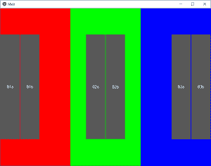

# Python |如何在 kivy 中使用多个 kv 文件

> 原文:[https://www . geesforgeks . org/python-如何使用-多 kv-files-in-kivy/](https://www.geeksforgeeks.org/python-how-to-use-multiple-kv-files-in-kivy/)

Kivy 是 Python 中独立于平台的 GUI 工具。因为它可以在安卓、IOS、linux 和 Windows 等平台上运行。它基本上是用来开发安卓应用程序的，但并不意味着它不能在桌面应用程序上使用。

在本文中，我们将看到如何使用多个[。kv 文件](https://www.geeksforgeeks.org/python-kivy-kv-file/)在单个应用程序中。

这是 Python 程序，使用 [GridLayout](https://www.geeksforgeeks.org/python-grid-layout-in-kivy-without-kv-file/) 作为根小部件。除了主 kv 文件，它还加载`box1.kv`、`box2.kv`和`box3.kv`。还有 2 个应用程序变量。这些变量是从主 kv 文件中引用的。

> 👉🏽 [Kivy 教程–通过示例学习 Kivy](https://www.geeksforgeeks.org/kivy-tutorial/)。

```
Basic Approach:

1) import kivy
2) import kivyApp
3) import Gridlayout
4) import Builder
5) Set minimum version(optional)
6) Create Layout class
7) Create App class
8) Set up multiple .kv file
9) return Layout/widget/Class(according to requirement)
10) Run an instance of the class
```

**main.py 文件的实现:**

```
# Multiple .kv file Python code

import kivy 

# base Class of your App inherits from the App class.   
# app:always refers to the instance of your application  
from kivy.app import App

# The GridLayout arranges children in a matrix.
# It takes the available space and divides
# it into columns and rows, then adds
# widgets to the resulting “cells”.
from kivy.uix.gridlayout import GridLayout

# Builder is a global Kivy instance used
# in widgets that you can use to load other
# kv files in addition to the default ones.
from kivy.lang import Builder

# Loading Multiple .kv files 
Builder.load_file('box1.kv')
Builder.load_file('box2.kv')
Builder.load_file('box3.kv')

# Creating main kv file class
class main_kv(GridLayout):
    pass

# Create App class
class MainApp(App):
    def build(self):
        self.x = 150
        self.y = 400
        return main_kv()

# run the App
if __name__=='__main__':
    MainApp().run()
```

主 kv 文件包含一个带有 3 列的网格布局。这 3 列包含不同的锚定布局。这些都在 **main.kv** 文件中定义。

**现在主. kv 文件:**

```
# Creating the main .kv files
# the difference is that it is
# the heart of the Application
# Other are just Organs

<main_kv>:

    # Assigning Grids
    cols: 3

    # Creating AnchorLayout
    AnchorLayout:
        anchor_x: 'left'
        anchor_y: 'center'

        # Canvas creation
        canvas:
            Color:
                rgb: [1, 0, 0]
            Rectangle:
                pos: self.pos
                size: self.size

        Box1:
            size_hint: [None, None]
            size: [app.x, app.y]

    AnchorLayout:
        anchor_x: 'center'
        anchor_y: 'center'
        canvas:
            Color:
                rgb: [0, 1, 0]
            Rectangle:
                pos: self.pos
                size: self.size
        Box2:
            size_hint: [None, None]
            size: [app.x, app.y]

    AnchorLayout:
        anchor_x: 'right'
        anchor_y: 'center'
        canvas:
            Color:
                rgb: [0, 0, 1]
            Rectangle:
                pos: self.pos
                size: self.size
        Box3:
            size_hint: [None, None]
            size: [app.x, app.y] 
```

现在，如输出中所示，在每个网格中有不同的按钮来创建按钮
，在每个网格中我们使用不同的按钮。kv 档案。

**box1.kv 文件–**

```
# Creating 1st .kv file  

<Box1@BoxLayout>:
    Button:
        text: 'B1a'
    Button:
        text: 'B1b'
```

**box2.kv 文件–**

```
# Creating 2nd .kv file

<Box2@BoxLayout>:
    Button:
        text: 'B2a'
    Button:
        text: 'B2b'
```

**box3.kv 文件–**

```
# Creating 3rd .kv file 

<Box3@BoxLayout>:
    Button:
        text: 'B3a'
    Button:
        text: 'B3b'
```

**输出:**
