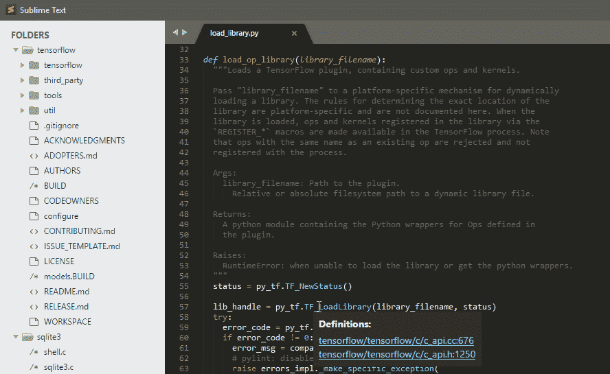
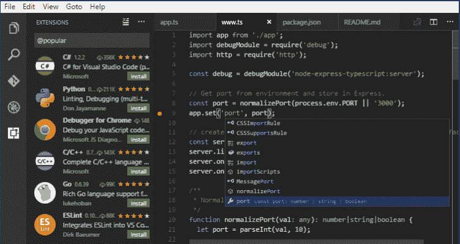
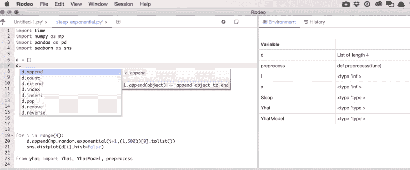
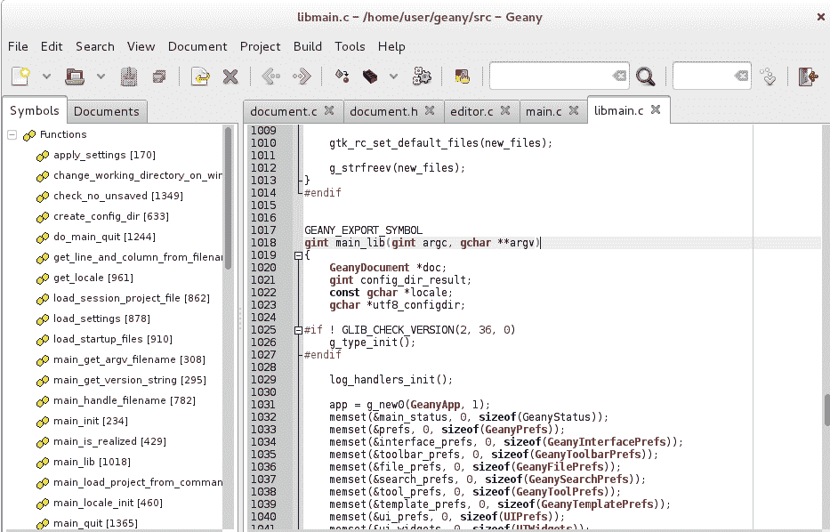

# 面向数据科学的 Python IDEs】

> 原文:[https://www.geeksforgeeks.org/python-ides-for-data-science/](https://www.geeksforgeeks.org/python-ides-for-data-science/)

数据科学是一个用来研究和理解数据，并借助不同的科学过程得出各种结论的领域。Python 是一种流行的语言，对数据科学非常有用，因为它的统计分析能力和可读性很强。Python 还有各种各样的包，用于机器学习、自然语言处理、数据可视化、数据分析等。这使得它适合数据科学。用于数据科学的一些 Python 集成开发环境如下所示:

1.  **Jupyter 笔记本–**
    [Jupyter 笔记本](https://jupyter.org/)是一款开源 IDE，用于创建 Jupyter 文档，可通过实时代码创建和共享。此外，它是一个基于网络的交互式计算环境。Jupyter 笔记本可以支持数据科学中流行的各种语言，如 Python、Julia、Scala、R 等。
    
2.  **Spyder–**
    [Spyder](https://www.spyder-ide.org/)是一款开源 IDE，最初由 Pierre Raybaut 在 2009 年创建和开发。它可以与许多不同的 Python 包集成，如 NumPy、SymPy、SciPy、pandas、IPython 等。Spyder 编辑器还支持代码自检、代码补全、语法高亮、水平和垂直拆分等。
    
3.  **崇高文本–**
    [崇高文本](https://www.sublimetext.com/)是一个专有的代码编辑器，它支持 Python API。崇高文本的一些特性是特定于项目的偏好、快速导航、跨平台的支持插件等。虽然崇高的文本相当快，有一个很好的支持团体，但它不是免费的。
    
4.  **Visual Studio Code–**
    [Visual Studio Code](https://code.visualstudio.com/)是微软开发的代码编辑器。它是用电子开发的，但不使用原子。Visual Studio Code 的一些特性是嵌入式 Git 控件、智能代码完成、支持调试、语法高亮、代码重构等。它也相当快，重量也很轻。
    
5.  **py charm–**
    [py charm](https://www.jetbrains.com/pycharm/)是由 JetBrains 开发的 IDE，专门为 Python 创建。它具有代码分析、集成单元测试器、集成 Python 调试器、支持 web 框架等多种功能。Pycharm 在机器学习中特别有用，因为它支持 Pandas、Matplotlib、Scikit-Learn、NumPy 等库。
    
6.  **Rodeo–**
    [Rodeo](https://rodeo.yhat.com/)是由 Yhat 为 Python 中的数据科学开发的开源 IDE。因此，Rodeo 包括 Python 教程和备忘单，如果需要的话可以作为参考。Rodeo 的一些特性是语法突出显示、自动完成、与数据框和图的轻松交互、内置的 IPython 支持等。
    
7.  **Thonny–**
    [Thonny](https://thonny.org/)是塔尔图大学为 Python 开发的一个 IDE。它是为学习用 Python 编程的初学者或教 Python 的人创建的。Thonny 的一些特性是不带断点的语句步进、简单的 pip GUI、行号、调试期间的活动变量等。
    
8.  **Atom–**
    [Atom](https://atom.io/)是一个使用 electronic 开发的开源文本和代码编辑器。它具有多种功能，如流畅的界面、文件系统浏览器、各种扩展等。Atom 还有一个扩展，可以在 Python 运行时支持 Python。
    
9.  **Geany–**
    [Geany](https://www.geany.org/)是一个支持 Python 的自由文本编辑器，也包含 IDE 特性。它最初是由恩里科·特尔格用 C 和 C++编写的。Geany 的一些功能包括符号列表、自动完成、语法突出显示、代码导航、多文档支持等。
    