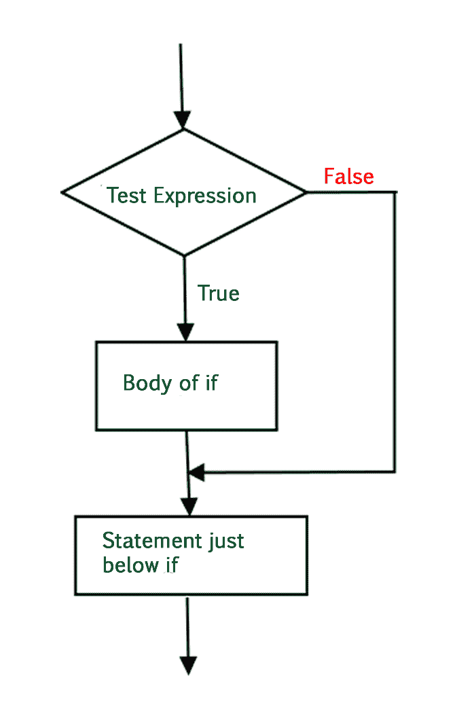
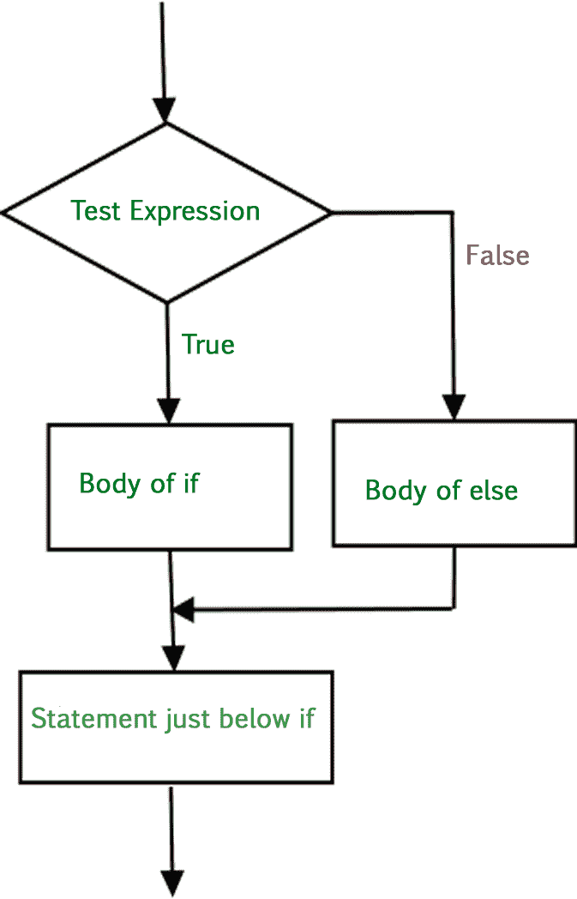
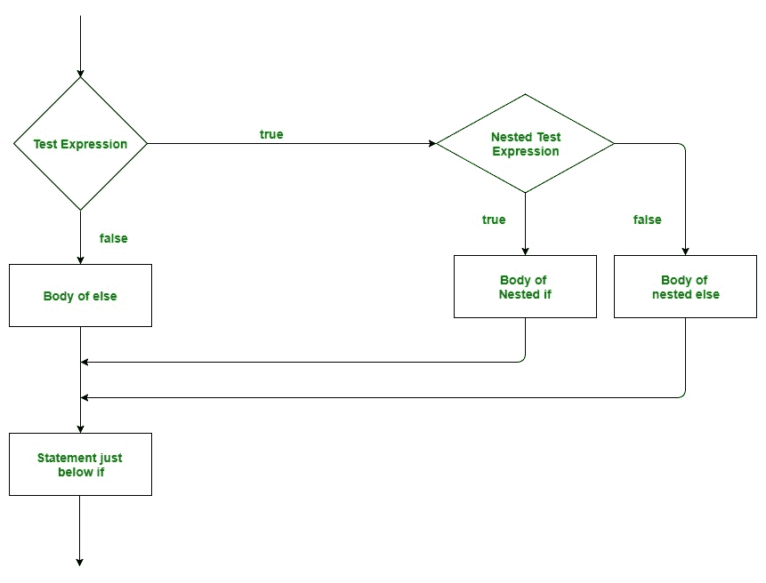
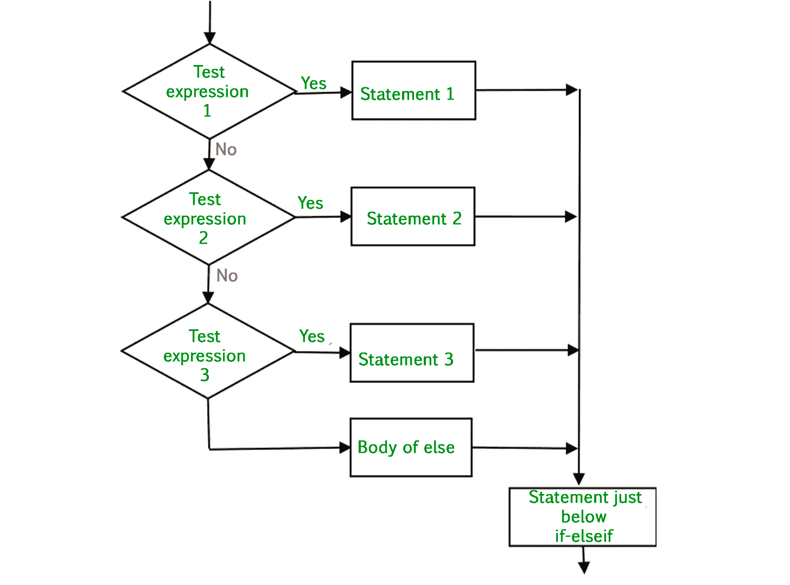

# Python if else

> 原文:[https://www.geeksforgeeks.org/python-if-else/](https://www.geeksforgeeks.org/python-if-else/)

现实生活中会出现这样的情况，我们需要做出一些决定，根据这些决定，我们决定下一步该做什么。类似的情况也会出现在编程中，我们需要做出一些决定，并根据这些决定执行下一个代码块。编程语言中的决策语句决定了程序执行流程的方向。

在 Python 中，if else elif 语句用于决策。

## **if 语句**

if 语句是最简单的决策语句。它用于决定是否执行某个语句或语句块，即如果某个条件为真，则执行某个语句块，否则不执行。

**语法**:

```
if *condition*:
   # Statements to execute if
   # condition is true
```

这里，评估后的条件不是真就是假。如果语句接受布尔值——如果值为真，则它将执行其下的语句块，否则不执行。我们也可以使用带括号“(' ')”的*条件*。

我们知道，python 使用缩进来识别一个块。因此，if 语句下的块将被识别，如下例所示:

```
if condition:
   statement1
statement2

# Here if the condition is true, if block 
# will consider only statement1 to be inside 
# its block.
```

## **Python if 语句流程图**



### 示例:Python if 语句

## 蟒蛇 3

```
# python program to illustrate If statement

i = 10

if (i > 15):
    print("10 is less than 15")
print("I am Not in if")
```

**输出:**

```
I am Not in if
```

因为 if 语句中的条件为假。所以，if 语句下面的块没有被执行。

## **如果-否则**

if 语句单独告诉我们，如果条件为真，它将执行一组语句，如果条件为假，它不会执行。但是如果条件是假的，我们想做别的事情怎么办。 *else* 语句来了。如果条件为假，我们可以使用 *else* 语句和 *if* 语句来执行一段代码。

**语法**:

```
if (condition):
    # Executes this block if
    # condition is true
else:
    # Executes this block if
    # condition is false
```

## **Python if else 语句的流程图**



### 示例 1: Python if else 语句

## 蟒蛇 3

```
# python program to illustrate If else statement
#!/usr/bin/python

i = 20
if (i < 15):
    print("i is smaller than 15")
    print("i'm in if Block")
else:
    print("i is greater than 15")
    print("i'm in else Block")
print("i'm not in if and not in else Block")
```

**输出:**

```
i is greater than 15
i'm in else Block
i'm not in if and not in else Block
```

else 语句后面的代码块在调用不在块中(没有空格)的语句后，作为 if 语句中的条件 false 执行。

### 示例 2:列表理解中的 Python if else

## 蟒蛇 3

```
# Explicit function
def digitSum(n):
    dsum = 0
    for ele in str(n):
        dsum += int(ele)
    return dsum

# Initializing list
List = [367, 111, 562, 945, 6726, 873]

# Using the function on odd elements of the list
newList = [digitSum(i) for i in List if i & 1]

# Displaying new list
print(newList)
```

**Output**

```
[16, 3, 18, 18]

```

## **嵌套-如果**

嵌套的 if 是一个 if 语句，它是另一个 if 语句的目标。嵌套的 if 语句意味着一个 if 语句在另一个 if 语句中。是的，Python 允许我们在 if 语句中嵌套 if 语句。也就是说，我们可以将一个 if 语句放在另一个 if 语句中。

**语法**:

```
if (condition1):
   # Executes when condition1 is true
   if (condition2): 
      # Executes when condition2 is true
   # if Block is end here
# if Block is end here
```

## Python 嵌套 if 语句流程图



### 示例:Python 嵌套 if

## 蟒蛇 3

```
# python program to illustrate nested If statement
#!/usr/bin/python
i = 10
if (i == 10):

    #  First if statement
    if (i < 15):
        print("i is smaller than 15")

    # Nested - if statement
    # Will only be executed if statement above
    # it is true
    if (i < 12):
        print("i is smaller than 12 too")
    else:
        print("i is greater than 15")
```

**输出:**

```
i is smaller than 15
i is smaller than 12 too
```

## **if-elif-else 梯子**

在这里，用户可以在多个选项中进行选择。if 语句从上到下执行。一旦控制 if 的条件之一为真，就执行与该 if 关联的语句，并绕过阶梯的其余部分。如果这些条件都不成立，那么将执行最后的 else 语句。

**语法**:

```
if (condition):
    statement
elif (condition):
    statement
.
.
else:
    statement
```

## **Python if else elif 语句的流程图**



### **示例:Python if else elif 语句**

## 蟒蛇 3

```
# Python program to illustrate if-elif-else ladder
#!/usr/bin/python

i = 20
if (i == 10):
    print("i is 10")
elif (i == 15):
    print("i is 15")
elif (i == 20):
    print("i is 20")
else:
    print("i is not present")
```

**输出:**

```
i is 20
```

## **短手 if 语句**

只要 if 块中只有一条语句要执行，就可以使用简写 if。该语句可以与 if 语句放在同一行。

**语法:**

```
if condition: statement
```

### **例:Python if 速记**

## 蟒蛇 3

```
# Python program to illustrate short hand if
i = 10
if i < 15:
    print("i is less than 15")
```

**输出:**

```
i is less than 15
```

## **短手 if-else 语句**

这可用于在一行中编写 if-else 语句，其中在 if 和 else 块中只执行一条语句。

**语法:**

```
statement_when_True if condition else statement_when_False
```

### **示例:Python if else 简写**

## 蟒蛇 3

```
# Python program to illustrate short hand if-else
i = 10
print(True) if i < 15 else print(False)
```

**输出:**

```
True
```