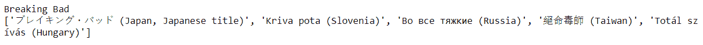

# Python IMDbPY–获取系列的替代名称

> 原文:[https://www . geeksforgeeks . org/python-imdbpy-get-alternate-of-series/](https://www.geeksforgeeks.org/python-imdbpy-getting-alternate-names-of-the-series/)

在本文中，我们将看到如何获得该系列的替代名称(akas)。许多系列都有备用名，因为在不同的语言中，单词的意思不同，所以每个系列都有备用名。

> 为了做到这一点，我们必须做到以下几点–
> 
> 1.借助 get_movie 方法
> 2 获取系列详情。由于这个对象将作为字典，因此我们必须过滤对象
> 3。借助返回字典
> 4 的数据方法获取对象的主要数据。从字典中获取 akas

下面是实现

```py
# importing the module
import imdb

# creating instance of IMDb
ia = imdb.IMDb()

# id
code = "0903747"

# getting information
series = ia.get_movie(code)

# getting alternate names of the series
names = series.data['akas']

# printing the object i.e name
print(series)

# print the series names
print(names)
```

**输出:**


另一个例子

```py
# importing the module
import imdb

# creating instance of IMDb
ia = imdb.IMDb()

# id
code = "6077448"

# getting information
series = ia.get_movie(code)

# getting alternate names of the series
names = series.data['akas']

# printing the object i.e name
print(series)

# print the series names
print(names)
```

**输出:**

```py
Sacred Games
['Le Seigneur de Bombay (France)', 'Der Pate von Bombay (Germany)', 'Juegos sagrados (Spain)', '?????????? ???? (Russia)', 'Kutsal Oyunlar (Turkey, Turkish title)']
```