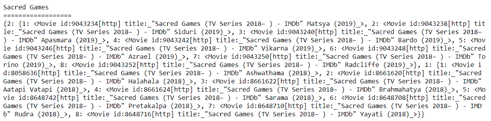
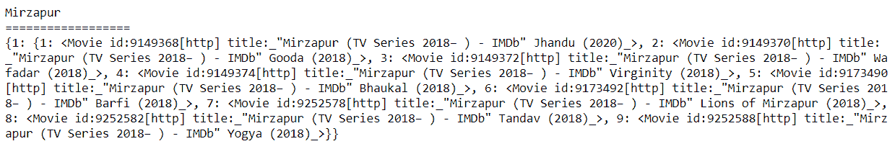

# Python IMDbPY–获取系列剧集

> 原文:[https://www . geesforgeks . org/python-imdbpy-get-剧集/](https://www.geeksforgeeks.org/python-imdbpy-getting-episodes-of-the-series/)

在本文中，我们将了解如何获得该系列的剧集。每个系列都有季节，每个季节都有多集，即每集是季节的子集，季节是系列的子集。

> 为了做到这一点，我们必须做到以下几点–
> 
> 1.借助 get_movie 方法
> 2 获取系列详情。使用
> 3 的更新方法为其添加剧集信息集。由于这个对象将作为字典，因此我们必须过滤对象
> 4。借助返回字典
> 5 的数据方法获取对象的主要数据。从字典中获取剧集

下面是实现

```
# importing the module
import imdb

# creating instance of IMDb
ia = imdb.IMDb()

# id
code = "6077448"

# getting information
series = ia.get_movie(code)

# adding new info set
ia.update(series, 'episodes')

# getting episodes of the series
episodes = series.data['episodes']

# printing the object i.e name
print(series)

print("==================")

# printing episodes
print(episodes)
```

**输出:**


另一个例子

```
# importing the module
import imdb

# creating instance of IMDb
ia = imdb.IMDb()

# id
code = "6473300"

# getting information
series = ia.get_movie(code)

# adding new info set
ia.update(series, 'episodes')

# getting episodes of the series
episodes = series.data['episodes']

# printing the object i.e name
print(series)

print("==================")

# printing episodes
print(episodes)
```

**输出:**
