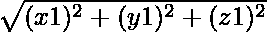
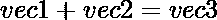
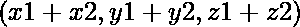
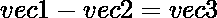
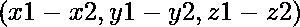
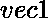
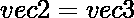
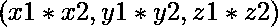

# Python |使用 dunder 方法实现 3D 矢量

> 原文:[https://www . geeksforgeeks . org/python-implementing-3d-vectors-use-dunder-methods/](https://www.geeksforgeeks.org/python-implementing-3d-vectors-using-dunder-methods/)

Python 中的 [Dunder 方法](https://www.geeksforgeeks.org/dunder-magic-methods-python/)(*d*double*在* score 下)是常用于运算符重载的方法。dunder 方法的一些例子有 __init__、__repr_、__add_、__str__ 等。这些方法对于修改对象的行为很有用。
例如，当在两个数字之间使用“+”运算符时，得到的结果只是两个数字的加法，而当在两个字符串之间使用“+”运算符时，得到的结果是两个字符串的串联。
**常用向量运算:**
考虑两个向量 **vec1** 和 **vec2** ，坐标为:vec1 = (x1，y1，z1)和 vec2 = (x2，y2，z2)。

*   **震级:**vec1 的震级= 。

*   **加法:**对于这个操作，我们需要 __add__ 方法来添加两个 Vector 对象。
    vec 3 的坐标是。

*   **减法:**对于这个操作，我们需要 __sub__ 方法来减去两个 Vector 对象。
    vec 3 的坐标是。

*   **点积:**对于这个操作，我们需要 __xor__ 方法，因为我们使用'^'符号来表示点积。^vec 3 的坐标为。

*   **叉积:**对于这个操作，我们需要 __mul__ 方法，因为我们正在使用“*”符号来表示叉积。 * 其中 vec3 的坐标为。

最后，我们还需要一个 __init__ 方法来初始化矢量坐标，以及 __repr__ 方法来定义矢量对象的表示。所以当我们打印矢量对象时，输出应该是这样的。print(Vector(1，-2，3)) ==> **输出:** 1i -2j + 3k
下面是实现:

## 蟒蛇 3

```
# Python3 program to implement 3-D Vectors.
from math import sqrt

# Definition of Vector class
class Vector:

    # Initialize 3D Coordinates of the Vector
    def __init__(self, x, y, z):
        self.x = x
        self.y = y
        self.z = z

    # Method to calculate magnitude of a Vector
    def magnitude(self):

        return sqrt(self.x ** 2 + self.y ** 2 + self.z ** 2)

    # Method to add to Vector
    def __add__(self, V):

        return Vector(self.x + V.x, self.y + V.y, self.z + V.z)

    # Method to subtract 2 Vectors
    def __sub__(self, V):

        return Vector(self.x - V.x, self.y - V.y, self.z - V.z)

    # Method to calculate the dot product of two Vectors
    def __xor__(self, V):

        return self.x * V.x + self.y * V.y + self.z * V.z

    # Method to calculate the cross product of 2 Vectors
    def __mul__(self, V):

        return Vector(self.y * V.z - self.z * V.y,
                      self.z * V.x - self.x * V.z,
                      self.x * V.y - self.y * V.x)

    # Method to define the representation of the Vector
    def __repr__(self):

        out = str(self.x) + "i "

        if self.y >= 0:
            out += "+ "
        out += str(self.y) + "j "
        if self.z >= 0:
            out += "+ "
        out += str(self.z) + "k"

        return out

if __name__ == "__main__":

    vec1 = Vector(1, 2, 2)
    vec2 = Vector(3, 1, 2)

    # Magnitude of vector1
    print("Magnitude of vector1:", vec1.magnitude())

    # String representation of vector
    print("String representation of vector1: " + str(vec1))

    # Addition of two vectors
    print("Addition of vector1 and vector2: " + str(vec1 + vec2))

    # Subtraction of two vectors
    print("Subtraction of vector1 and vector2: " + str(vec1 - vec2))

    # Dot product of two vectors
    print("Dot Product of vector1 and vector2: " + str(vec1 ^ vec2))

    # Cross product of two vectors
    print("Cross Product of vector1 and vector2: " + str(vec1 * vec2))
```

**Output**

```
Magnitude of vector1: 3.0
String representation of vector1: 1i + 2j + 2k
Addition of vector1 and vector2: 4i + 3j + 4k
Subtraction of vector1 and vector2: -2i + 1j + 0k
Dot Product of vector1 and vector2: 9
Cross Product of vector1 and vector2: 2i + 4j -5k

```