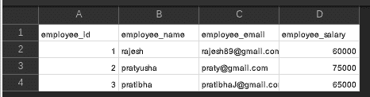

# Python–将 CSV 导入 PostgreSQL

> 原文:[https://www . geesforgeks . org/python-import-CSV-into-PostgreSQL/](https://www.geeksforgeeks.org/python-import-csv-into-postgresql/)

在本文中，我们将看到如何使用 Python 包 psycopg2 将 CSV 文件导入 PostgreSQL。

首先，我们导入 psycopg2 包，并使用 [pyscopg2.connect()](https://www.geeksforgeeks.org/postgresql-connect-to-postgresql-database-server-in-python/) 方法建立到 PostgreSQL 数据库的连接。在导入 CSV 文件之前，我们需要创建一个表。在下面的例子中，我们通过使用 [cursor.execute()](https://www.geeksforgeeks.org/python-sqlite-connecting-to-database/) 方法执行“创建表”SQL 命令来创建一个表。

```
'''CREATE TABLE DETAILS(employee_id int NOT NULL,
                        employee_name char(20), 
                        employee_email varchar(30),
                        employee_salary float);'''
```

**空表视图:**


表格描述

创建表后，我们需要在 SQL 表单中执行“复制”命令。在 copy 命令中，我们需要指定 CSV 文件的路径。

**使用的 CSV 文件:**



使用的 CSV 文件

```
'''COPY table_name
FROM 'C:\folder\file.csv' 
DELIMITER ',' 
CSV HEADER;'''
```

**下面是实现:**

## 蟒蛇 3

```
import psycopg2

conn = psycopg2.connect(database="EMPLOYEE_DATABASE",
                        user='postgres', password='pass', 
                        host='127.0.0.1', port='5432'
)

conn.autocommit = True
cursor = conn.cursor()

sql = '''CREATE TABLE DETAILS(employee_id int NOT NULL,\
employee_name char(20),\
employee_email varchar(30), employee_salary float);'''

cursor.execute(sql)

sql2 = '''COPY details(employee_id,employee_name,\
employee_email,employee_salary)
FROM '/private/tmp/details.csv'
DELIMITER ','
CSV HEADER;'''

cursor.execute(sql2)

sql3 = '''select * from details;'''
cursor.execute(sql3)
for i in cursor.fetchall():
    print(i)

conn.commit()
conn.close()
```

**输出:**

```
(1, 'rajesh              ', 'rajesh89@gmail.com', 60000.0)
(2, 'pratyusha           ', 'praty@gmail.com', 75000.0)
(3, 'pratibha            ', 'pratibhaJ@gmail.com', 65000.0)
```