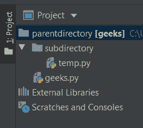
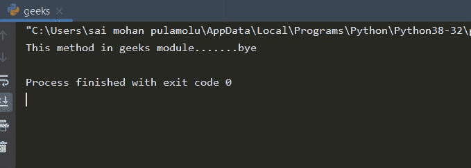

# Python–从父目录导入

> 原文:[https://www . geesforgeks . org/python-从父目录导入/](https://www.geeksforgeeks.org/python-import-from-parent-directory/)

在本文中，我们将学习如何从父目录导入模块。从 Python 3.3 开始，不允许在父目录中引用或导入模块，从下面的例子中你可以清楚地理解这一点。



目录结构

在父目录中，我们有一个子目录 geeks.py 文件，在子目录中，我们有一个名为 temp.py 的 python 文件，现在让我们尝试一下是否可以从子目录中的 temp.py 文件导入父目录中的 geeks 模块。

**geeks.py(父目录中的模块)**

## 蟒蛇 3

```py
def geek_method():
    print("This method in geeks module.......bye")
```

**temp.py(子目录中的 python 文件)**

## 蟒蛇 3

```py
# importing the module in
# parent directory
from parentdirectory import geeks

# calling the func1() method 
# from geeks module
geeks.geek_method()
```

正如我们之前讨论过的，从父目录导入模块是不可能的，所以这会导致类似这样的错误。

> 追溯(最近一次通话持续时间):
> 
> 文件“C:/Users/sai Mohan pulmo Lu/Desktop/parentdirectory/子目录/temp.py”，第 2 行，在
> 
> 来自 parentdirectory 导入极客
> 
> 模块上下文错误:没有名为“父目录”的模块

**现在我们来学习如何从** **父目录**导入模块

为了导入一个模块，包含该模块的目录必须出现在 [PYTHONPATH 上。](https://www.geeksforgeeks.org/pythonpath-environment-variable-in-python/)它是一个环境变量，包含 Python 将要加载的包列表。出现在 PYTHONPATH 中的包列表也出现在 sys.path 中，因此将把父目录路径添加到 sys.path 中。

在我们的工作中，我们使用了三种不同的方法，这些方法将在下面通过例子进行解释。

**方法 1:** 这里我们将使用 sys 模块，并直接设置到所需模块的路径。

使用**追加()**方法将父目录添加到[系统路径](https://www.geeksforgeeks.org/sys-path-in-python/)中。它是 sys 模块的内置函数，可以和 path 变量一起使用，为解释器添加特定的路径进行搜索。以下示例显示了如何做到这一点。

**代码:**

## 蟒蛇 3

```py
import sys

# setting path
sys.path.append('../parentdirectory')

# importing
from parentdirectory.geeks import geek_method

# using
geek_method()
```

**输出:**

```py
This method in geeks module.......bye
```

**方法 2:** 这里我们将使用 sys 模块和 path 模块来获取目录，并将路径直接设置到所需的模块。

> ***语法:**OS . path . abpath(路径)*
> 
> ***参数:***
> ***路径:**表示文件系统路径的类路径对象。*
> 
> ***返回类型:**该方法返回路径名路径的规范化版本。*

首先，我们将使用 path . path(_ file _ _)获取 temp.py 文件当前所在目录的名称。其次，将目录添加到[系统路径](https://www.geeksforgeeks.org/sys-path-in-python/)中。追加检查，我们将使用它的方法。

**代码:**

## 蟒蛇 3

```py
import path
import sys

# directory reach
directory = path.path(__file__).abspath()

# setting path
sys.path.append(directory.parent.parent)

# importing
from parentdirectory.geeks import geek_method

# using
geek_method()
```

**输出:**

```py
 This method in geeks module.......bye
```

**方法 3:** 这里我们将使用 sys 模块和 os 模块来获取目录(当前和父目录)，并直接设置到所需模块的路径。

> ***语法:** os.path.dirname(路径)*
> 
> ***参数:***
> ***路径**:表示文件系统路径的类路径对象。*
> 
> ***返回类型:**这个方法返回一个字符串值，代表指定路径的目录名。*

首先我们将使用 os.path.dirname(OS . path . real path(_ file _ _)获取当前目录，其次我们将使用 OS . path . dirname()获取父目录，最后将父目录添加到 [sys.path](https://www.geeksforgeeks.org/sys-path-in-python/) 中进行检查，我们将使用其方法。

**代码:**

## 蟒蛇 3

```py
import sys
import os

# getting the name of the directory
# where the this file is present.
current = os.path.dirname(os.path.realpath(__file__))

# Getting the parent directory name
# where the current directory is present.
parent = os.path.dirname(current)

# adding the parent directory to 
# the sys.path.
sys.path.append(parent)

# now we can import the module in the parent
# directory.
import geeks

geeks.geek_method()
```

**输出:**

