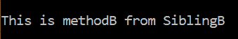

# Python–从同级目录导入

> 原文:[https://www . geesforgeks . org/python-从同级导入-目录/](https://www.geeksforgeeks.org/python-import-from-sibling-directory/)

在本文中，我们将讨论在 Python 中从同级目录导入文件的方法。首先，在一个根文件夹中创建两个文件夹，并在每个文件夹中创建一个 python 文件。下面是字典树:

```py
Directory Tree:

root :
 |
 |__SiblingA:
 |    \__A.py
 |     
 |__SiblingB:
 |      \__B.py
```

在 B.py 中，我们将创建一个简单的函数，在 A.py 中，我们将导入同级模块，并调用在 B.py 中创建的函数。为了在 A.py 中导入同级模块，我们需要在 A.py 中指定父目录，这可以通过使用[](https://www.geeksforgeeks.org/python-sys-module/)**模块中的 **path.append()** 方法来完成。通过**' .. 'append()方法中的**将在 A.py 中追加父目录的路径**

**【A.py 的代码:**

## **蟒蛇 3**

```py
# import requi9red module
import sys

# append the path of the
# parent directory
sys.path.append("..")

# import method from sibling
# module
from SiblingB.B import methodB

# call method
s = methodB()
print(s)
```

**【B.py 的代码:**

## **蟒蛇 3**

```py
# defining method to import 
# in A.py which returns a string
def methodB():
    return "\n\nThis is methodB from SiblingB"
```

****执行 A.py 后的输出:****

****

**执行 A.py 并调用 methodB()。**

****注意:**我们不能将 A.py 中的 methodB 直接导入为“from”..SiblingB。b 导入方法 b "这将给出一个错误，说明导入错误:试图在没有已知父包的情况下进行相对导入。这是因为 python 不将当前工作目录视为包 if __init__。py 在其中没有定义。**

**执行相同任务的另一种类似方式是通过将 _ _ init _ _ _，将兄弟目录作为一个包。py 文件，然后从同级目录中导入它。__init__。py 可以将所需的方法导入到其他模块中。下面是字典树:**

```py
**Directory Tree:**

root :
 |
 |__SiblingA:
 |    \__A.py
 |     
 |__SiblingB:
 |      \_ __init__.py
 |      \__B.py
 |
```

**【A.py 的代码:**

## **蟒蛇 3**

```py
# import requi9red module
import sys

# append the path of the
# parent directory
sys.path.append("..")

# import method from sibling 
# module
from SiblingB import methodB

# call method
s = methodB()
print(s)
```

****代码为 __init__。py :****

## **蟒蛇 3**

```py
# from .fileName import methodName
from .B import methodB
```

**【B.py 的代码:**

## **蟒蛇 3**

```py
# defining method to import in 
# A.py which returns this string
def methodB():
    return "\n\nThis is methodB from SiblingB"
```

****执行 A.py 后的输出:****

****

****注意:**一次 __init__。py 放在一个文件夹中，这个文件夹现在在 python 中充当一个包。**