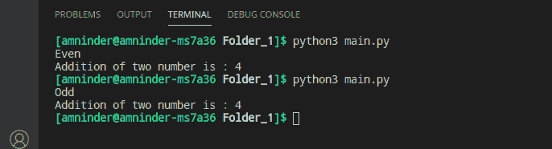

# Python–从不同目录导入模块

> 原文:[https://www . geesforgeks . org/python-import-module-from-different-directory/](https://www.geeksforgeeks.org/python-import-module-from-different-directory/)

在处理大型项目时，我们可能会遇到这样一种情况:我们想要从不同的目录中导入一个**模块**。但是由于某些原因，模块可能无法正确导入。现在，如果您的模块没有正确导入，请不要担心。在本文中，我们将讨论从另一个目录导入模块的方法。

**注意:**一个模块只是一个以**结尾的 Python 程序。py** 扩展名和包含模块的文件夹成为一个包。

### 导入模块

假设我们有两个不同的文件夹，一个包含 **main.py** ，这是我们要从 **Folder_2 导入**模块 1** 的主 Python 文件。**

**目录结构**

```
 - Folder_1
    - main.py
 - Folder_2
     - module1.py
```

**Module1** 包含两个函数，分别叫做**加**和**奇数 _ 偶数。**函数**添加**将接受两个参数并返回它们的相加。**奇数 _ 偶数**功能只取一个参数，如果数字为偶数则打印**偶数**，如果数字为奇数则打印**奇数**。

### **模块 1.py**

## 蟒蛇 3

```
# creating a simple add function
def add(a, b):
    return a+b

# creating a simple odd_even function
# to check if the number is odd or even
def odd_even(n):
    if n % 2 == 0:
        print("Even")
    else:
        print("Odd")
```

如果我们简单地尝试从**文件夹 _2、**导入**模块 1** ，我们将会遇到以下错误。

#### **main.py**

## 蟒蛇 3

```
# importing module1 from another folder
import Folder_2

# calling odd_even function
module1.odd_even(5)
```

**输出:**


错误

**modulentfounderror**，因为默认情况下 python 解释器只会检查当前目录下的文件，我们需要手动设置文件路径才能从另一个目录导入模块。我们可以用各种方法做到这一点。下面将详细讨论这些方法。

### **使用系统模块**

我们可以使用 **sys.path** 将新的不同文件夹(我们要从其中导入模块的文件夹)的路径添加到系统路径中，这样，如果 python 在当前目录中没有找到该模块，它也可以在该目录中查找该模块。由于**系统路径**属于**列表类型类**，所以我们可以很容易地使用插入方法添加文件夹路径。

## 蟒蛇 3

```
# importing sys
import sys

# adding Folder_2 to the system path
sys.path.insert(0, '/home/amninder/Desktop/Folder_2')

# importing the add and odd_even 
# function
from module1 import odd_even, add

# calling odd_even function
odd_even(5)

# calling add function
print("Addition of two number is :", add(2, 2))
```

**输出**:



使用 sys

### **使用 PYTHONPATH** **环境变量**

同样，如果不想使用 **sys** 模块设置新目录的路径。您可以为 PYTHONPATH 变量分配一个目录路径，并且仍然让您的程序工作。

在 Linux 中，我们可以在终端中使用以下命令来设置路径:

> 导出 PYTHONPATH= '路径/到/目录'

在视窗系统中:

> SET PYTHONPATH= "路径/到/目录"

要查看 PYTHONPATH 变量是否保存新文件夹的路径，我们可以使用以下命令:

> 回声$PYTHONPATH

## 蟒蛇 3

```
# importing the add and odd_even function
from module1 import odd_even, add

# calling odd_even function
odd_even(5)

# calling add function
print("Addition of two number is :", add(2, 2))
```