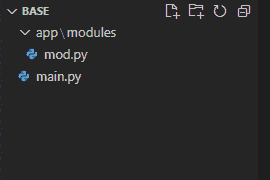
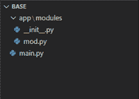

# Python–导入目录外的模块

> 原文:[https://www . geesforgeks . org/python-import-module-external-directory/](https://www.geeksforgeeks.org/python-import-module-outside-directory/)

模块只是一条 python。py 文件，我们可以在另一个文件中使用函数、类和变量。要在另一个文件中使用这些东西，我们需要首先在那个文件中导入那个模块，然后才能使用它们。模块可以存在于不同的目录中，如果它们与文件存在于同一个目录中，我们可以使用 import module_name 语法直接导入它。但是如果它存在于不同的目录中，我们就不能直接导入它。在本文中，我们将讨论从目录外导入模块的各种方法。

**我们的目录树如下:**

```
D :\projects\base
|__main.py   
|__app:
      |__modules
           |___mod.py
```



在 D:\ project 中，我们有一个名为“base”的文件夹，在 base 文件夹中，我们有名为 app 的文件夹。base 包含 main.py，我们将在其中导入模块，app 包含另一个名为 modules 的文件夹，其中包含 mod.py，这是需要导入的模块。

为了更好地解释，我们将尽可能简化这两个文件的代码:

**修改 py:**

## 计算机编程语言

```
# defining a function hello()
def hello():

    # printing the string 'hello geeks!'
    print('hello geeks!')
```

现在我们将导入 mod.py 模块，并使用许多方法在 main.py 中调用它的函数 hello。

### **方法 1:使用 sys.path.append()**

模块[系统](https://www.geeksforgeeks.org/python-sys-module/)的[系统路径](https://www.geeksforgeeks.org/sys-path-in-python/)变量包含 python 将在其中搜索要导入的模块的所有目录列表。我们可以直接调用这个方法来查看它包含的目录。所以为了在 main.py 中导入 mod.py，我们将在 [sys.path](https://www.geeksforgeeks.org/sys-path-in-python/) 中添加 mod.py 的路径，这样为了导入 python 会在其目录中搜索 mod.py，并找到它以成功导入它。此方法的代码是:

## 计算机编程语言

```
# importing the sys module
import sys         

# appending the directory of mod.py 
# in the sys.path list
sys.path.append('D:/projects/base/app/modules')        

# now we can import mod
import mod    

# calling the hello function of mod.py
mod.hello()
```

**输出:**

```
hello geeks!
```

### 方法 2:使用 sys.path.insert()。

正如我们已经讨论过的[系统路径](https://www.geeksforgeeks.org/sys-path-in-python/)包含将为模块搜索的所有目录的列表。一个更好的方法是在位置 1 插入模块的目录，以便它以更高的优先级加载，这反过来有助于避免一些名称冲突。此方法的 main.py 代码为:

## 计算机编程语言

```
# importing the sys module
import sys        

# inserting the mod.py directory at 
# position 1 in sys.path
sys.path.insert(1, 'D:/projects/base/app/modules')        

# importing the module mod.py
import mod    

# calling the function hello() of mod.py
mod.hello()
```

**输出:**

```
hello geeks!
```

### 方法 3:使用 __init__。巴拉圭

我们也可以通过首先将存在的目录转换为 [python 包](https://www.geeksforgeeks.org/create-access-python-package/)来导入模块。要将目录转换成 python 包，我们必须包含一个文件 __init__。可以留空目录中的 py。当我们添加文件 __init__ 时。py 我们告诉 python，目录是一个包。所以在创建 __init__ 之后。py 目录树如下所示:

```
D :\projects\base
|__main.py 
|__app:
|      |__modules
|          |___mod.py
|          |___init__.py
|__main.py
```



我们在 import 语句中调用模块的方式是从 app 文件夹转到 mod 文件，并用“.”分隔每个路径变量。现在从这个方法导入 main.py 中的 mod.py，main.py 中的代码将是:

## 计算机编程语言

```
# importing the module
import app.modules.mod         

# calling the hello function of the module
app.modules.mod.hello()
```

**输出:**

```
hello geeks!
```

### 方法 4:使用导入库

我们还可以使用导入库从外部目录导入模块。为此，我们首先必须导入 importlib.util 模块。然后调用 import lib . util . spec _ from _ file _ location()方法，该方法接受两个参数 file_name 和 file_path 并返回一个值，该值将与 import lib . util . module _ from _ spec()方法一起使用，以导入具有特定名称的模块。然后我们可以用这个特定的名字来调用模块的函数、类、变量。

## 计算机编程语言

```
# importing the importlib.util module
import importlib.util        

# passing the file name and path as argument
spec = importlib.util.spec_from_file_location(
  "mod", "D:/projects/base/app/modules/mod.py")    

# importing the module as foo 
foo = importlib.util.module_from_spec(spec)        
spec.loader.exec_module(foo)

# calling the hello function of mod.py
foo.hello()
```

**输出:**

```
hello geeks!
```