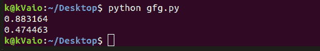

# 竞技编程中的 Python

> 原文:[https://www . geesforgeks . org/python-in-competitive-programming/](https://www.geeksforgeeks.org/python-in-competitive-programming/)

[2017 年，当 ACM 允许 Python](https://icpc.baylor.edu/compete/problems) 支持其享有盛誉的竞赛——ACM ICPC 时，一个全新的社区对竞技编程这项运动产生了兴趣。这意味着更多的人回归基础，学习算法，这些算法是他们用来构建高级包的复杂包的构建块。
不幸的是，关于如何有效地使用数据结构，甚至 python 的作用域规则的信息并不多，这导致人们认为 python 不适合竞争性编程。
今天我将向您展示 python 有时由于其惊人的库而比 C++或 Java 更强大，以及它实际上可以有多简单。

让我用一个简单的例子来演示，看看下面的代码片段-

```py
alphabets = ['a', 'b', 'c']
for item in alphabets:
    len(item) 
```

```py
alphabets = ['a', 'b', 'c']
fn = len
for item in alphabets:
        fn(item)
```

你可能会认为我给函数“len”分配了一个别名，这可能没什么区别。
所以我写了一个性能测试函数如下。

```py
import datetime
alphabets = [str(x)for x in range(10000000)]
a = datetime.datetime.now() # store initial time
for item in alphabets:
    len(item)
b = datetime.datetime.now() # store final time
print (b-a).total_seconds() # results
a = datetime.datetime.now()
fn = len                    # function stored locally
for item in alphabets:
    fn(item)
b = datetime.datetime.now()
print (b-a).total_seconds()
```

我鼓励你在你的系统上尝试它。
这是我运行 performance.py 脚本的输出。



差不多一半！

好了，现在让我们来分析一下为什么会发生这种情况。原因？查找函数是一项昂贵的操作。
在第二个代码片段中，我将函数直接存储在函数的作用域中，所以无论我调用它多少次，每次运行时都确切地知道它必须在哪里寻找结果。

Itertools
如果你去过 codeforces，你现在知道很多编程挑战都涉及到回溯。所以今天我将告诉你一个库，它使用一个内置的库包来生成所有的排列和组合，速度非常快。Itertools 如果你想用 python 解决算法难题，那么 itertools 是你必须探索的库。
生成所有排列–

```py
from itertools import permutations
perm = permutations([1, 2, 3], 2)
for i in list(perm):
    print i

# Answer->(1, 2), (1, 3), (2, 1), (2, 3), (3, 1), (3, 2)
```

组合()函数的行为类似，我鼓励读者自行尝试。

> 只有当您的代码没有成功利用 Python 的强大功能时，python 才是一种缓慢的语言。如果你是一个 python 程序员，不要觉得自己处于劣势，它实际上非常简洁而且非常快速！