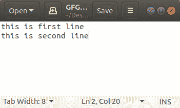
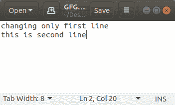
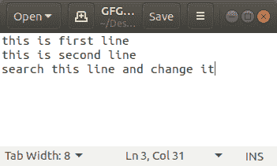
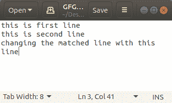
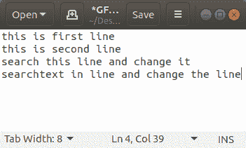
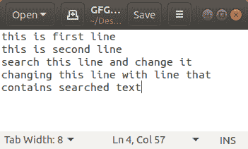
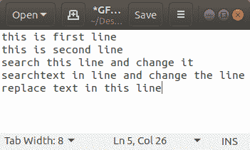
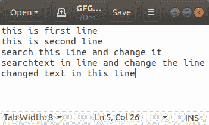

# Python:使用文件输入进行就地编辑

> 原文:[https://www . geesforgeks . org/python-in place-editing-using-file input/](https://www.geeksforgeeks.org/python-inplace-editing-using-fileinput/)

Python3 的`fileinput`提供了许多有用的特性，可以用来做很多事情，而不需要很多代码。它在很多地方都很方便，但是在本文中，我们将使用 fileinput 在文本文件中进行就地编辑。基本上，我们将在不创建任何其他文件或开销的情况下更改文本文件中的文本。

**语法:**

```
FileInput(filename, inplace=True, backup='.bak')

```

**注意:**备份是编辑前创建的备份文件的扩展名。

**示例 1:** 仅更改文件的第一行

**文本文件:**



```
# Python code to change only first line of file
import fileinput

filename = "GFG.txt"

with fileinput.FileInput(filename, 
                         inplace = True, backup ='.bak') as f:

    for line in f:
        if f.isfirstline():
            print("changing only first line", end ='\n')
        else:
            print(line, end ='')
```

**输出:**



**示例 2:** 搜索并用文件中的其他行替换该行

**文本文件:**



```
# python3 code to search and 
# replace line with other line in file
import fileinput

filename = "GFG.txt"

with fileinput.FileInput(filename,
                         inplace = True, backup ='.bak') as f:

    for line in f:
        if "search this line and change it\n" == line:
            print("changing the matched line with this line",
                  end ='\n')
        else:
            print(line, end ='')
```

**输出:**



**示例 3:** 内联搜索文本，并用文件中的另一行替换该行。

**文本文件:**



```
# python3 code to search text in 
# line and replace that line with 
# other line in file
import fileinput

filename = "GFG.txt"

with fileinput.FileInput(filename,
                         inplace = True, backup ='.bak') as f:
    for line in f:
        if "searchtext" in line:
            print("changing this line with line that contains searched text",
                  end ='\n')
        else:
            print(line, end ='')
```

**输出:**



**示例 4:** 搜索文本并替换文件中的文本。

**文本文件:**



```
# python code to search
# text and replace that text
# in file

import fileinput

filename = "GFG.txt"

with fileinput.FileInput(filename, 
                         inplace = True, backup ='.bak') as f:

    for line in f:
        if "replace text" in line:
            print(line.replace("replace text",
                               "changed text"), end ='')
        else:
            print(line, end ='')
```

**输出:**

