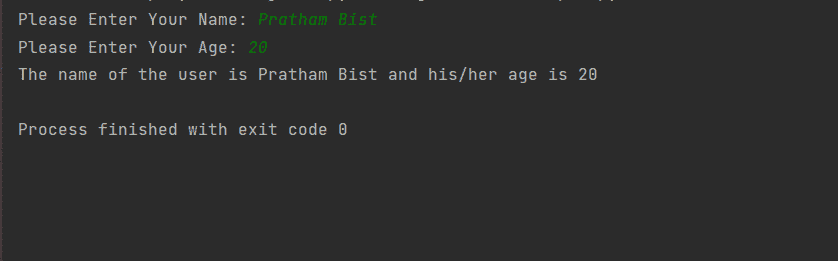
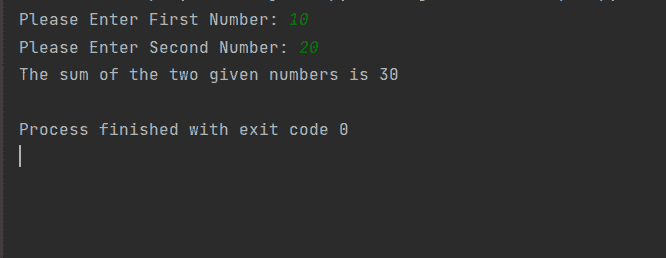
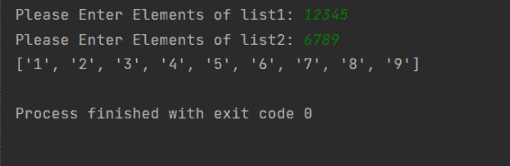

# Python 输入()函数

> 原文:[https://www.geeksforgeeks.org/python-input-function/](https://www.geeksforgeeks.org/python-input-function/)

**Python 输入()功能**用于取用户输入。默认情况下，它以字符串的形式返回用户输入。

**语法**

> 输入(提示)

**参数**:

*   **提示:**一个字符串，代表输入前的默认消息(通常是屏幕)。但是，有提示信息是可选的。

**返回** : input()返回一个字符串对象。即使输入的值是一个**整数**，它也会将其转换成一个字符串。

### **例 1:以**用户的**姓名和年龄为输入并打印出来**

默认情况下，输入返回一个字符串。因此姓名和年龄将存储为字符串。

## 计算机编程语言

```py
# Taking name of the user as input 
# and storing it name variable
name = input("Please Enter Your Name: ")

# taking age of the user as input and 
# storing in into variable age
age = input("Please Enter Your Age: ")

# printing it
print("The name of the user is {0} and his/her age is {1}".format(name, age))
```

**输出:**



### 示例 2:从用户处获取两个整数并相加。

在本例中，我们将研究如何从用户那里获取整数输入。为了获得整数输入，我们将使用 int()和 input()

## 计算机编程语言

```py
# Taking number 1 from user as int
num1 = int(input("Please Enter First Number: "))

# Taking number 2 from user as int
num2 = int(input("Please Enter Second Number: "))

# adding num1 and num2 and storing them in
# variable addition
addition = num1 + num2

# printing
print("The sum of the two given numbers is {} ".format(addition))
```

**输出:**



同样，我们可以使用 float()获取两个浮点数。让我们再看一个如何将列表作为输入的例子

### 示例 3:将两个列表作为输入并追加它们

## 计算机编程语言

```py
# Taking list1 input from user as list
list1 = list(input("Please Enter Elements of list1: "))

# Taking list2 input from user as list
list2 = list(input("Please Enter Elements of list2: "))

# appending list2 into list1 using .append function
for i in list2:
    list1.append(i)

# printing list1
print(list1)
```

**输出:**

