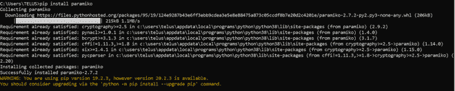
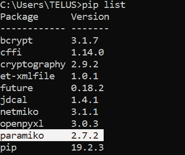
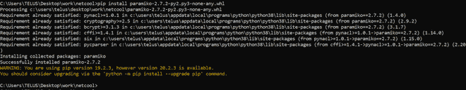
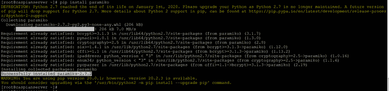
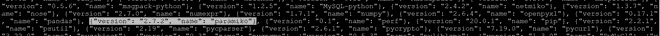

# Python–在 Windows 和 Linux 上安装 Paramiko

> 原文:[https://www . geesforgeks . org/python-install-paramiko-on-windows-and-Linux/](https://www.geeksforgeeks.org/python-install-paramiko-on-windows-and-linux/)

高级 python API 从创建安全连接对象开始。拥有更直接的控制，并通过套接字传输来启动远程访问。作为客户端，它使用用户凭据或私钥进行身份验证，并检查服务器的主机密钥。

**Paramiko** 是一个 Python 库，通过 SSh 与远程设备进行连接。Paramiko 正在使用 SSH2 代替 SSL，在两台设备之间建立安全连接。它还支持 SFTP 客户端和服务器模型。

## **安装**

### 在窗口上

使用 cmd 上的 **pip** 运行以下命令，在 Windows 上安装 **Paramiko** 。

```py
pip install paramiko

```

**输出:**



要检查已安装的**参数**，运行以下程序:

```py
pip list

```

**输出:**



使用**安装**帕拉米科**。线文件。下载。https://pypi.org/project/paramiko/#files 档案**

```py
pip install paramiko-2.7.2-py2.py3-none-any.whl

```

**输出:**



### **在 Linux 上**

Python **paramiko** 可以多种方式安装在 Linux 上，**使用 pip** 就是其中之一。

```py
pip install paramiko

```

**输出:**



检查已安装的**参数**:

```py
pip list --format=json

```

**输出:**

