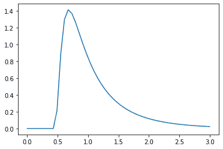
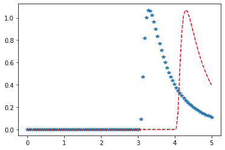

# Python–统计中的逆高斯分布

> 原文:[https://www . geesforgeks . org/python-逆高斯-统计中的分布/](https://www.geeksforgeeks.org/python-inverse-gaussian-distribution-in-statistics/)

**scipy.stats.invgauss()** 是一个反高斯连续随机变量。它继承自泛型方法的，作为 **rv_continuous 类**的实例。它用特定于这个特定分布的细节来完成这些方法。

**参数:**

> **a :** 形参
> T3】c:耿氏特例。默认值等于 c = -1

**代码#1:创建逆高斯连续随机变量**

```
# importing library
from scipy.stats import invgauss   

numargs = invgauss.numargs 
[a, b] = [0.7, 0.4] * numargs 
rv = invgauss (a, b) 

print ("RV : \n", rv)  
```

**输出:**

```
RV : 
 scipy.stats._distn_infrastructure.rv_frozen object at 0x1a220d7bd0

```

**代码#2:逆高斯连续变量和概率分布**

```
import numpy as np 
quantile = np.arange (0.01, 1) 

# Random Variates 
R = invgauss.ppf(0.01, a) 
print ("Random Variates : \n", R) 

# PDF 
R = invgauss.pdf(invgauss.ppf(0.01, a), a) 
print ("\nProbability Distribution : \n", R) 
```

**输出:**

```
Random Variates : 
 0.25801533159920903

Probability Distribution : 
 0.15984442779701688

```

**代码#3:图形表示。**

```
import numpy as np 
import matplotlib.pyplot as plt 

distribution = np.linspace(0, np.minimum(rv.dist.b, 3)) 
print("Distribution : \n", distribution) 

plot = plt.plot(distribution, rv.pdf(distribution)) 
```

**输出:**

```
Distribution : 
 [0\.         0.06122449 0.12244898 0.18367347 0.24489796 0.30612245
 0.36734694 0.42857143 0.48979592 0.55102041 0.6122449  0.67346939
 0.73469388 0.79591837 0.85714286 0.91836735 0.97959184 1.04081633
 1.10204082 1.16326531 1.2244898  1.28571429 1.34693878 1.40816327
 1.46938776 1.53061224 1.59183673 1.65306122 1.71428571 1.7755102
 1.83673469 1.89795918 1.95918367 2.02040816 2.08163265 2.14285714
 2.20408163 2.26530612 2.32653061 2.3877551  2.44897959 2.51020408
 2.57142857 2.63265306 2.69387755 2.75510204 2.81632653 2.87755102
 2.93877551 3\.        ]

```



**代码#4:变化的位置参数**

```
import matplotlib.pyplot as plt 
import numpy as np 

x = np.linspace(0, 5, 100) 

# Varying positional arguments 
y1 = invgauss .pdf(x, 1, 3) 
y2 = invgauss .pdf(x, 1, 4) 
plt.plot(x, y1, "*", x, y2, "r--") 
```

**输出:**
