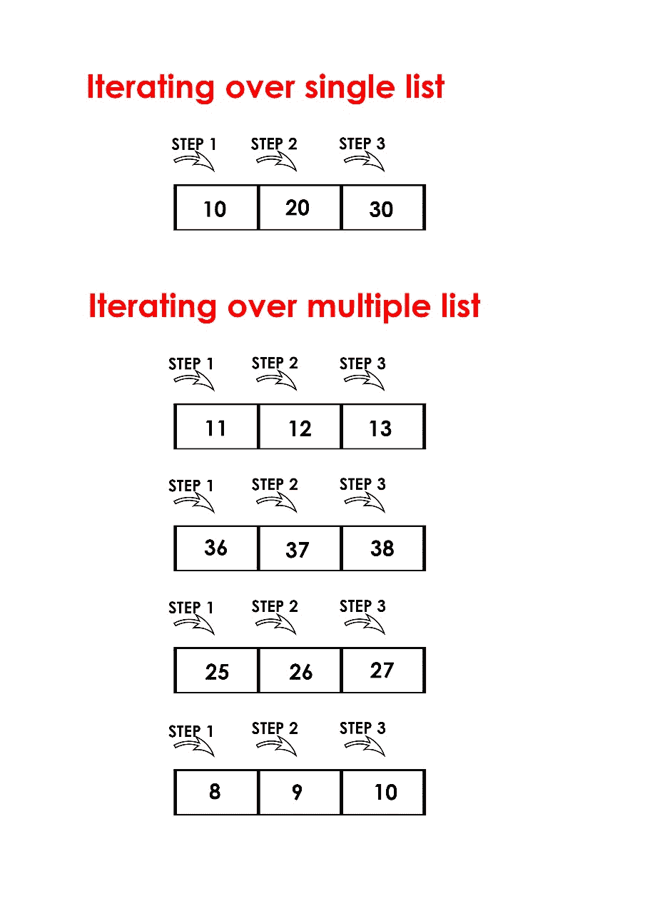

# Python |同时迭代多个列表

> 原文:[https://www . geesforgeks . org/python-iterate-multi-list-同时/](https://www.geeksforgeeks.org/python-iterate-multiple-lists-simultaneously/)

对单个列表进行迭代，是指在特定步骤对单个列表的单个元素进行迭代时使用 **[进行循环](https://www.geeksforgeeks.org/loops-in-python/)** ，而在同时对多个列表进行迭代时，是指在特定步骤对多个列表的单个元素进行迭代时使用**进行循环**。



**一次迭代多个列表**

为了更好地理解多个列表的迭代，我们一次迭代 3 个列表。

*我们可以通过以下方式同时迭代列表:*

1.  **zip()** : In Python 3, zip returns an iterator. zip() function stops when anyone of the list of all the lists gets exhausted. In simple words, it runs till the smallest of all the lists.

    下面是 zip 函数和 itertools.izip 的实现，它遍历 3 个列表:

    ## 蟒蛇 3

    ```
    # Python program to iterate
    # over 3 lists using zip function

    import itertools 

    num = [1, 2, 3]
    color = ['red', 'while', 'black']
    value = [255, 256]

    # iterates over 3 lists and executes 
    # 2 times as len(value)= 2 which is the
    # minimum among all the three 
    for (a, b, c) in zip(num, color, value):
         print (a, b, c)
    ```

    **Output:**

    ```
    1 red 255
    2 while 256

    ```

2.  **itertools.zip_longest()** : zip_longest stops when all lists are exhausted. When the shorter iterator(s) are exhausted, zip_longest yields a tuple with None value.

    下面是迭代 3 个列表的 itertools.zip _ longest 的实现:

    ## 蟒蛇 3

    ```
    # Python program to iterate
    # over 3 lists using itertools.zip_longest

    import itertools 

    num = [1, 2, 3]
    color = ['red', 'while', 'black']
    value = [255, 256]

    # iterates over 3 lists and till all are exhausted
    for (a, b, c) in itertools.zip_longest(num, color, value):
        print (a, b, c)
    ```

    **Output:**

    ```
    1 red 255
    2 while 256
    3 black None

    ```

    **输出:**

    ```
    1 red 255
    2 while 256
    3 black None

    ```

我们还可以在 zip _ longest()中指定一个默认值，而不是“无”

## 蟒蛇 3

```
# Python program to iterate
# over 3 lists using itertools.zip_longest

import itertools 

num = [1, 2, 3]
color = ['red', 'while', 'black']
value = [255, 256]

# Specifying default value as -1
for (a, b, c) in itertools.zip_longest(num, color, value, fillvalue=-1):
    print (a, b, c)
```

**Output:**

```
1 red 255
2 while 256
3 black -1

```

 **注意:** Python 2.x 有两个额外的函数 izip()和 izip _ longest()。在 Python 2.x 中，zip()和 zip _ longest()用于返回列表，izip()和 izip _ longest()用于返回迭代器。在 Python 3.x 中，izip()和 izip _ longestest()不作为 zip()和 zip _ long()返回迭代器存在。