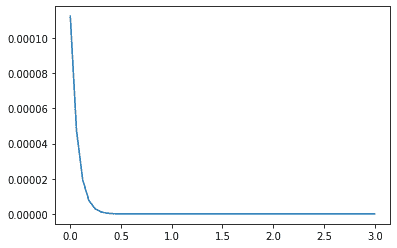
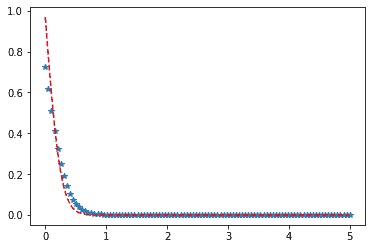

# 统计中 Python–Johnson SU 分布

> 原文:[https://www . geesforgeks . org/python-Johnson-su-distribution-in-statistics/](https://www.geeksforgeeks.org/python-johnson-su-distribution-in-statistics/)

**scipy.stats.johnsonsu()** 是一个 johnsonsu 连续随机变量，用标准格式和一些形状参数定义，以完成其规范。

**参数:**

> **q :** 上下尾概率
> T3】x:分位数
> **loc :** 【可选】位置参数。默认= 0
> **比例:**【可选】比例参数。默认值= 1
> **大小:**【整数元组，可选】形状或随机变量。
> **时刻:**【可选】由字母['mvsk']组成；m’=均值，‘v’=方差，‘s’= Fisher 偏斜度，‘k’= Fisher 峰度。(默认值= 'mv ')。
> 
> **结果:**约翰逊 SU 连续随机变量

**代码#1:创建约翰逊 SU 连续随机变量**

```
# importing library

from scipy.stats import johnsonsu  

numargs = johnsonsu.numargs 
a, b = 4.32, 3.18
rv = johnsonsu(a, b) 

print ("RV : \n", rv)  
```

**输出:**

```
RV : 
 scipy.stats._distn_infrastructure.rv_frozen object at 0x000002A9D4E91708

```

 **代码#2:强森 SU 连续变量和概率分布**

```
import numpy as np 
quantile = np.arange (0.01, 1, 0.1) 

# Random Variates 
R = johnsonsu.rvs(a, b, scale = 2, size = 10) 
print ("Random Variates : \n", R) 

# PDF 
R = johnsonsu.pdf(a, b, quantile, loc = 0, scale = 1) 
print ("\nProbability Distribution : \n", R)  
```

**输出:**

```
Random Variates : 
 [-6.33841843 -5.35469028 -5.36145351 -4.4504208  -1.91574847 -5.01633416
 -5.37699657 -4.15794134 -4.90450547 -2.93846617]

Probability Distribution : 
 [5.34745702e-06 2.86846536e-05 2.54767528e-05 1.66921608e-05
 9.34800722e-06 4.69729578e-06 2.16525150e-06 9.26607636e-07
 3.70800055e-07 1.39402846e-07]

```

**代码#3:图形表示。**

```
import numpy as np 
import matplotlib.pyplot as plt 

distribution = np.linspace(0, np.minimum(rv.dist.b, 3)) 
print("Distribution : \n", distribution) 

plot = plt.plot(distribution, rv.pdf(distribution)) 
```

**输出:**

```
Distribution : 
 [0\.         0.06122449 0.12244898 0.18367347 0.24489796 0.30612245
 0.36734694 0.42857143 0.48979592 0.55102041 0.6122449  0.67346939
 0.73469388 0.79591837 0.85714286 0.91836735 0.97959184 1.04081633
 1.10204082 1.16326531 1.2244898  1.28571429 1.34693878 1.40816327
 1.46938776 1.53061224 1.59183673 1.65306122 1.71428571 1.7755102
 1.83673469 1.89795918 1.95918367 2.02040816 2.08163265 2.14285714
 2.20408163 2.26530612 2.32653061 2.3877551  2.44897959 2.51020408
 2.57142857 2.63265306 2.69387755 2.75510204 2.81632653 2.87755102
 2.93877551 3\.        ]

```



**代码#4:变化的位置参数**

```
import matplotlib.pyplot as plt 
import numpy as np 

x = np.linspace(0, 5, 100) 

# Varying positional arguments 
y1 = johnsonsu .pdf(x, 1, 3) 
y2 = johnsonsu .pdf(x, 1, 4) 
plt.plot(x, y1, "*", x, y2, "r--") 
```

**输出:** 